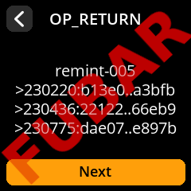

# remint-005.md (January 2025)


# Table of Contents
* [Purpose](#purpose)
* [Tools](#tools)
* [Roles, Keys, and Epochs](#roles-keys-and-epochs)
* [Miniscript Policy and Wallet Output Descriptor](#miniscript-policy-and-wallet-output-descriptor)
* [Analyzing Miniscript](#analyzing-miniscript)
* [Signing Device](#signing-device)
* [Bitcoin Core as a Watch-Only Wallet](#bitcoin-core-as-a-watch-only-wallet)
* [Lessons learned along the way](#lessons-learned-along-the-way)
* [Epoch One](#epoch-one):
[Jan 3rd](#january-3rd-2025),
[4th](#january-4th-2025),
[5th](#january-5th-2025)
* [Committing to "not yet"](#committing-to-not-yet)
* [Epoch Two](#epoch-two):
[not yet](#not-yet-too-early-for-epoch-two),
[Jan 10th](#january-10th-2025),
[11th](#january-11th-2025)
* [Epoch Three](#epoch-three):
[not yet](#not-yet-too-early-for-epoch-three),
[Jan 12th](#january-12th-2025)
* [Epoch Four](#epoch-four):
[not yet](#not-yet-too-early-for-epoch-four),
[Jan 14th](#january-14th-2025)
* [Closing Up](#closing-up-returning-coins-to-the-faucet)

---


# Purpose
At project [Krux](https://github.com/selfcustody/krux), contributors have been working on support for [Miniscript](https://bitcoin.sipa.be/miniscript/).

Working with [@pythcoiner](https://github.com/pythcoiner)'s [SeedQReader](https://github.com/pythcoiner/SeedQReader) and [@Wizardsardine](https://github.com/wizardsardine/)'s [Liana](https://github.com/wizardsardine/liana) wallet, initial Miniscript support is evolving quickly in Krux, currently working for Liana templates:

* "Simple Inheritance": a single primary key with a recovery key that can spend after a pre-determined number of confirmations -- in both P2WSH and P2TR forms,

* "Expanding Multisig": a primary M-of-N multisig that adds a key, becoming M-of-N+1 after a pre-determined number of confirmations -- both P2WSH and P2TR forms,

* Basic, but not tested extensively: Customization of above w/ added keys and added recovery conditions.
 
<!--
* "Reduced Multisig":
* "Expanding Multisig":
-->
  
In order to further exercise Miniscript support in krux (and its [embit](https://github.com/diybitcoinhardware/embit) bitcoin library), we intend to repeat [@Rob1Ham](https://github.com/Rob1Ham)'s more complex "10-key + 4-epoch" `wsh miniscript` template known as [mint-005.md](https://github.com/Blockstream/miniscript-templates/blob/main/mint-005.md) on [signet](https://mempool.space/signet).

---


# Tools
* mint-005.md: wsh Miniscript template, use-case story
* krux -- pull-request #498: the air-gapped PSBT signer and private-keys creator,
* bitcoin core v27: the watch-only wallet (PSBT roles: creator, updater, combiner, finalizer, extractor)
* SeedQReader: the air-gapped QR encoder/decoder for cut/paste operations between krux and core
---


# Roles, Keys and Epochs

## Actor Roles and their Watch-Only Keys (w/ origin)

### Primary Agent Keys
```
A:  [fbf14e49/45h/1h/0h/3h]tpubDEPmZmWcL9G3XEbhBy6A5UG7tR4hAT7zvhu4cVmCSbVPhjkfuYRgqFnUfG4Gm1NSaoo412nzyRe3UAtC73BHQbVDLz4nAkrhJDSxcYSpUnz
B:  [525cb3d5/45h/1h/0h/3h]tpubDF4yVr6ohjK1hQgyHvtLpanC4JxkshsMVUDHfmDvpXcBzdD2peXKdhfLFVNWQekAYAN1vU81dUNfgokZb1foUQfDMtf6X8mb3vMs7cYHbcr
C:  [5fc83bce/45h/1h/0h/3h]tpubDFMqbP9gd34rd5Db2hHVYsJA3LnBD2fZo6zWFzeAA2kUC27cndyN2axBs55K9qJSghbvZx1Nyrrvb2ixgLXRzyK7dLLnXHGAmHe7apv4XwU
```

### Secondary Agent Key
```
D:  [5acaced1/49h/1h/0h]tpubDDXMHf1PVPUPYHKyR9b5pbsfcd4SDC5FHtx7msTwazX4gkZPCRjoTYB2mFR4HsiybdptPtKH7yyoogx9d2gvc92SaoCYANEdZYqRR6FJKGx
```

### Principal (owner) Keys
```
E:  [5ecc195f/48h/1h/0h/2h]tpubDFfTpjFSFT9FFvWwXand2JfnRBSpekQQpzdoz5qm8fy6cUhjLdTBuNrqxdsFgyTJ6xr5oeUAqa28VHPMprbosXLhGEgJW4SPa31tuSmp9Ub
F:  [a1088994/48h/1h/0h/2h]tpubDFE64qjVGZ8L31gXFNtRUUpbaZ5viPgkFpth8j3XfGNWgaM6Vsm3F4z1nNE1soY3cQc6YZtNqMqfrywkeAQMiiYnR8N1oyFP5YuuFYTQ2nx
G:  [8faeabe8/48h/1h/0h/2h]tpubDEMz5Gib3V3i1xzY4yaKH2k2J4MBRjNYNSace1YHMr6MgaM1oLZ4qiF7mWQvGPm9gH5bgroqPMr44viw16XWYoig6rbCQrkzakJw6hsapFw
```
### Recovery Keys (owner)
```
H:  [2bd4a49f/84h/1h/1h]tpubDCtwDKhf7tMtt2NDNrWsN7tFQSEvoKt9qvSBMUPuZVnoR52FwSaQS37UT5skDddUyzhVEGJozGxu8CBJPPc8MXhXidD7azaubMHgNCPvq28
I:  [d38f3599/84h/1h/2h]tpubDDYgycbJd7DgJjKFd4W8Dp8RRNhDDYfLs93cjhBP6boyXiZxdUyZc8fuLMJyetQXq6i9xfYSJwEf1GYxmND6jXExLS9q9ibP2YXZxtqe7mK
J:  [001ceab0/84h/1h/3h]tpubDCuJUyHrMq4PY4fXEHyADTkFwgy498AnuhrhFzgT7tWuuwp9JAeopqMTre99nzEVnqJNsJk21VRLeLsGz4cA5hboULrupdHqiZdxKRLJV9R
```

## From Air-gapped Secrets to Watch-Only Extended Public Keys

Bip32 master Extended Private Keys can be created in an air-gapped manner, then their Extended Public Keys can be exported.

Below, Secondary Agent's master Key D has previously been created and loaded into krux.  We will customize for `testnet`, `miniscript`, and `native segwit` on a custom `derivation path`, then prepare to export the Extended Public Key -- as text to be written down-by hand, saved on the sdcard, or expressed as a QR-Code for scanning:


## 2025 epochs (and blockheight events)

Note: In the original `mint-005` reference, absolute locktime is expressed as a timestamp, but we'll be using block-heights.
1. prior to block #230220,
2. after block #230220, (~Jan 10 15:33 -- wink to Hal's "running bitcoin" in 2009)
3. after block #230436, (~Jan 12 03:30 -- wink to Satoshi's "send 10btc to hal" in 2009)
4. after block #230775, (~Jan 14 12:00 -- wink to Poon/Dryja's "lightning network" whitepaper in 2016)

---


# Miniscript Policy and Wallet Output Descriptor

#### From the reference `mint-005`: Output Descriptor template:

`wsh(andor(multi(2,$PAK_1$,$PAK_2$,$PAK_3$),or_i(and_v(v:pkh($SAK$),after(between_epoch_timestamp)),thresh(2,pk($PK_1$),s:pk($PK_2$),s:pk($PK_3$),snl:after(smallest_epoch_timestamp))),and_v(v:thresh(2,pkh($RK_1$),a:pkh($RK_2$),a:pkh($RK_3$)),after(larget_epoch_timestamp))))`

### Creating an Output Descriptor for `remint-005`:

We create a complete wallet output descriptor by using the above template, filling in each `$variable$` with our Actor keys, suffixing each xpub with `/<0;1>/*` receive/change paths, replacing the epoch_timestamps with our 2025 epochs, and adding a bip380 bech32 descriptor checksum.

```
wsh(andor(multi(2,[fbf14e49/45h/1h/0h/3h]tpubDEPmZmWcL9G3XEbhBy6A5UG7tR4hAT7zvhu4cVmCSbVPhjkfuYRgqFnUfG4Gm1NSaoo412nzyRe3UAtC73BHQbVDLz4nAkrhJDSxcYSpUnz/<0;1>/*,[525cb3d5/45h/1h/0h/3h]tpubDF4yVr6ohjK1hQgyHvtLpanC4JxkshsMVUDHfmDvpXcBzdD2peXKdhfLFVNWQekAYAN1vU81dUNfgokZb1foUQfDMtf6X8mb3vMs7cYHbcr/<0;1>/*,[5fc83bce/45h/1h/0h/3h]tpubDFMqbP9gd34rd5Db2hHVYsJA3LnBD2fZo6zWFzeAA2kUC27cndyN2axBs55K9qJSghbvZx1Nyrrvb2ixgLXRzyK7dLLnXHGAmHe7apv4XwU/<0;1>/*),or_i(and_v(v:pkh([5acaced1/49h/1h/0h]tpubDDXMHf1PVPUPYHKyR9b5pbsfcd4SDC5FHtx7msTwazX4gkZPCRjoTYB2mFR4HsiybdptPtKH7yyoogx9d2gvc92SaoCYANEdZYqRR6FJKGx/<0;1>/*),after(230436)),thresh(2,pk([5ecc195f/48h/1h/0h/2h]tpubDFfTpjFSFT9FFvWwXand2JfnRBSpekQQpzdoz5qm8fy6cUhjLdTBuNrqxdsFgyTJ6xr5oeUAqa28VHPMprbosXLhGEgJW4SPa31tuSmp9Ub/<0;1>/*),s:pk([a1088994/48h/1h/0h/2h]tpubDFE64qjVGZ8L31gXFNtRUUpbaZ5viPgkFpth8j3XfGNWgaM6Vsm3F4z1nNE1soY3cQc6YZtNqMqfrywkeAQMiiYnR8N1oyFP5YuuFYTQ2nx/<0;1>/*),s:pk([8faeabe8/48h/1h/0h/2h]tpubDEMz5Gib3V3i1xzY4yaKH2k2J4MBRjNYNSace1YHMr6MgaM1oLZ4qiF7mWQvGPm9gH5bgroqPMr44viw16XWYoig6rbCQrkzakJw6hsapFw/<0;1>/*),snl:after(230220))),and_v(v:thresh(2,pkh([2bd4a49f/84h/1h/1h]tpubDCtwDKhf7tMtt2NDNrWsN7tFQSEvoKt9qvSBMUPuZVnoR52FwSaQS37UT5skDddUyzhVEGJozGxu8CBJPPc8MXhXidD7azaubMHgNCPvq28/<0;1>/*),a:pkh([d38f3599/84h/1h/2h]tpubDDYgycbJd7DgJjKFd4W8Dp8RRNhDDYfLs93cjhBP6boyXiZxdUyZc8fuLMJyetQXq6i9xfYSJwEf1GYxmND6jXExLS9q9ibP2YXZxtqe7mK/<0;1>/*),a:pkh([001ceab0/84h/1h/3h]tpubDCuJUyHrMq4PY4fXEHyADTkFwgy498AnuhrhFzgT7tWuuwp9JAeopqMTre99nzEVnqJNsJk21VRLeLsGz4cA5hboULrupdHqiZdxKRLJV9R/<0;1>/*)),after(230775))))#5flg0r73
```

### Reverting the Output Descriptor back to a readable Policy

Using `embit.descriptor.Descriptor` we can load this string via the `.from_string` method and then access a simplified miniscript policy via the `.full_policy` attribute:

`andor(multi(2,A,B,C),or_i(and_v(v:pkh(D),after(230436)),thresh(2,pk(E),s:pk(F),s:pk(G),snl:after(230220))),and_v(v:thresh(2,pkh(H),a:pkh(I),a:pkh(J)),after(230775)))`

---

# Analyzing Miniscript

### Refer to BIP-379 and the Miniscript Page

* [BIP-379](https://github.com/bitcoin/bips/blob/master/bip-0379.md) is the Miniscript BIP.

* [https://bitcoin.sipa.be/miniscript](https://bitcoin.sipa.be/miniscript/) is the interactive Miniscript reference page.

Copying the 'simplified' descriptor policy:
`andor(multi(2,A,B,C),or_i(and_v(v:pkh(D),after(230436)),thresh(2,pk(E),s:pk(F),s:pk(G),snl:after(230220))),and_v(v:thresh(2,pkh(H),a:pkh(I),a:pkh(J)),after(230775)))`

and pasting it into the [Analyze Miniscript](https://bitcoin.sipa.be/miniscript/#analyze_ms) form renders:
```
Analysis

Size: 352 bytes script

    andor [or]
        andor [and]
            multi(2 of 3)
            or_i
                and_v
                    v: c: pk_h(D)
                    after(230436)
                thresh(2 of 4)
                    c: pk_k(E)
                    s: c: pk_k(F)
                    s: c: pk_k(G)
                    s: n: or_i
                        false
                        after(230220)
        and_v
            v: thresh(2 of 3)
                c: pk_h(H)
                a: c: pk_h(I)
                a: c: pk_h(J)
            after(230775)

Resulting script structure

2 <A> <B> <C> 3 OP_CHECKMULTISIG OP_NOTIF
  OP_DUP OP_HASH160 <HASH160(H)> OP_EQUALVERIFY OP_CHECKSIG OP_TOALTSTACK OP_DUP
  OP_HASH160 <HASH160(I)> OP_EQUALVERIFY OP_CHECKSIG OP_FROMALTSTACK OP_ADD
  OP_TOALTSTACK OP_DUP OP_HASH160 <HASH160(J)> OP_EQUALVERIFY OP_CHECKSIG
  OP_FROMALTSTACK OP_ADD 2 OP_EQUALVERIFY <778503> OP_CHECKLOCKTIMEVERIFY
OP_ELSE
  OP_IF
    OP_DUP OP_HASH160 <HASH160(D)> OP_EQUALVERIFY OP_CHECKSIGVERIFY <248403>
    OP_CHECKLOCKTIMEVERIFY
  OP_ELSE
    <E> OP_CHECKSIG OP_SWAP <F> OP_CHECKSIG OP_ADD OP_SWAP <G> OP_CHECKSIG
    OP_ADD OP_SWAP OP_IF
      0
    OP_ELSE
      <4c8303> OP_CHECKLOCKTIMEVERIFY
    OP_ENDIF
    OP_0NOTEQUAL OP_ADD 2 OP_EQUAL
  OP_ENDIF
OP_ENDIF
```

### Understanding this Policy
We'll define the following to denote the moment when a new epoch begins:
* EPOCH2: block #230220
* EPOCH3: block #230436
* EPOCH4: block #230775

The entire policy is wrapped in `andor()` which implies "(X and Y) or Z", therefore read this policy as 3 terms, the first two conditions must both succeed OR the third condition must succeed.

The first condition: `multi(2,A,B,C)` is the first half of this default contract. It means that the Primary Agent must create 2 of 3 valid signatures from keys A, B, and C.

The second condition: `or_i(and_v(v:pkh(D),after(EPOCH3)),thresh(2,pk(E),s:pk(F),s:pk(G),snl:after(EPOCH2)))`is the second half of this default contract.  It's a bit more complicated, wrapped in `or()`, so we can break it into its 2 subterms:
* the first subterm: `and_v(v:pkh(D),after(EPOCH3))`, wrapped in `and()`, means that the Secondary Agent's Key D is applicable ONLY after the EPOCH3 begins.
* the second subterm: `thresh(2,pk(E),s:pk(F),s:pk(G),snl:after(EPOCH2))`, wrapped in `thresh(2...)` and having 4 additional params means that only 2 of the 4 conditions must succeed for overall success.  Success could be 2 valid signatures from the three Principals' (owner) Keys E, F, and G.  Success could also be just one of their valid signatures after EPOCH2 begins.

The third condition: `and_v(v:thresh(2,pkh(H),a:pkh(I),a:pkh(J)),after(EPOCH4))`, wrapped in `and()` indicates that both of its conditions must succeed.  This condition could succeed ONLY after EPOCH4 begins (effectively at the end of the contract between the Principal (owner) and the Agents), it would require 2 of 3 valid signatures from owner Recovery Keys H, I, and J.

Putting it all together, and remembering that `andor()` implies "(X and Y) or Z":
* In the first epoch (prior to EPOCH2): The Primary Agent AND the Principal (owner) must provide 2 of 3 valid signatures each.
* In the second epoch (after EPOCH2): while previous success conditions remain available, assuming that the Principal owner lost 2 of their keys, they can work with the Primary Agent using the Principal's only remaining key.
* In the third epoch (after EPOCH3): while previous success conditions remain available, assuming that the Principal lost all 3 keys, the Primary Agent and the Secondary Agent may work together on behalf of the principal owner.
* In the final epoch (after EPOCH4): while previous success conditions remain available, assuming that the Primary and Secondary Agents are no longer cooperating and the Principal doesn't have keys, the Principal owner's Recovery Keys may provide 2 of 3 valid signatures.

---


# Signing Device

## Loading the Output Descriptor and Reviewing the Miniscript Policy

As an example, we'll assume that the Secondary Agent's Key D were loaded and setup in krux as seen above.  The Wallet Output Descriptor can then be loaded for inspection -- via qrcode or from a `.txt` file on the sdcard.  Besides viewing the Miniscript, loading a Wallet Descriptor enables verification of addresses, viewing of address listings, and is highly recommended for verification of self-transfers and change during PSBT signing.


---


# Bitcoin Core as a watch-only wallet

## (all PSBT roles except "signer")

Assuming that bitcoin core v27 does not support bip389 (receive/change like `"<0;1>/*"`)
```
"message": "Key path value '<0;1>' is not a valid uint32"
```
...we've altered the descriptors for receive and change to be used with `bitcoin-cli`.

<details><summary>Bitcoin Core -- command line interface</summary>
<p>

```bash
# set variable "receive" for a modified bitcoin core receive descriptor ("/<0;1>/*" becomes "/0/*")
receive="wsh(andor(multi(2,[fbf14e49/45h/1h/0h/3h]tpubDEPmZmWcL9G3XEbhBy6A5UG7tR4hAT7zvhu4cVmCSbVPhjkfuYRgqFnUfG4Gm1NSaoo412nzyRe3UAtC73BHQbVDLz4nAkrhJDSxcYSpUnz/0/*,[525cb3d5/45h/1h/0h/3h]tpubDF4yVr6ohjK1hQgyHvtLpanC4JxkshsMVUDHfmDvpXcBzdD2peXKdhfLFVNWQekAYAN1vU81dUNfgokZb1foUQfDMtf6X8mb3vMs7cYHbcr/0/*,[5fc83bce/45h/1h/0h/3h]tpubDFMqbP9gd34rd5Db2hHVYsJA3LnBD2fZo6zWFzeAA2kUC27cndyN2axBs55K9qJSghbvZx1Nyrrvb2ixgLXRzyK7dLLnXHGAmHe7apv4XwU/0/*),or_i(and_v(v:pkh([5acaced1/49h/1h/0h]tpubDDXMHf1PVPUPYHKyR9b5pbsfcd4SDC5FHtx7msTwazX4gkZPCRjoTYB2mFR4HsiybdptPtKH7yyoogx9d2gvc92SaoCYANEdZYqRR6FJKGx/0/*),after(230436)),thresh(2,pk([5ecc195f/48h/1h/0h/2h]tpubDFfTpjFSFT9FFvWwXand2JfnRBSpekQQpzdoz5qm8fy6cUhjLdTBuNrqxdsFgyTJ6xr5oeUAqa28VHPMprbosXLhGEgJW4SPa31tuSmp9Ub/0/*),s:pk([a1088994/48h/1h/0h/2h]tpubDFE64qjVGZ8L31gXFNtRUUpbaZ5viPgkFpth8j3XfGNWgaM6Vsm3F4z1nNE1soY3cQc6YZtNqMqfrywkeAQMiiYnR8N1oyFP5YuuFYTQ2nx/0/*),s:pk([8faeabe8/48h/1h/0h/2h]tpubDEMz5Gib3V3i1xzY4yaKH2k2J4MBRjNYNSace1YHMr6MgaM1oLZ4qiF7mWQvGPm9gH5bgroqPMr44viw16XWYoig6rbCQrkzakJw6hsapFw/0/*),snl:after(230220))),and_v(v:thresh(2,pkh([2bd4a49f/84h/1h/1h]tpubDCtwDKhf7tMtt2NDNrWsN7tFQSEvoKt9qvSBMUPuZVnoR52FwSaQS37UT5skDddUyzhVEGJozGxu8CBJPPc8MXhXidD7azaubMHgNCPvq28/0/*),a:pkh([d38f3599/84h/1h/2h]tpubDDYgycbJd7DgJjKFd4W8Dp8RRNhDDYfLs93cjhBP6boyXiZxdUyZc8fuLMJyetQXq6i9xfYSJwEf1GYxmND6jXExLS9q9ibP2YXZxtqe7mK/0/*),a:pkh([001ceab0/84h/1h/3h]tpubDCuJUyHrMq4PY4fXEHyADTkFwgy498AnuhrhFzgT7tWuuwp9JAeopqMTre99nzEVnqJNsJk21VRLeLsGz4cA5hboULrupdHqiZdxKRLJV9R/0/*)),after(230775))))#e60ztuzk"

# set variable "change" for a modified bitcoin core change descriptor ("/<0;1>/*" becomes "/1/*")
change="wsh(andor(multi(2,[fbf14e49/45h/1h/0h/3h]tpubDEPmZmWcL9G3XEbhBy6A5UG7tR4hAT7zvhu4cVmCSbVPhjkfuYRgqFnUfG4Gm1NSaoo412nzyRe3UAtC73BHQbVDLz4nAkrhJDSxcYSpUnz/1/*,[525cb3d5/45h/1h/0h/3h]tpubDF4yVr6ohjK1hQgyHvtLpanC4JxkshsMVUDHfmDvpXcBzdD2peXKdhfLFVNWQekAYAN1vU81dUNfgokZb1foUQfDMtf6X8mb3vMs7cYHbcr/1/*,[5fc83bce/45h/1h/0h/3h]tpubDFMqbP9gd34rd5Db2hHVYsJA3LnBD2fZo6zWFzeAA2kUC27cndyN2axBs55K9qJSghbvZx1Nyrrvb2ixgLXRzyK7dLLnXHGAmHe7apv4XwU/1/*),or_i(and_v(v:pkh([5acaced1/49h/1h/0h]tpubDDXMHf1PVPUPYHKyR9b5pbsfcd4SDC5FHtx7msTwazX4gkZPCRjoTYB2mFR4HsiybdptPtKH7yyoogx9d2gvc92SaoCYANEdZYqRR6FJKGx/1/*),after(230436)),thresh(2,pk([5ecc195f/48h/1h/0h/2h]tpubDFfTpjFSFT9FFvWwXand2JfnRBSpekQQpzdoz5qm8fy6cUhjLdTBuNrqxdsFgyTJ6xr5oeUAqa28VHPMprbosXLhGEgJW4SPa31tuSmp9Ub/1/*),s:pk([a1088994/48h/1h/0h/2h]tpubDFE64qjVGZ8L31gXFNtRUUpbaZ5viPgkFpth8j3XfGNWgaM6Vsm3F4z1nNE1soY3cQc6YZtNqMqfrywkeAQMiiYnR8N1oyFP5YuuFYTQ2nx/1/*),s:pk([8faeabe8/48h/1h/0h/2h]tpubDEMz5Gib3V3i1xzY4yaKH2k2J4MBRjNYNSace1YHMr6MgaM1oLZ4qiF7mWQvGPm9gH5bgroqPMr44viw16XWYoig6rbCQrkzakJw6hsapFw/1/*),snl:after(230220))),and_v(v:thresh(2,pkh([2bd4a49f/84h/1h/1h]tpubDCtwDKhf7tMtt2NDNrWsN7tFQSEvoKt9qvSBMUPuZVnoR52FwSaQS37UT5skDddUyzhVEGJozGxu8CBJPPc8MXhXidD7azaubMHgNCPvq28/1/*),a:pkh([d38f3599/84h/1h/2h]tpubDDYgycbJd7DgJjKFd4W8Dp8RRNhDDYfLs93cjhBP6boyXiZxdUyZc8fuLMJyetQXq6i9xfYSJwEf1GYxmND6jXExLS9q9ibP2YXZxtqe7mK/1/*),a:pkh([001ceab0/84h/1h/3h]tpubDCuJUyHrMq4PY4fXEHyADTkFwgy498AnuhrhFzgT7tWuuwp9JAeopqMTre99nzEVnqJNsJk21VRLeLsGz4cA5hboULrupdHqiZdxKRLJV9R/1/*)),after(230775))))#9e008lmj"

# list bitcoin core's receive addresses
bitcoin-cli deriveaddresses "$receive" 11
[
  "tb1qd2gseeq3xt7nsa7ywp0ffq656hk4fejux8yemwmum92vlxaujdjs6wt7qq",
  "tb1qtmcqs7kq0w20lrpaawd9a5ncz34dy7vpr0jz6hwe0ve5s4pr28ssqxq5nu",
  "tb1q897j94zq683hz2szykshw32c46339al30fvtf7kxc6rd8u56qlus5mzh4e",
  "tb1qc42nrm7keuhkjsen2shrjdygl5904l3gajtz93xmn2s0q4nmyensfrej4w",
  "tb1qum5fu9r57hxevns0fc44vyxr7rt9rzym73jk7r3t8djjea2h0a4qls3p33",
  "tb1qu55gs9zhrpfza08kykghmlf09nugaxz0a9a4x9znty95f9dklkvq8d03d7",
  "tb1q94yxn9lcducse3j34e4ssrz29mg7yrna2enxckjs0h5amwnffdwqncces9",
  "tb1quq5slwz8qqfhxztzm2yge2wgdt9p2k75e3rlcf5qn66ah9epvlvq5m40ru",
  "tb1qh5ckr8vmsvjmdsl8tlzfmq2jg55jtu6gx8vqr2xkxkgakxrm6kvsykruq6",
  "tb1q3j9j9qveu593lpm4n66n8v6te8nxc6tpf3pyckw0aku2rq7mv5ks70vd4t",
  "tb1q3h2vccqcp4ep3z6fngupe87hvglma4aqc88emq8yrqeqkks5avsq3kgmx4",
  "tb1qt786m69ygsjmnsrq6f0ukxlt7ut5gn9u86em8d6vj23gcsewfhsq665hhk"
]

# list bitcoin core's change addresses
bitcoin-cli deriveaddresses "$change" 11
[
  "tb1qr85t92mc3wqasjh0c7runy9r54rdxwc5wgkx9va225edcp2k9nysgt8r0q",
  "tb1q0d0yttw7c3yndxelk6788unl0zfzaz5hkmrf0h65jj2us32d7qus0yqtml",
  "tb1qrasnjst7hka5jzt7n23urfwhrleh9q7ze5ukzcvcnwp3jtwtj9msnh4xtj",
  "tb1qz8w3q425x9a78n6nsv8yvhysxyl2wsgyxdf3rjmrkpuncufxw8cqf789we",
  "tb1q9sz8a2el56jpyr8cvyzjw4duu82nud3v68ylt7yxmfr6raj6sxwshh8kuu",
  "tb1q7kpu6l5uy6twlcmlgg909p2patr0yu7vxg28lyjxzgsqtd9js6es00t55g",
  "tb1quxz8alepz9ep8gdkmjvwjzsv8srhrk5u6kwy3y48fxfh8zgwp3wsfsnalh",
  "tb1qysgp6m2kl6hczs2yd4j7yern5r6kwwsn9mdn0fmatsn3gkd4m88s4c6jdy",
  "tb1qtfhxmvyrm2jh7dagv00qp360a99enhv0gqdvzcgzhy0s5wta7gas02nsf4",
  "tb1qag03nfyx835g66q4femgsgmxgcazjdqxm5a9sls2cwd7wx2ang8q88m3h5",
  "tb1q8la3tcudvyfd64rxgex00g4e6jjhxhf4h0y5d2h6smc95vctqrfs484g2e",
  "tb1q5mlcymvg2lc8xgv5mt4e69t2kne98c9n7ws99ajehlgp64zrnctqjl9lzu"
]

# create a new wallet
bitcoin-cli createwallet "remint-005" true true "" true true true true

# load the wallet
bitcoin-cli loadwallet "remint-005"
{
  "name": "remint-005"
}

# add the descriptors
bitcoin-cli importdescriptors "[{\"desc\":\"$receive\", \"timestamp\": \"now\"},{\"desc\":\"$change\", \"timestamp\": \"now\"}]"
[
  {
    "success": true,
    "warnings": [
      "Range not given, using default keypool range"
    ]
  },
  {
    "success": true,
    "warnings": [
      "Range not given, using default keypool range"
    ]
  }
]

# view the new wallet
bitcoin-cli getwalletinfo
{
  "walletname": "remint-005",
  "walletversion": 169900,
  "format": "sqlite",
  "balance": 0.00000000,
  "unconfirmed_balance": 0.00000000,
  "immature_balance": 0.00000000,
  "txcount": 0,
  "keypoolsize": 0,
  "keypoolsize_hd_internal": 0,
  "paytxfee": 0.00000000,
  "private_keys_enabled": false,
  "avoid_reuse": true,
  "scanning": false,
  "descriptors": true,
  "external_signer": true,
  "blank": true,
  "birthtime": 1735837037,
  "lastprocessedblock": {
    "hash": "000000a69a20b95b9ba7cc4d278a9e600c326daf0561ad81316419f2f7384228",
    "height": 229082
  }
}

# view the descriptors
bitcoin-cli listdescriptors
{
  "wallet_name": "remint-005",
  "descriptors": [
    {
      "desc": "wsh(andor(multi(2,[fbf14e49/45h/1h/0h/3h]tpubDEPmZmWcL9G3XEbhBy6A5UG7tR4hAT7zvhu4cVmCSbVPhjkfuYRgqFnUfG4Gm1NSaoo412nzyRe3UAtC73BHQbVDLz4nAkrhJDSxcYSpUnz/0/*,[525cb3d5/45h/1h/0h/3h]tpubDF4yVr6ohjK1hQgyHvtLpanC4JxkshsMVUDHfmDvpXcBzdD2peXKdhfLFVNWQekAYAN1vU81dUNfgokZb1foUQfDMtf6X8mb3vMs7cYHbcr/0/*,[5fc83bce/45h/1h/0h/3h]tpubDFMqbP9gd34rd5Db2hHVYsJA3LnBD2fZo6zWFzeAA2kUC27cndyN2axBs55K9qJSghbvZx1Nyrrvb2ixgLXRzyK7dLLnXHGAmHe7apv4XwU/0/*),or_i(and_v(v:pkh([5acaced1/49h/1h/0h]tpubDDXMHf1PVPUPYHKyR9b5pbsfcd4SDC5FHtx7msTwazX4gkZPCRjoTYB2mFR4HsiybdptPtKH7yyoogx9d2gvc92SaoCYANEdZYqRR6FJKGx/0/*),after(230436)),thresh(2,pk([5ecc195f/48h/1h/0h/2h]tpubDFfTpjFSFT9FFvWwXand2JfnRBSpekQQpzdoz5qm8fy6cUhjLdTBuNrqxdsFgyTJ6xr5oeUAqa28VHPMprbosXLhGEgJW4SPa31tuSmp9Ub/0/*),s:pk([a1088994/48h/1h/0h/2h]tpubDFE64qjVGZ8L31gXFNtRUUpbaZ5viPgkFpth8j3XfGNWgaM6Vsm3F4z1nNE1soY3cQc6YZtNqMqfrywkeAQMiiYnR8N1oyFP5YuuFYTQ2nx/0/*),s:pk([8faeabe8/48h/1h/0h/2h]tpubDEMz5Gib3V3i1xzY4yaKH2k2J4MBRjNYNSace1YHMr6MgaM1oLZ4qiF7mWQvGPm9gH5bgroqPMr44viw16XWYoig6rbCQrkzakJw6hsapFw/0/*),snl:after(230220))),and_v(v:thresh(2,pkh([2bd4a49f/84h/1h/1h]tpubDCtwDKhf7tMtt2NDNrWsN7tFQSEvoKt9qvSBMUPuZVnoR52FwSaQS37UT5skDddUyzhVEGJozGxu8CBJPPc8MXhXidD7azaubMHgNCPvq28/0/*),a:pkh([d38f3599/84h/1h/2h]tpubDDYgycbJd7DgJjKFd4W8Dp8RRNhDDYfLs93cjhBP6boyXiZxdUyZc8fuLMJyetQXq6i9xfYSJwEf1GYxmND6jXExLS9q9ibP2YXZxtqe7mK/0/*),a:pkh([001ceab0/84h/1h/3h]tpubDCuJUyHrMq4PY4fXEHyADTkFwgy498AnuhrhFzgT7tWuuwp9JAeopqMTre99nzEVnqJNsJk21VRLeLsGz4cA5hboULrupdHqiZdxKRLJV9R/0/*)),after(230775))))#e60ztuzk",
      "timestamp": 1735837037,
      "active": false,
      "range": [
        0,
        999
      ],
      "next": 0,
      "next_index": 0
    },
    {
      "desc": "wsh(andor(multi(2,[fbf14e49/45h/1h/0h/3h]tpubDEPmZmWcL9G3XEbhBy6A5UG7tR4hAT7zvhu4cVmCSbVPhjkfuYRgqFnUfG4Gm1NSaoo412nzyRe3UAtC73BHQbVDLz4nAkrhJDSxcYSpUnz/1/*,[525cb3d5/45h/1h/0h/3h]tpubDF4yVr6ohjK1hQgyHvtLpanC4JxkshsMVUDHfmDvpXcBzdD2peXKdhfLFVNWQekAYAN1vU81dUNfgokZb1foUQfDMtf6X8mb3vMs7cYHbcr/1/*,[5fc83bce/45h/1h/0h/3h]tpubDFMqbP9gd34rd5Db2hHVYsJA3LnBD2fZo6zWFzeAA2kUC27cndyN2axBs55K9qJSghbvZx1Nyrrvb2ixgLXRzyK7dLLnXHGAmHe7apv4XwU/1/*),or_i(and_v(v:pkh([5acaced1/49h/1h/0h]tpubDDXMHf1PVPUPYHKyR9b5pbsfcd4SDC5FHtx7msTwazX4gkZPCRjoTYB2mFR4HsiybdptPtKH7yyoogx9d2gvc92SaoCYANEdZYqRR6FJKGx/1/*),after(230436)),thresh(2,pk([5ecc195f/48h/1h/0h/2h]tpubDFfTpjFSFT9FFvWwXand2JfnRBSpekQQpzdoz5qm8fy6cUhjLdTBuNrqxdsFgyTJ6xr5oeUAqa28VHPMprbosXLhGEgJW4SPa31tuSmp9Ub/1/*),s:pk([a1088994/48h/1h/0h/2h]tpubDFE64qjVGZ8L31gXFNtRUUpbaZ5viPgkFpth8j3XfGNWgaM6Vsm3F4z1nNE1soY3cQc6YZtNqMqfrywkeAQMiiYnR8N1oyFP5YuuFYTQ2nx/1/*),s:pk([8faeabe8/48h/1h/0h/2h]tpubDEMz5Gib3V3i1xzY4yaKH2k2J4MBRjNYNSace1YHMr6MgaM1oLZ4qiF7mWQvGPm9gH5bgroqPMr44viw16XWYoig6rbCQrkzakJw6hsapFw/1/*),snl:after(230220))),and_v(v:thresh(2,pkh([2bd4a49f/84h/1h/1h]tpubDCtwDKhf7tMtt2NDNrWsN7tFQSEvoKt9qvSBMUPuZVnoR52FwSaQS37UT5skDddUyzhVEGJozGxu8CBJPPc8MXhXidD7azaubMHgNCPvq28/1/*),a:pkh([d38f3599/84h/1h/2h]tpubDDYgycbJd7DgJjKFd4W8Dp8RRNhDDYfLs93cjhBP6boyXiZxdUyZc8fuLMJyetQXq6i9xfYSJwEf1GYxmND6jXExLS9q9ibP2YXZxtqe7mK/1/*),a:pkh([001ceab0/84h/1h/3h]tpubDCuJUyHrMq4PY4fXEHyADTkFwgy498AnuhrhFzgT7tWuuwp9JAeopqMTre99nzEVnqJNsJk21VRLeLsGz4cA5hboULrupdHqiZdxKRLJV9R/1/*)),after(230775))))#9e008lmj",
      "timestamp": 1735837037,
      "active": false,
      "range": [
        0,
        999
      ],
      "next": 0,
      "next_index": 0
    }
  ]
}
```

</p>
</details>

This wallet is now created watch-only in bitcoin core, so we'll take a moment for verification, as well as backing up the descriptor -- if not already done.  All of the signing Roles for this wallet likely deserve a wallet Output Descriptor backup.

In krux, without even loading any secrets, we can load the same "trusted" wallet Output Descriptor that we used to create the bitcoin core wallet above -- by scanning the Descriptor QR-Code or by loading it from sdcard, so that we can verify.  Once loaded, we'll be able to review the Keys and Policy just as we did previously for Secondary Agent Key D.


Then we'll be offered options to scan an address QR-Code, or to view lists of `remint-005`'s receive and change addresses.
Below, we'll do so in order to verify the first twelve receive and change addresses that we listed when setting up the bitcoin core watch-only wallet above.


Verified and backed up, this wallet is now ready for use.  Thanks to faucets: [Signet Faucet](https://signetfaucet.com/) and [Alt Signet Faucet](https://signet25.bublina.eu.org/), the first three receive addresses were funded on January 2nd 2025.


#### Reviewing the recently funded wallet


<details><summary>Bitcoin Core -- command line interface</summary>
<p>

```bash
# view balances
bitcoin-cli getbalances
{
  "mine": {
    "trusted": 0.00141144,
    "untrusted_pending": 0.00000000,
    "immature": 0.00000000,
    "used": 0.00000000
  },
  "lastprocessedblock": {
    "hash": "00000064a7cf942b3940a56b202419baee71784144391dc79fee127dc54efb39",
    "height": 229198
  }
}

# viewing utxos
bitcoin-cli listunspent
[
  {
    "txid": "1a52cf9afaf56b2550cdcc7729d07fdd0640917b1dbe64ede24c654c0abe6579",
    "vout": 29,
    "address": "tb1q897j94zq683hz2szykshw32c46339al30fvtf7kxc6rd8u56qlus5mzh4e",
    "witnessScript": "5221033faf91091dc30d797790bb7a86823040ac84b75a2e3bc9f563343a0e118b62512102dd8a47fa133e84785c260a362b8fa6889f4e3ef7a2e5389c3c51b79cd6e64a7121031a7819dfdfbc05678f354d26a0863a377bed7747712c404633b4ef71d69e952853ae6476a9146eae5f605332cc8e6ba56c200b882cc1e370ad7b88ac6b76a91420f320d94e1bcdf82a0bf30d38e45db2ca2dbd6f88ac6c936b76a9148b8007c656297e72443afb33bfd23cffdcc5829388ac6c93528803778503b1676376a9143da4be4df8d89af836dd058c2782a744c623924f88ad03248403b16721025e8b57b0fc240fd58f46d4d6e63f1dbe1c7f80e3fd170d9c7107857649e64cabac7c21026450a476108df9d92f13ed8289057e70fc1ff5c8c2750f269fdfd422ec329588ac937c210270f280cd6902883a566e5af9bb98a13f543d255371d1dfa268d8802314ef6eabac937c630067034c8303b168929352876868",
    "scriptPubKey": "0020397d22d440d1e3712a0225a1774558aea312f7f17a58b4fac6c686d3f29a07f9",
    "amount": 0.00010000,
    "confirmations": 99,
    "spendable": true,
    "solvable": true,
    "desc": "wsh(andor(multi(2,[fbf14e49/45h/1h/0h/3h/0/2]033faf91091dc30d797790bb7a86823040ac84b75a2e3bc9f563343a0e118b6251,[525cb3d5/45h/1h/0h/3h/0/2]02dd8a47fa133e84785c260a362b8fa6889f4e3ef7a2e5389c3c51b79cd6e64a71,[5fc83bce/45h/1h/0h/3h/0/2]031a7819dfdfbc05678f354d26a0863a377bed7747712c404633b4ef71d69e9528),or_i(and_v(v:pkh([5acaced1/49h/1h/0h/0/2]03bef698cce72c9b320358c1fa56062514b731edaba0356a32f7459704bf3e6b2b),after(230436)),thresh(2,pk([5ecc195f/48h/1h/0h/2h/0/2]025e8b57b0fc240fd58f46d4d6e63f1dbe1c7f80e3fd170d9c7107857649e64cab),s:pk([a1088994/48h/1h/0h/2h/0/2]026450a476108df9d92f13ed8289057e70fc1ff5c8c2750f269fdfd422ec329588),s:pk([8faeabe8/48h/1h/0h/2h/0/2]0270f280cd6902883a566e5af9bb98a13f543d255371d1dfa268d8802314ef6eab),snl:after(230220))),and_v(v:thresh(2,pkh([2bd4a49f/84h/1h/1h/0/2]038033bf7fdbf2ac996c2bf61167f66dcff497c882073b44711d5934d54a794bde),a:pkh([d38f3599/84h/1h/2h/0/2]0261b1b1e3281ef7e5cba75dbcf3237e04eea99e8d48b452309a6404ee8b95f76e),a:pkh([001ceab0/84h/1h/3h/0/2]03ee67ec419678b8af28c81896b8bf1d02daf3288827cc7e4031ce79763abcb7eb)),after(230775))))#j8kzw95x",
    "parent_descs": [
      "wsh(andor(multi(2,[fbf14e49/45h/1h/0h/3h]tpubDEPmZmWcL9G3XEbhBy6A5UG7tR4hAT7zvhu4cVmCSbVPhjkfuYRgqFnUfG4Gm1NSaoo412nzyRe3UAtC73BHQbVDLz4nAkrhJDSxcYSpUnz/0/*,[525cb3d5/45h/1h/0h/3h]tpubDF4yVr6ohjK1hQgyHvtLpanC4JxkshsMVUDHfmDvpXcBzdD2peXKdhfLFVNWQekAYAN1vU81dUNfgokZb1foUQfDMtf6X8mb3vMs7cYHbcr/0/*,[5fc83bce/45h/1h/0h/3h]tpubDFMqbP9gd34rd5Db2hHVYsJA3LnBD2fZo6zWFzeAA2kUC27cndyN2axBs55K9qJSghbvZx1Nyrrvb2ixgLXRzyK7dLLnXHGAmHe7apv4XwU/0/*),or_i(and_v(v:pkh([5acaced1/49h/1h/0h]tpubDDXMHf1PVPUPYHKyR9b5pbsfcd4SDC5FHtx7msTwazX4gkZPCRjoTYB2mFR4HsiybdptPtKH7yyoogx9d2gvc92SaoCYANEdZYqRR6FJKGx/0/*),after(230436)),thresh(2,pk([5ecc195f/48h/1h/0h/2h]tpubDFfTpjFSFT9FFvWwXand2JfnRBSpekQQpzdoz5qm8fy6cUhjLdTBuNrqxdsFgyTJ6xr5oeUAqa28VHPMprbosXLhGEgJW4SPa31tuSmp9Ub/0/*),s:pk([a1088994/48h/1h/0h/2h]tpubDFE64qjVGZ8L31gXFNtRUUpbaZ5viPgkFpth8j3XfGNWgaM6Vsm3F4z1nNE1soY3cQc6YZtNqMqfrywkeAQMiiYnR8N1oyFP5YuuFYTQ2nx/0/*),s:pk([8faeabe8/48h/1h/0h/2h]tpubDEMz5Gib3V3i1xzY4yaKH2k2J4MBRjNYNSace1YHMr6MgaM1oLZ4qiF7mWQvGPm9gH5bgroqPMr44viw16XWYoig6rbCQrkzakJw6hsapFw/0/*),snl:after(230220))),and_v(v:thresh(2,pkh([2bd4a49f/84h/1h/1h]tpubDCtwDKhf7tMtt2NDNrWsN7tFQSEvoKt9qvSBMUPuZVnoR52FwSaQS37UT5skDddUyzhVEGJozGxu8CBJPPc8MXhXidD7azaubMHgNCPvq28/0/*),a:pkh([d38f3599/84h/1h/2h]tpubDDYgycbJd7DgJjKFd4W8Dp8RRNhDDYfLs93cjhBP6boyXiZxdUyZc8fuLMJyetQXq6i9xfYSJwEf1GYxmND6jXExLS9q9ibP2YXZxtqe7mK/0/*),a:pkh([001ceab0/84h/1h/3h]tpubDCuJUyHrMq4PY4fXEHyADTkFwgy498AnuhrhFzgT7tWuuwp9JAeopqMTre99nzEVnqJNsJk21VRLeLsGz4cA5hboULrupdHqiZdxKRLJV9R/0/*)),after(230775))))#e60ztuzk"
    ],
    "reused": false,
    "safe": true
  },
  {
    "txid": "677a093dcd81b52d0e41c06a7843a6044067e5d70fc88a1ff91d1e5f954afa9c",
    "vout": 1,
    "address": "tb1qtmcqs7kq0w20lrpaawd9a5ncz34dy7vpr0jz6hwe0ve5s4pr28ssqxq5nu",
    "witnessScript": "522103b54d06e7c4548d6264d0d584ab6a206ff6b16c8d3f72bb059f5701357e9d513c2102cca4dc9ebf1da4d831b8f6f7df477f7ef3bc9da21dfe51d5450d5c62b8c435dd21032b296571b7cf2402940b0a5b478d82ce609fc2c5934e83cbe2dfabb8d598668853ae6476a914c1d9c510a983ad5ca38381d9ce8fb24b0496bc2888ac6b76a91499ccfaad3823c163742babcf327750fc337a60ed88ac6c936b76a914a02e7aaa2b6a6937be47e77731f972235641d36488ac6c93528803778503b1676376a91483fa71b1b782a88ff1662a7511295d14635872e688ad03248403b1672102eba51a49788ab3a79e4149a358c42275a342ca86f7da36b5e67b6b066ea8c372ac7c21021c7a79ed751bffeced94be8757b3a2bcbb58deac08e913176621e1f598128512ac937c210377664d31ae7901a77f678f4c991f4c794704dd82dbf19daf955503b3bd12bd27ac937c630067034c8303b168929352876868",
    "scriptPubKey": "00205ef0087ac07b94ff8c3deb9a5ed278146ad279811be42d5dd97b3348542351e1",
    "amount": 0.00121144,
    "confirmations": 99,
    "spendable": true,
    "solvable": true,
    "desc": "wsh(andor(multi(2,[fbf14e49/45h/1h/0h/3h/0/1]03b54d06e7c4548d6264d0d584ab6a206ff6b16c8d3f72bb059f5701357e9d513c,[525cb3d5/45h/1h/0h/3h/0/1]02cca4dc9ebf1da4d831b8f6f7df477f7ef3bc9da21dfe51d5450d5c62b8c435dd,[5fc83bce/45h/1h/0h/3h/0/1]032b296571b7cf2402940b0a5b478d82ce609fc2c5934e83cbe2dfabb8d5986688),or_i(and_v(v:pkh([5acaced1/49h/1h/0h/0/1]038fc7b348fb3ece773ca21e6a74ce2aa59488a0b99b07c9785c0171699d787805),after(230436)),thresh(2,pk([5ecc195f/48h/1h/0h/2h/0/1]02eba51a49788ab3a79e4149a358c42275a342ca86f7da36b5e67b6b066ea8c372),s:pk([a1088994/48h/1h/0h/2h/0/1]021c7a79ed751bffeced94be8757b3a2bcbb58deac08e913176621e1f598128512),s:pk([8faeabe8/48h/1h/0h/2h/0/1]0377664d31ae7901a77f678f4c991f4c794704dd82dbf19daf955503b3bd12bd27),snl:after(230220))),and_v(v:thresh(2,pkh([2bd4a49f/84h/1h/1h/0/1]03c60fbdece59aacb6f37b7583f131e02406941cd16fab44a163022f87fe92dd4e),a:pkh([d38f3599/84h/1h/2h/0/1]034b3eaa8275ed39b70bd11a6488c09174a64fdfd7865933bbd4f342ff93fe305f),a:pkh([001ceab0/84h/1h/3h/0/1]02fc096bf2b3a1309d8dbced8f0b8eb097d84685159487b7cd14670f24803174f1)),after(230775))))#mkh0qyyg",
    "parent_descs": [
      "wsh(andor(multi(2,[fbf14e49/45h/1h/0h/3h]tpubDEPmZmWcL9G3XEbhBy6A5UG7tR4hAT7zvhu4cVmCSbVPhjkfuYRgqFnUfG4Gm1NSaoo412nzyRe3UAtC73BHQbVDLz4nAkrhJDSxcYSpUnz/0/*,[525cb3d5/45h/1h/0h/3h]tpubDF4yVr6ohjK1hQgyHvtLpanC4JxkshsMVUDHfmDvpXcBzdD2peXKdhfLFVNWQekAYAN1vU81dUNfgokZb1foUQfDMtf6X8mb3vMs7cYHbcr/0/*,[5fc83bce/45h/1h/0h/3h]tpubDFMqbP9gd34rd5Db2hHVYsJA3LnBD2fZo6zWFzeAA2kUC27cndyN2axBs55K9qJSghbvZx1Nyrrvb2ixgLXRzyK7dLLnXHGAmHe7apv4XwU/0/*),or_i(and_v(v:pkh([5acaced1/49h/1h/0h]tpubDDXMHf1PVPUPYHKyR9b5pbsfcd4SDC5FHtx7msTwazX4gkZPCRjoTYB2mFR4HsiybdptPtKH7yyoogx9d2gvc92SaoCYANEdZYqRR6FJKGx/0/*),after(230436)),thresh(2,pk([5ecc195f/48h/1h/0h/2h]tpubDFfTpjFSFT9FFvWwXand2JfnRBSpekQQpzdoz5qm8fy6cUhjLdTBuNrqxdsFgyTJ6xr5oeUAqa28VHPMprbosXLhGEgJW4SPa31tuSmp9Ub/0/*),s:pk([a1088994/48h/1h/0h/2h]tpubDFE64qjVGZ8L31gXFNtRUUpbaZ5viPgkFpth8j3XfGNWgaM6Vsm3F4z1nNE1soY3cQc6YZtNqMqfrywkeAQMiiYnR8N1oyFP5YuuFYTQ2nx/0/*),s:pk([8faeabe8/48h/1h/0h/2h]tpubDEMz5Gib3V3i1xzY4yaKH2k2J4MBRjNYNSace1YHMr6MgaM1oLZ4qiF7mWQvGPm9gH5bgroqPMr44viw16XWYoig6rbCQrkzakJw6hsapFw/0/*),snl:after(230220))),and_v(v:thresh(2,pkh([2bd4a49f/84h/1h/1h]tpubDCtwDKhf7tMtt2NDNrWsN7tFQSEvoKt9qvSBMUPuZVnoR52FwSaQS37UT5skDddUyzhVEGJozGxu8CBJPPc8MXhXidD7azaubMHgNCPvq28/0/*),a:pkh([d38f3599/84h/1h/2h]tpubDDYgycbJd7DgJjKFd4W8Dp8RRNhDDYfLs93cjhBP6boyXiZxdUyZc8fuLMJyetQXq6i9xfYSJwEf1GYxmND6jXExLS9q9ibP2YXZxtqe7mK/0/*),a:pkh([001ceab0/84h/1h/3h]tpubDCuJUyHrMq4PY4fXEHyADTkFwgy498AnuhrhFzgT7tWuuwp9JAeopqMTre99nzEVnqJNsJk21VRLeLsGz4cA5hboULrupdHqiZdxKRLJV9R/0/*)),after(230775))))#e60ztuzk"
    ],
    "reused": false,
    "safe": true
  },
  {
    "txid": "5c634022e28ed6876f83b280752817319100a09ccd4ff74b1d82078104030039",
    "vout": 42,
    "address": "tb1qd2gseeq3xt7nsa7ywp0ffq656hk4fejux8yemwmum92vlxaujdjs6wt7qq",
    "witnessScript": "5221028f16f918ecc1a56e650d7e96d4be601972216c72fa7df65f0212584d784cea172102e5227b84a40b18753470290cbe937ebb059cb256e80c0524a01b7f0a894353e82103d5ded3b1f98c481b9a22a4abc34a496523e890abdc67e200d01e7a45b523a03553ae6476a9147006645f3dea08d7a158a4f812b74395af6950ab88ac6b76a914931cc9f201409469bd9776511d84b14f9b876aec88ac6c936b76a91440c1c51a7bdeb7fa32234738b68f8b0836f586eb88ac6c93528803778503b1676376a914cd1b945ab8ba002743b2f7a281d3e1447b83342988ad03248403b16721025765d0eb23fb9f9e00e7e0126fdbaf9df2d1e1f6bd7e85dfdd851a52411f448fac7c210200e6216d8c2b50a1cd6d9a71b989ec4adf8d821394791147d7d350a6054be8a7ac937c2103da72b7fdb2a0933ce609ddc9c0a8256e2d3dda6269f98c19ec0ca31dee983213ac937c630067034c8303b168929352876868",
    "scriptPubKey": "00206a910ce41132fd3877c4705e948354d5ed54e65c31c99dbb7cd954cf9bbc9365",
    "amount": 0.00010000,
    "confirmations": 99,
    "spendable": true,
    "solvable": true,
    "desc": "wsh(andor(multi(2,[fbf14e49/45h/1h/0h/3h/0/0]028f16f918ecc1a56e650d7e96d4be601972216c72fa7df65f0212584d784cea17,[525cb3d5/45h/1h/0h/3h/0/0]02e5227b84a40b18753470290cbe937ebb059cb256e80c0524a01b7f0a894353e8,[5fc83bce/45h/1h/0h/3h/0/0]03d5ded3b1f98c481b9a22a4abc34a496523e890abdc67e200d01e7a45b523a035),or_i(and_v(v:pkh([5acaced1/49h/1h/0h/0/0]03c6d493daf31a3b8ffa723147cc6cb26dce0e6a5ae89ecdb268ed411db0083d37),after(230436)),thresh(2,pk([5ecc195f/48h/1h/0h/2h/0/0]025765d0eb23fb9f9e00e7e0126fdbaf9df2d1e1f6bd7e85dfdd851a52411f448f),s:pk([a1088994/48h/1h/0h/2h/0/0]0200e6216d8c2b50a1cd6d9a71b989ec4adf8d821394791147d7d350a6054be8a7),s:pk([8faeabe8/48h/1h/0h/2h/0/0]03da72b7fdb2a0933ce609ddc9c0a8256e2d3dda6269f98c19ec0ca31dee983213),snl:after(230220))),and_v(v:thresh(2,pkh([2bd4a49f/84h/1h/1h/0/0]02f9b79113b6747ee73beb6758aaac3cf4b6cab16c43570b124653c418ad048cea),a:pkh([d38f3599/84h/1h/2h/0/0]02815fd447db6e99835c46eb44f10f914f7acffc77dcff3b7fd2fcc2d0d3aa35db),a:pkh([001ceab0/84h/1h/3h/0/0]0299c49f2d13c6ad1d58b339339774e18c336a2b0becc310bcb2b12d06de673c01)),after(230775))))#pghd2rz8",
    "parent_descs": [
      "wsh(andor(multi(2,[fbf14e49/45h/1h/0h/3h]tpubDEPmZmWcL9G3XEbhBy6A5UG7tR4hAT7zvhu4cVmCSbVPhjkfuYRgqFnUfG4Gm1NSaoo412nzyRe3UAtC73BHQbVDLz4nAkrhJDSxcYSpUnz/0/*,[525cb3d5/45h/1h/0h/3h]tpubDF4yVr6ohjK1hQgyHvtLpanC4JxkshsMVUDHfmDvpXcBzdD2peXKdhfLFVNWQekAYAN1vU81dUNfgokZb1foUQfDMtf6X8mb3vMs7cYHbcr/0/*,[5fc83bce/45h/1h/0h/3h]tpubDFMqbP9gd34rd5Db2hHVYsJA3LnBD2fZo6zWFzeAA2kUC27cndyN2axBs55K9qJSghbvZx1Nyrrvb2ixgLXRzyK7dLLnXHGAmHe7apv4XwU/0/*),or_i(and_v(v:pkh([5acaced1/49h/1h/0h]tpubDDXMHf1PVPUPYHKyR9b5pbsfcd4SDC5FHtx7msTwazX4gkZPCRjoTYB2mFR4HsiybdptPtKH7yyoogx9d2gvc92SaoCYANEdZYqRR6FJKGx/0/*),after(230436)),thresh(2,pk([5ecc195f/48h/1h/0h/2h]tpubDFfTpjFSFT9FFvWwXand2JfnRBSpekQQpzdoz5qm8fy6cUhjLdTBuNrqxdsFgyTJ6xr5oeUAqa28VHPMprbosXLhGEgJW4SPa31tuSmp9Ub/0/*),s:pk([a1088994/48h/1h/0h/2h]tpubDFE64qjVGZ8L31gXFNtRUUpbaZ5viPgkFpth8j3XfGNWgaM6Vsm3F4z1nNE1soY3cQc6YZtNqMqfrywkeAQMiiYnR8N1oyFP5YuuFYTQ2nx/0/*),s:pk([8faeabe8/48h/1h/0h/2h]tpubDEMz5Gib3V3i1xzY4yaKH2k2J4MBRjNYNSace1YHMr6MgaM1oLZ4qiF7mWQvGPm9gH5bgroqPMr44viw16XWYoig6rbCQrkzakJw6hsapFw/0/*),snl:after(230220))),and_v(v:thresh(2,pkh([2bd4a49f/84h/1h/1h]tpubDCtwDKhf7tMtt2NDNrWsN7tFQSEvoKt9qvSBMUPuZVnoR52FwSaQS37UT5skDddUyzhVEGJozGxu8CBJPPc8MXhXidD7azaubMHgNCPvq28/0/*),a:pkh([d38f3599/84h/1h/2h]tpubDDYgycbJd7DgJjKFd4W8Dp8RRNhDDYfLs93cjhBP6boyXiZxdUyZc8fuLMJyetQXq6i9xfYSJwEf1GYxmND6jXExLS9q9ibP2YXZxtqe7mK/0/*),a:pkh([001ceab0/84h/1h/3h]tpubDCuJUyHrMq4PY4fXEHyADTkFwgy498AnuhrhFzgT7tWuuwp9JAeopqMTre99nzEVnqJNsJk21VRLeLsGz4cA5hboULrupdHqiZdxKRLJV9R/0/*)),after(230775))))#e60ztuzk"
    ],
    "reused": false,
    "safe": true
  }
]
```

</p>
</details>

---

# Lessons Learned along the way

### A brief pause to explain some mistakes made during the life of this exercise.

On January 8th 2025, while reviewing consensus rules for OP_CLTV of an absolute block-height, it was realized that pre-signed-and-combined PSBTs, prepared on January 5th as "not yet" final, but expected to become finalizeable as the blockchain reaches EPOCH# targets, will fail to ever become complete.  This is due to not setting each transaction's nLockTime >= EPOCH# block-height explicitely, instead they were defaulted nLockTime=0.  They'll never get mined.

Additionally, even for PSBTs signed in a manner where OP_CLTV will not be necessary, it is best-practice to set the nLockTime to a value of the current block height to prevent miner re-orgs.

Since `remint-005` uses absolute locktimes (`after()` is OP_CLTV) there is nothing special to do with each input's nSequence value -- as long as it is not 0xffffffff.  Bitcoin core is defaulting with 0xffffffd which will work, however if this mint were using relative locktimes (`older()` is OP_CSV), there would be something special to do for each input's nSequence value.

We will NOT be altering the work that has already been performed/confirmed January 3rd thru January 5th below, but we will be adding "#TODO:" comments so that others following along will know to do better and won't follow the same mistakes.  As we create more transactions, we too will do better. 

---

# Epoch One

Prior to block #230220, spending rules for this epoch require:
* 2 of 3 signatures from Primary Agent Keys (`multi(2,A,B,C)`)
* AND
* 2 of 3 signatures from Principal Keys (`thresh(2,pk(E),s:pk(F),s:pk(G))`)


## January 3rd, 2025

### Spend via ( (pk(A), pk(B)) AND (pk(E), pk(F)) )

#### Using bitcoin-core and previously setup env variables, create a PSBT

<details><summary>Bitcoin Core -- command line interface</summary>
<p>

```bash
# store variables for spend_addr and change_addr
spend_addr="tb1qfp8g7n3a6u9kyncsl7lph7xunwg9820a83t84k"
change_addr="tb1q0d0yttw7c3yndxelk6788unl0zfzaz5hkmrf0h65jj2us32d7qus0yqtml"

# TODO -- Do Better than Below:
# Add a 3rd argument of <current-block-height> for `locktime` as a best practice against miner reorgs

# create a PSBT (spending 121144s input to 10Ks spend, 101Ks change, 11144s fee)
bitcoin-cli createpsbt "[{\"txid\": \"677a093dcd81b52d0e41c06a7843a6044067e5d70fc88a1ff91d1e5f954afa9c\", \"vout\": 1}]" "[{\"$spend_addr\": 0.0001},{\"$change_addr\": 0.00101}]"
cHNidP8BAH0CAAAAAZz6SpVfHh35H4rID9flZ0AEpkN4asBBDi21gc09CXpnAQAAAAD9////AhAnAAAAAAAAFgAUSE6PTj3XC2JPEP++G/jcm5BTqf2IigEAAAAAACIAIHteRa3exEk2mz+2vHPyf3iSLoqXtsaX31SUlchFTfA5AAAAAAAAAAA=

# store a variable "psbt" cutting/pasting from above
psbt="cHNidP8BAH0CAAAAAZz6SpVfHh35H4rID9flZ0AEpkN4asBBDi21gc09CXpnAQAAAAD9////AhAnAAAAAAAAFgAUSE6PTj3XC2JPEP++G/jcm5BTqf2IigEAAAAAACIAIHteRa3exEk2mz+2vHPyf3iSLoqXtsaX31SUlchFTfA5AAAAAAAAAAA="

# process the PSBT with descriptors
bitcoin-cli descriptorprocesspsbt "$psbt" "[\"$receive\",\"$change\"]"
{
  "psbt": "cHNidP8BAH0CAAAAAZz6SpVfHh35H4rID9flZ0AEpkN4asBBDi21gc09CXpnAQAAAAD9////AhAnAAAAAAAAFgAUSE6PTj3XC2JPEP++G/jcm5BTqf2IigEAAAAAACIAIHteRa3exEk2mz+2vHPyf3iSLoqXtsaX31SUlchFTfA5AAAAAAABASs42QEAAAAAACIAIF7wCHrAe5T/jD3rml7SeBRq0nmBG+QtXdl7M0hUI1HhAQX9YAFSIQO1TQbnxFSNYmTQ1YSraiBv9rFsjT9yuwWfVwE1fp1RPCECzKTcnr8dpNgxuPb330d/fvO8naId/lHVRQ1cYrjENd0hAyspZXG3zyQClAsKW0eNgs5gn8LFk06Dy+Lfq7jVmGaIU65kdqkUwdnFEKmDrVyjg4HZzo+ySwSWvCiIrGt2qRSZzPqtOCPBY3Qrq88yd1D8M3pg7YisbJNrdqkUoC56qitqaTe+R+d3MflyI1ZB02SIrGyTUogDd4UDsWdjdqkUg/pxsbeCqI/xZip1ESldFGNYcuaIrQMkhAOxZyEC66UaSXiKs6eeQUmjWMQidaNCyob32ja15ntrBm6ow3KsfCECHHp57XUb/+ztlL6HV7OivLtY3qwI6RMXZiHh9ZgShRKsk3whA3dmTTGueQGnf2ePTJkfTHlHBN2C2/Gdr5VVA7O9Er0nrJN8YwBnA0yDA7FokpNSh2hoIgYCHHp57XUb/+ztlL6HV7OivLtY3qwI6RMXZiHh9ZgShRIcoQiJlDAAAIABAACAAAAAgAIAAIAAAAAAAQAAACIGAsyk3J6/HaTYMbj2999Hf37zvJ2iHf5R1UUNXGK4xDXdHFJcs9UtAACAAQAAgAAAAIADAACAAAAAAAEAAAAiBgLrpRpJeIqzp55BSaNYxCJ1o0LKhvfaNrXme2sGbqjDchxezBlfMAAAgAEAAIAAAACAAgAAgAAAAAABAAAAIgYC/Alr8rOhMJ2NvO2PC46wl9hGhRWUh7fNFGcPJIAxdPEYABzqsFQAAIABAACAAwAAgAAAAAABAAAAIgYDKyllcbfPJAKUCwpbR42CzmCfwsWTToPL4t+ruNWYZogcX8g7zi0AAIABAACAAAAAgAMAAIAAAAAAAQAAACIGA0s+qoJ17Tm3C9EaZIjAkXSmT9/Xhlkzu9TzQv+T/jBfGNOPNZlUAACAAQAAgAIAAIAAAAAAAQAAACIGA3dmTTGueQGnf2ePTJkfTHlHBN2C2/Gdr5VVA7O9Er0nHI+uq+gwAACAAQAAgAAAAIACAACAAAAAAAEAAAAiBgOPx7NI+z7OdzyiHmp0ziqllIiguZsHyXhcAXFpnXh4BRhays7RMQAAgAEAAIAAAACAAAAAAAEAAAAiBgO1TQbnxFSNYmTQ1YSraiBv9rFsjT9yuwWfVwE1fp1RPBz78U5JLQAAgAEAAIAAAACAAwAAgAAAAAABAAAAIgYDxg+97OWarLbze3WD8THgJAaUHNFvq0ShYwIvh/6S3U4YK9Skn1QAAIABAACAAQAAgAAAAAABAAAAAAABAf1gAVIhAmM3yMBb7ENfXVU0+H446aFUgaK3s3ApWM+xqj+KtPx6IQIHBg5ZzyBqTVfAlnr77/+P3ggyhxbcp8Dg/4auNGxlkSECcgVC2voZNirhSMtB+AGeWJonOH4itTpqVuiEHiQzg09TrmR2qRT83sqljOsgk9UxjdBWF+C5RIvDQ4isa3apFBTEzTKf2qAid7O2FWHhK5REAGUiiKxsk2t2qRTpgsAKBYeqGdmn5kT5/KrhtDKSw4isbJNSiAN3hQOxZ2N2qRTQBn5Alw5iW6/8YeyAQB+mifPeg4itAySEA7FnIQPPZ8oxjLS1vT3zjUkaw+OiSO2cxx+zNr4TPDrGhlNYS6x8IQI0jbsE8IQZ1CG9J8U5Z4K+Vpg/15IFybvMOtsFsx5Vv6yTfCEDFMewYR8InyCFtQ19RRJ5MUKC37uxy5mnvKxK8psA5xWsk3xjAGcDTIMDsWiSk1KHaGgiAgIHBg5ZzyBqTVfAlnr77/+P3ggyhxbcp8Dg/4auNGxlkRxSXLPVLQAAgAEAAIAAAACAAwAAgAEAAAABAAAAIgICHwZD5mLEbeoIIHnz/JD89KZhHfoZvfAeYFryMw2soqQYK9Skn1QAAIABAACAAQAAgAEAAAABAAAAIgICNI27BPCEGdQhvSfFOWeCvlaYP9eSBcm7zDrbBbMeVb8coQiJlDAAAIABAACAAAAAgAIAAIABAAAAAQAAACICAmM3yMBb7ENfXVU0+H446aFUgaK3s3ApWM+xqj+KtPx6HPvxTkktAACAAQAAgAAAAIADAACAAQAAAAEAAAAiAgJovr6ovFqsxVtDvL0hyO3vC1SOV6Oaq5Hwfuuex8FsxBhays7RMQAAgAEAAIAAAACAAQAAAAEAAAAiAgJyBULa+hk2KuFIy0H4AZ5Ymic4fiK1OmpW6IQeJDODTxxfyDvOLQAAgAEAAIAAAACAAwAAgAEAAAABAAAAIgIClpsQuXp5YjUP6EZbsXhvfgoriIuiJWa52RNMLqexHbkY0481mVQAAIABAACAAgAAgAEAAAABAAAAIgIDFMewYR8InyCFtQ19RRJ5MUKC37uxy5mnvKxK8psA5xUcj66r6DAAAIABAACAAAAAgAIAAIABAAAAAQAAACICAzBIC6G4vUdu9fsxjZ0HwcM5xTFRMcTHT3NPJMEIfu6PGAAc6rBUAACAAQAAgAMAAIABAAAAAQAAACICA89nyjGMtLW9PfONSRrD46JI7ZzHH7M2vhM8OsaGU1hLHF7MGV8wAACAAQAAgAAAAIACAACAAQAAAAEAAAAA",
  "complete": false
}

# store a variable for the above unsigned PSBT
psbt_unsigned="cHNidP8BAH0CAAAAAZz6SpVfHh35H4rID9flZ0AEpkN4asBBDi21gc09CXpnAQAAAAD9////AhAnAAAAAAAAFgAUSE6PTj3XC2JPEP++G/jcm5BTqf2IigEAAAAAACIAIHteRa3exEk2mz+2vHPyf3iSLoqXtsaX31SUlchFTfA5AAAAAAABASs42QEAAAAAACIAIF7wCHrAe5T/jD3rml7SeBRq0nmBG+QtXdl7M0hUI1HhAQX9YAFSIQO1TQbnxFSNYmTQ1YSraiBv9rFsjT9yuwWfVwE1fp1RPCECzKTcnr8dpNgxuPb330d/fvO8naId/lHVRQ1cYrjENd0hAyspZXG3zyQClAsKW0eNgs5gn8LFk06Dy+Lfq7jVmGaIU65kdqkUwdnFEKmDrVyjg4HZzo+ySwSWvCiIrGt2qRSZzPqtOCPBY3Qrq88yd1D8M3pg7YisbJNrdqkUoC56qitqaTe+R+d3MflyI1ZB02SIrGyTUogDd4UDsWdjdqkUg/pxsbeCqI/xZip1ESldFGNYcuaIrQMkhAOxZyEC66UaSXiKs6eeQUmjWMQidaNCyob32ja15ntrBm6ow3KsfCECHHp57XUb/+ztlL6HV7OivLtY3qwI6RMXZiHh9ZgShRKsk3whA3dmTTGueQGnf2ePTJkfTHlHBN2C2/Gdr5VVA7O9Er0nrJN8YwBnA0yDA7FokpNSh2hoIgYCHHp57XUb/+ztlL6HV7OivLtY3qwI6RMXZiHh9ZgShRIcoQiJlDAAAIABAACAAAAAgAIAAIAAAAAAAQAAACIGAsyk3J6/HaTYMbj2999Hf37zvJ2iHf5R1UUNXGK4xDXdHFJcs9UtAACAAQAAgAAAAIADAACAAAAAAAEAAAAiBgLrpRpJeIqzp55BSaNYxCJ1o0LKhvfaNrXme2sGbqjDchxezBlfMAAAgAEAAIAAAACAAgAAgAAAAAABAAAAIgYC/Alr8rOhMJ2NvO2PC46wl9hGhRWUh7fNFGcPJIAxdPEYABzqsFQAAIABAACAAwAAgAAAAAABAAAAIgYDKyllcbfPJAKUCwpbR42CzmCfwsWTToPL4t+ruNWYZogcX8g7zi0AAIABAACAAAAAgAMAAIAAAAAAAQAAACIGA0s+qoJ17Tm3C9EaZIjAkXSmT9/Xhlkzu9TzQv+T/jBfGNOPNZlUAACAAQAAgAIAAIAAAAAAAQAAACIGA3dmTTGueQGnf2ePTJkfTHlHBN2C2/Gdr5VVA7O9Er0nHI+uq+gwAACAAQAAgAAAAIACAACAAAAAAAEAAAAiBgOPx7NI+z7OdzyiHmp0ziqllIiguZsHyXhcAXFpnXh4BRhays7RMQAAgAEAAIAAAACAAAAAAAEAAAAiBgO1TQbnxFSNYmTQ1YSraiBv9rFsjT9yuwWfVwE1fp1RPBz78U5JLQAAgAEAAIAAAACAAwAAgAAAAAABAAAAIgYDxg+97OWarLbze3WD8THgJAaUHNFvq0ShYwIvh/6S3U4YK9Skn1QAAIABAACAAQAAgAAAAAABAAAAAAABAf1gAVIhAmM3yMBb7ENfXVU0+H446aFUgaK3s3ApWM+xqj+KtPx6IQIHBg5ZzyBqTVfAlnr77/+P3ggyhxbcp8Dg/4auNGxlkSECcgVC2voZNirhSMtB+AGeWJonOH4itTpqVuiEHiQzg09TrmR2qRT83sqljOsgk9UxjdBWF+C5RIvDQ4isa3apFBTEzTKf2qAid7O2FWHhK5REAGUiiKxsk2t2qRTpgsAKBYeqGdmn5kT5/KrhtDKSw4isbJNSiAN3hQOxZ2N2qRTQBn5Alw5iW6/8YeyAQB+mifPeg4itAySEA7FnIQPPZ8oxjLS1vT3zjUkaw+OiSO2cxx+zNr4TPDrGhlNYS6x8IQI0jbsE8IQZ1CG9J8U5Z4K+Vpg/15IFybvMOtsFsx5Vv6yTfCEDFMewYR8InyCFtQ19RRJ5MUKC37uxy5mnvKxK8psA5xWsk3xjAGcDTIMDsWiSk1KHaGgiAgIHBg5ZzyBqTVfAlnr77/+P3ggyhxbcp8Dg/4auNGxlkRxSXLPVLQAAgAEAAIAAAACAAwAAgAEAAAABAAAAIgICHwZD5mLEbeoIIHnz/JD89KZhHfoZvfAeYFryMw2soqQYK9Skn1QAAIABAACAAQAAgAEAAAABAAAAIgICNI27BPCEGdQhvSfFOWeCvlaYP9eSBcm7zDrbBbMeVb8coQiJlDAAAIABAACAAAAAgAIAAIABAAAAAQAAACICAmM3yMBb7ENfXVU0+H446aFUgaK3s3ApWM+xqj+KtPx6HPvxTkktAACAAQAAgAAAAIADAACAAQAAAAEAAAAiAgJovr6ovFqsxVtDvL0hyO3vC1SOV6Oaq5Hwfuuex8FsxBhays7RMQAAgAEAAIAAAACAAQAAAAEAAAAiAgJyBULa+hk2KuFIy0H4AZ5Ymic4fiK1OmpW6IQeJDODTxxfyDvOLQAAgAEAAIAAAACAAwAAgAEAAAABAAAAIgIClpsQuXp5YjUP6EZbsXhvfgoriIuiJWa52RNMLqexHbkY0481mVQAAIABAACAAgAAgAEAAAABAAAAIgIDFMewYR8InyCFtQ19RRJ5MUKC37uxy5mnvKxK8psA5xUcj66r6DAAAIABAACAAAAAgAIAAIABAAAAAQAAACICAzBIC6G4vUdu9fsxjZ0HwcM5xTFRMcTHT3NPJMEIfu6PGAAc6rBUAACAAQAAgAMAAIABAAAAAQAAACICA89nyjGMtLW9PfONSRrD46JI7ZzHH7M2vhM8OsaGU1hLHF7MGV8wAACAAQAAgAAAAIACAACAAQAAAAEAAAAA"
```

</p>
</details>
    
    
#### Sign by Principal Keys (E, F) and Primary Agent Keys (A, B) -- with Krux
We'll acquire partially-signed PSBTs by cutting the unsigned PSBT from above, pasting into SeedQReader, scanning and signing with krux, then scanning the partially-signed PSBT from krux into SeedQReader.  After each additional signature, we'll update our environment with a new partially signed PSBT variable. Once done, we'll combine them all, finalize and publish.

Below, Principal's master Extended Private key E was loaded into krux.  We customized it for `testnet`, `miniscript`, and `native segwit` to a defaulted derivation path of `m/48'/1'/0'/2'` (matching E's entry in the descriptor), then the `remint-005` descriptor was loaded (as verification that krux was properly setup, and enabling better verification of a matching PSBT).


<details><summary>Bitcoin Core -- command line interface</summary>
<p>

```bash
# set variables for partially signed PSBTs

# signed by Principal Key E
psbtE="cHNidP8BAH0CAAAAAZz6SpVfHh35H4rID9flZ0AEpkN4asBBDi21gc09CXpnAQAAAAD9////AhAnAAAAAAAAFgAUSE6PTj3XC2JPEP++G/jcm5BTqf2IigEAAAAAACIAIHteRa3exEk2mz+2vHPyf3iSLoqXtsaX31SUlchFTfA5AAAAAAABASs42QEAAAAAACIAIF7wCHrAe5T/jD3rml7SeBRq0nmBG+QtXdl7M0hUI1HhIgIC66UaSXiKs6eeQUmjWMQidaNCyob32ja15ntrBm6ow3JHMEQCIHNvyZ8qmAQ8rEyyo38ySaMW6P+Pa3/9fgs168h6ODupAiAAgm5NkxRtob2Bsc6AcadL+nqDFutpF3I0ebbZskEtoAEBBf1gAVIhA7VNBufEVI1iZNDVhKtqIG/2sWyNP3K7BZ9XATV+nVE8IQLMpNyevx2k2DG49vffR39+87ydoh3+UdVFDVxiuMQ13SEDKyllcbfPJAKUCwpbR42CzmCfwsWTToPL4t+ruNWYZohTrmR2qRTB2cUQqYOtXKODgdnOj7JLBJa8KIisa3apFJnM+q04I8FjdCurzzJ3UPwzemDtiKxsk2t2qRSgLnqqK2ppN75H53cx+XIjVkHTZIisbJNSiAN3hQOxZ2N2qRSD+nGxt4Koj/FmKnURKV0UY1hy5oitAySEA7FnIQLrpRpJeIqzp55BSaNYxCJ1o0LKhvfaNrXme2sGbqjDcqx8IQIcenntdRv/7O2UvodXs6K8u1jerAjpExdmIeH1mBKFEqyTfCEDd2ZNMa55Aad/Z49MmR9MeUcE3YLb8Z2vlVUDs70SvSesk3xjAGcDTIMDsWiSk1KHaGgAAAA="

# signed by Principal Key F
psbtF="cHNidP8BAH0CAAAAAZz6SpVfHh35H4rID9flZ0AEpkN4asBBDi21gc09CXpnAQAAAAD9////AhAnAAAAAAAAFgAUSE6PTj3XC2JPEP++G/jcm5BTqf2IigEAAAAAACIAIHteRa3exEk2mz+2vHPyf3iSLoqXtsaX31SUlchFTfA5AAAAAAABASs42QEAAAAAACIAIF7wCHrAe5T/jD3rml7SeBRq0nmBG+QtXdl7M0hUI1HhIgICHHp57XUb/+ztlL6HV7OivLtY3qwI6RMXZiHh9ZgShRJHMEQCIFk4bJNA3tGd1Q3HBy3j3Qno0owdbM+ckyNvZaFssFp6AiB9J7BIFpTuGjFn9PFgjrG3usFFWRXsyRqhRS2U0E5U0gEBBf1gAVIhA7VNBufEVI1iZNDVhKtqIG/2sWyNP3K7BZ9XATV+nVE8IQLMpNyevx2k2DG49vffR39+87ydoh3+UdVFDVxiuMQ13SEDKyllcbfPJAKUCwpbR42CzmCfwsWTToPL4t+ruNWYZohTrmR2qRTB2cUQqYOtXKODgdnOj7JLBJa8KIisa3apFJnM+q04I8FjdCurzzJ3UPwzemDtiKxsk2t2qRSgLnqqK2ppN75H53cx+XIjVkHTZIisbJNSiAN3hQOxZ2N2qRSD+nGxt4Koj/FmKnURKV0UY1hy5oitAySEA7FnIQLrpRpJeIqzp55BSaNYxCJ1o0LKhvfaNrXme2sGbqjDcqx8IQIcenntdRv/7O2UvodXs6K8u1jerAjpExdmIeH1mBKFEqyTfCEDd2ZNMa55Aad/Z49MmR9MeUcE3YLb8Z2vlVUDs70SvSesk3xjAGcDTIMDsWiSk1KHaGgAAAA="

# signed by Primary Agent Key A
psbtA="cHNidP8BAH0CAAAAAZz6SpVfHh35H4rID9flZ0AEpkN4asBBDi21gc09CXpnAQAAAAD9////AhAnAAAAAAAAFgAUSE6PTj3XC2JPEP++G/jcm5BTqf2IigEAAAAAACIAIHteRa3exEk2mz+2vHPyf3iSLoqXtsaX31SUlchFTfA5AAAAAAABASs42QEAAAAAACIAIF7wCHrAe5T/jD3rml7SeBRq0nmBG+QtXdl7M0hUI1HhIgIDtU0G58RUjWJk0NWEq2ogb/axbI0/crsFn1cBNX6dUTxHMEQCIHVFrUEeRe49qYpwDv5QqxTgQQqqmMTTIcQI3wb7f70gAiAxqj6fpUn0dC9HYg5P8Qu0+v9cWVH5Weuu1R29v71imgEBBf1gAVIhA7VNBufEVI1iZNDVhKtqIG/2sWyNP3K7BZ9XATV+nVE8IQLMpNyevx2k2DG49vffR39+87ydoh3+UdVFDVxiuMQ13SEDKyllcbfPJAKUCwpbR42CzmCfwsWTToPL4t+ruNWYZohTrmR2qRTB2cUQqYOtXKODgdnOj7JLBJa8KIisa3apFJnM+q04I8FjdCurzzJ3UPwzemDtiKxsk2t2qRSgLnqqK2ppN75H53cx+XIjVkHTZIisbJNSiAN3hQOxZ2N2qRSD+nGxt4Koj/FmKnURKV0UY1hy5oitAySEA7FnIQLrpRpJeIqzp55BSaNYxCJ1o0LKhvfaNrXme2sGbqjDcqx8IQIcenntdRv/7O2UvodXs6K8u1jerAjpExdmIeH1mBKFEqyTfCEDd2ZNMa55Aad/Z49MmR9MeUcE3YLb8Z2vlVUDs70SvSesk3xjAGcDTIMDsWiSk1KHaGgAAAA="

# signed by Primary Agent Key B
psbtB="cHNidP8BAH0CAAAAAZz6SpVfHh35H4rID9flZ0AEpkN4asBBDi21gc09CXpnAQAAAAD9////AhAnAAAAAAAAFgAUSE6PTj3XC2JPEP++G/jcm5BTqf2IigEAAAAAACIAIHteRa3exEk2mz+2vHPyf3iSLoqXtsaX31SUlchFTfA5AAAAAAABASs42QEAAAAAACIAIF7wCHrAe5T/jD3rml7SeBRq0nmBG+QtXdl7M0hUI1HhIgICzKTcnr8dpNgxuPb330d/fvO8naId/lHVRQ1cYrjENd1HMEQCIAlo+pM5AtE/066Ki5ham4Rr7HGOnxrL8zaNSmLOjc5AAiAjOMzyOyviWjZyrSftGgEmi+AWX0o++mezBw7OefojzgEBBf1gAVIhA7VNBufEVI1iZNDVhKtqIG/2sWyNP3K7BZ9XATV+nVE8IQLMpNyevx2k2DG49vffR39+87ydoh3+UdVFDVxiuMQ13SEDKyllcbfPJAKUCwpbR42CzmCfwsWTToPL4t+ruNWYZohTrmR2qRTB2cUQqYOtXKODgdnOj7JLBJa8KIisa3apFJnM+q04I8FjdCurzzJ3UPwzemDtiKxsk2t2qRSgLnqqK2ppN75H53cx+XIjVkHTZIisbJNSiAN3hQOxZ2N2qRSD+nGxt4Koj/FmKnURKV0UY1hy5oitAySEA7FnIQLrpRpJeIqzp55BSaNYxCJ1o0LKhvfaNrXme2sGbqjDcqx8IQIcenntdRv/7O2UvodXs6K8u1jerAjpExdmIeH1mBKFEqyTfCEDd2ZNMa55Aad/Z49MmR9MeUcE3YLb8Z2vlVUDs70SvSesk3xjAGcDTIMDsWiSk1KHaGgAAAA="

# combine the original unsigned PSBT with all signed PSBTs
bitcoin-cli combinepsbt "[\"$psbt_unsigned\", \"$psbtA\", \"$psbtB\", \"$psbtE\", \"$psbtF\"]"
cHNidP8BAH0CAAAAAZz6SpVfHh35H4rID9flZ0AEpkN4asBBDi21gc09CXpnAQAAAAD9////AhAnAAAAAAAAFgAUSE6PTj3XC2JPEP++G/jcm5BTqf2IigEAAAAAACIAIHteRa3exEk2mz+2vHPyf3iSLoqXtsaX31SUlchFTfA5AAAAAAABASs42QEAAAAAACIAIF7wCHrAe5T/jD3rml7SeBRq0nmBG+QtXdl7M0hUI1HhIgICzKTcnr8dpNgxuPb330d/fvO8naId/lHVRQ1cYrjENd1HMEQCIAlo+pM5AtE/066Ki5ham4Rr7HGOnxrL8zaNSmLOjc5AAiAjOMzyOyviWjZyrSftGgEmi+AWX0o++mezBw7OefojzgEiAgO1TQbnxFSNYmTQ1YSraiBv9rFsjT9yuwWfVwE1fp1RPEcwRAIgdUWtQR5F7j2pinAO/lCrFOBBCqqYxNMhxAjfBvt/vSACIDGqPp+lSfR0L0diDk/xC7T6/1xZUflZ667VHb2/vWKaASICAhx6ee11G//s7ZS+h1ezory7WN6sCOkTF2Yh4fWYEoUSRzBEAiBZOGyTQN7RndUNxwct490J6NKMHWzPnJMjb2WhbLBaegIgfSewSBaU7hoxZ/TxYI6xt7rBRVkV7MkaoUUtlNBOVNIBIgIC66UaSXiKs6eeQUmjWMQidaNCyob32ja15ntrBm6ow3JHMEQCIHNvyZ8qmAQ8rEyyo38ySaMW6P+Pa3/9fgs168h6ODupAiAAgm5NkxRtob2Bsc6AcadL+nqDFutpF3I0ebbZskEtoAEBBf1gAVIhA7VNBufEVI1iZNDVhKtqIG/2sWyNP3K7BZ9XATV+nVE8IQLMpNyevx2k2DG49vffR39+87ydoh3+UdVFDVxiuMQ13SEDKyllcbfPJAKUCwpbR42CzmCfwsWTToPL4t+ruNWYZohTrmR2qRTB2cUQqYOtXKODgdnOj7JLBJa8KIisa3apFJnM+q04I8FjdCurzzJ3UPwzemDtiKxsk2t2qRSgLnqqK2ppN75H53cx+XIjVkHTZIisbJNSiAN3hQOxZ2N2qRSD+nGxt4Koj/FmKnURKV0UY1hy5oitAySEA7FnIQLrpRpJeIqzp55BSaNYxCJ1o0LKhvfaNrXme2sGbqjDcqx8IQIcenntdRv/7O2UvodXs6K8u1jerAjpExdmIeH1mBKFEqyTfCEDd2ZNMa55Aad/Z49MmR9MeUcE3YLb8Z2vlVUDs70SvSesk3xjAGcDTIMDsWiSk1KHaGgAAAA=

# store the above
psbt_combined="cHNidP8BAH0CAAAAAZz6SpVfHh35H4rID9flZ0AEpkN4asBBDi21gc09CXpnAQAAAAD9////AhAnAAAAAAAAFgAUSE6PTj3XC2JPEP++G/jcm5BTqf2IigEAAAAAACIAIHteRa3exEk2mz+2vHPyf3iSLoqXtsaX31SUlchFTfA5AAAAAAABASs42QEAAAAAACIAIF7wCHrAe5T/jD3rml7SeBRq0nmBG+QtXdl7M0hUI1HhIgICzKTcnr8dpNgxuPb330d/fvO8naId/lHVRQ1cYrjENd1HMEQCIAlo+pM5AtE/066Ki5ham4Rr7HGOnxrL8zaNSmLOjc5AAiAjOMzyOyviWjZyrSftGgEmi+AWX0o++mezBw7OefojzgEiAgO1TQbnxFSNYmTQ1YSraiBv9rFsjT9yuwWfVwE1fp1RPEcwRAIgdUWtQR5F7j2pinAO/lCrFOBBCqqYxNMhxAjfBvt/vSACIDGqPp+lSfR0L0diDk/xC7T6/1xZUflZ667VHb2/vWKaASICAhx6ee11G//s7ZS+h1ezory7WN6sCOkTF2Yh4fWYEoUSRzBEAiBZOGyTQN7RndUNxwct490J6NKMHWzPnJMjb2WhbLBaegIgfSewSBaU7hoxZ/TxYI6xt7rBRVkV7MkaoUUtlNBOVNIBIgIC66UaSXiKs6eeQUmjWMQidaNCyob32ja15ntrBm6ow3JHMEQCIHNvyZ8qmAQ8rEyyo38ySaMW6P+Pa3/9fgs168h6ODupAiAAgm5NkxRtob2Bsc6AcadL+nqDFutpF3I0ebbZskEtoAEBBf1gAVIhA7VNBufEVI1iZNDVhKtqIG/2sWyNP3K7BZ9XATV+nVE8IQLMpNyevx2k2DG49vffR39+87ydoh3+UdVFDVxiuMQ13SEDKyllcbfPJAKUCwpbR42CzmCfwsWTToPL4t+ruNWYZohTrmR2qRTB2cUQqYOtXKODgdnOj7JLBJa8KIisa3apFJnM+q04I8FjdCurzzJ3UPwzemDtiKxsk2t2qRSgLnqqK2ppN75H53cx+XIjVkHTZIisbJNSiAN3hQOxZ2N2qRSD+nGxt4Koj/FmKnURKV0UY1hy5oitAySEA7FnIQLrpRpJeIqzp55BSaNYxCJ1o0LKhvfaNrXme2sGbqjDcqx8IQIcenntdRv/7O2UvodXs6K8u1jerAjpExdmIeH1mBKFEqyTfCEDd2ZNMa55Aad/Z49MmR9MeUcE3YLb8Z2vlVUDs70SvSesk3xjAGcDTIMDsWiSk1KHaGgiBgIcenntdRv/7O2UvodXs6K8u1jerAjpExdmIeH1mBKFEhyhCImUMAAAgAEAAIAAAACAAgAAgAAAAAABAAAAIgYCzKTcnr8dpNgxuPb330d/fvO8naId/lHVRQ1cYrjENd0cUlyz1S0AAIABAACAAAAAgAMAAIAAAAAAAQAAACIGAuulGkl4irOnnkFJo1jEInWjQsqG99o2teZ7awZuqMNyHF7MGV8wAACAAQAAgAAAAIACAACAAAAAAAEAAAAiBgL8CWvys6EwnY287Y8LjrCX2EaFFZSHt80UZw8kgDF08RgAHOqwVAAAgAEAAIADAACAAAAAAAEAAAAiBgMrKWVxt88kApQLCltHjYLOYJ/CxZNOg8vi36u41ZhmiBxfyDvOLQAAgAEAAIAAAACAAwAAgAAAAAABAAAAIgYDSz6qgnXtObcL0RpkiMCRdKZP39eGWTO71PNC/5P+MF8Y0481mVQAAIABAACAAgAAgAAAAAABAAAAIgYDd2ZNMa55Aad/Z49MmR9MeUcE3YLb8Z2vlVUDs70SvSccj66r6DAAAIABAACAAAAAgAIAAIAAAAAAAQAAACIGA4/Hs0j7Ps53PKIeanTOKqWUiKC5mwfJeFwBcWmdeHgFGFrKztExAACAAQAAgAAAAIAAAAAAAQAAACIGA7VNBufEVI1iZNDVhKtqIG/2sWyNP3K7BZ9XATV+nVE8HPvxTkktAACAAQAAgAAAAIADAACAAAAAAAEAAAAiBgPGD73s5ZqstvN7dYPxMeAkBpQc0W+rRKFjAi+H/pLdThgr1KSfVAAAgAEAAIABAACAAAAAAAEAAAAAAAEB/WABUiECYzfIwFvsQ19dVTT4fjjpoVSBorezcClYz7GqP4q0/HohAgcGDlnPIGpNV8CWevvv/4/eCDKHFtynwOD/hq40bGWRIQJyBULa+hk2KuFIy0H4AZ5Ymic4fiK1OmpW6IQeJDODT1OuZHapFPzeyqWM6yCT1TGN0FYX4LlEi8NDiKxrdqkUFMTNMp/aoCJ3s7YVYeErlEQAZSKIrGyTa3apFOmCwAoFh6oZ2afmRPn8quG0MpLDiKxsk1KIA3eFA7FnY3apFNAGfkCXDmJbr/xh7IBAH6aJ896DiK0DJIQDsWchA89nyjGMtLW9PfONSRrD46JI7ZzHH7M2vhM8OsaGU1hLrHwhAjSNuwTwhBnUIb0nxTlngr5WmD/XkgXJu8w62wWzHlW/rJN8IQMUx7BhHwifIIW1DX1FEnkxQoLfu7HLmae8rErymwDnFayTfGMAZwNMgwOxaJKTUodoaCICAgcGDlnPIGpNV8CWevvv/4/eCDKHFtynwOD/hq40bGWRHFJcs9UtAACAAQAAgAAAAIADAACAAQAAAAEAAAAiAgIfBkPmYsRt6gggefP8kPz0pmEd+hm98B5gWvIzDayipBgr1KSfVAAAgAEAAIABAACAAQAAAAEAAAAiAgI0jbsE8IQZ1CG9J8U5Z4K+Vpg/15IFybvMOtsFsx5VvxyhCImUMAAAgAEAAIAAAACAAgAAgAEAAAABAAAAIgICYzfIwFvsQ19dVTT4fjjpoVSBorezcClYz7GqP4q0/Hoc+/FOSS0AAIABAACAAAAAgAMAAIABAAAAAQAAACICAmi+vqi8WqzFW0O8vSHI7e8LVI5Xo5qrkfB+657HwWzEGFrKztExAACAAQAAgAAAAIABAAAAAQAAACICAnIFQtr6GTYq4UjLQfgBnliaJzh+IrU6albohB4kM4NPHF/IO84tAACAAQAAgAAAAIADAACAAQAAAAEAAAAiAgKWmxC5enliNQ/oRluxeG9+CiuIi6IlZrnZE0wup7EduRjTjzWZVAAAgAEAAIACAACAAQAAAAEAAAAiAgMUx7BhHwifIIW1DX1FEnkxQoLfu7HLmae8rErymwDnFRyPrqvoMAAAgAEAAIAAAACAAgAAgAEAAAABAAAAIgIDMEgLobi9R271+zGNnQfBwznFMVExxMdPc08kwQh+7o8YABzqsFQAAIABAACAAwAAgAEAAAABAAAAIgIDz2fKMYy0tb09841JGsPjokjtnMcfsza+Ezw6xoZTWEscXswZXzAAAIABAACAAAAAgAIAAIABAAAAAQAAAAA="

# finalize it
bitcoin-cli finalizepsbt $psbt_combined
{
  "hex": "020000000001019cfa4a955f1e1df91f8ac80fd7e5674004a643786ac0410e2db581cd3d097a670100000000fdffffff021027000000000000160014484e8f4e3dd70b624f10ffbe1bf8dc9b9053a9fd888a0100000000002200207b5e45addec449369b3fb6bc73f27f78922e8a97b6c697df549495c8454df03909010100473044022059386c9340ded19dd50dc7072de3dd09e8d28c1d6ccf9c93236f65a16cb05a7a02207d27b0481694ee1a3167f4f1608eb1b7bac1455915ecc91aa1452d94d04e54d2014730440220736fc99f2a98043cac4cb2a37f3249a316e8ff8f6b7ffd7e0b35ebc87a383ba9022000826e4d93146da1bd81b1ce8071a74bfa7a8316eb6917723479b6d9b2412da001000047304402207545ad411e45ee3da98a700efe50ab14e0410aaa98c4d321c408df06fb7fbd20022031aa3e9fa549f4742f47620e4ff10bb4faff5c5951f959ebaed51dbdbfbd629a0147304402200968fa933902d13fd3ae8a8b985a9b846bec718e9f1acbf3368d4a62ce8dce4002202338ccf23b2be25a3672ad27ed1a01268be0165f4a3efa67b3070ece79fa23ce01fd6001522103b54d06e7c4548d6264d0d584ab6a206ff6b16c8d3f72bb059f5701357e9d513c2102cca4dc9ebf1da4d831b8f6f7df477f7ef3bc9da21dfe51d5450d5c62b8c435dd21032b296571b7cf2402940b0a5b478d82ce609fc2c5934e83cbe2dfabb8d598668853ae6476a914c1d9c510a983ad5ca38381d9ce8fb24b0496bc2888ac6b76a91499ccfaad3823c163742babcf327750fc337a60ed88ac6c936b76a914a02e7aaa2b6a6937be47e77731f972235641d36488ac6c93528803778503b1676376a91483fa71b1b782a88ff1662a7511295d14635872e688ad03248403b1672102eba51a49788ab3a79e4149a358c42275a342ca86f7da36b5e67b6b066ea8c372ac7c21021c7a79ed751bffeced94be8757b3a2bcbb58deac08e913176621e1f598128512ac937c210377664d31ae7901a77f678f4c991f4c794704dd82dbf19daf955503b3bd12bd27ac937c630067034c8303b16892935287686800000000",
  "complete": true
}

# and broadcast it
bitcoin-cli sendrawtransaction 020000000001019cfa4a955f1e1df91f8ac80fd7e5674004a643786ac0410e2db581cd3d097a670100000000fdffffff021027000000000000160014484e8f4e3dd70b624f10ffbe1bf8dc9b9053a9fd888a0100000000002200207b5e45addec449369b3fb6bc73f27f78922e8a97b6c697df549495c8454df03909010100473044022059386c9340ded19dd50dc7072de3dd09e8d28c1d6ccf9c93236f65a16cb05a7a02207d27b0481694ee1a3167f4f1608eb1b7bac1455915ecc91aa1452d94d04e54d2014730440220736fc99f2a98043cac4cb2a37f3249a316e8ff8f6b7ffd7e0b35ebc87a383ba9022000826e4d93146da1bd81b1ce8071a74bfa7a8316eb6917723479b6d9b2412da001000047304402207545ad411e45ee3da98a700efe50ab14e0410aaa98c4d321c408df06fb7fbd20022031aa3e9fa549f4742f47620e4ff10bb4faff5c5951f959ebaed51dbdbfbd629a0147304402200968fa933902d13fd3ae8a8b985a9b846bec718e9f1acbf3368d4a62ce8dce4002202338ccf23b2be25a3672ad27ed1a01268be0165f4a3efa67b3070ece79fa23ce01fd6001522103b54d06e7c4548d6264d0d584ab6a206ff6b16c8d3f72bb059f5701357e9d513c2102cca4dc9ebf1da4d831b8f6f7df477f7ef3bc9da21dfe51d5450d5c62b8c435dd21032b296571b7cf2402940b0a5b478d82ce609fc2c5934e83cbe2dfabb8d598668853ae6476a914c1d9c510a983ad5ca38381d9ce8fb24b0496bc2888ac6b76a91499ccfaad3823c163742babcf327750fc337a60ed88ac6c936b76a914a02e7aaa2b6a6937be47e77731f972235641d36488ac6c93528803778503b1676376a91483fa71b1b782a88ff1662a7511295d14635872e688ad03248403b1672102eba51a49788ab3a79e4149a358c42275a342ca86f7da36b5e67b6b066ea8c372ac7c21021c7a79ed751bffeced94be8757b3a2bcbb58deac08e913176621e1f598128512ac937c210377664d31ae7901a77f678f4c991f4c794704dd82dbf19daf955503b3bd12bd27ac937c630067034c8303b16892935287686800000000
a25290ff074c0779a3fd5df91538e2b789100d2dd9be7154d1dea86f636ba9f5
```

</p>
</details>
    
    
[First epoch tx signed by: 2of3 Primary Agent Keys A,B and 2of3 Principal Keys E,F](https://mempool.space/signet/tx/a25290ff074c0779a3fd5df91538e2b789100d2dd9be7154d1dea86f636ba9f5)


## January 4th, 2025

### Spend via ( (pk(B), pk(C)) AND (pk(F), pk(G)) )

Starting today with a fresh ENV, and recently restarted bitcoind.
We'll also be using `jq` to process json -- for what we've already covered above. 

<details><summary>Bitcoin Core -- command line interface</summary>
<p>

```bash
bitcoin-cli listwallets
[
]

# load the remint-005 wallet that we previously setup
bitcoin-cli loadwallet "remint-005"
{
  "name": "remint-005"
}

# get a list of our receive and change descriptors
descriptors=`bitcoin-cli listdescriptors | jq '.descriptors | [.[0].desc, .[1].desc]'`

# find UTXOs sufficient for spend of 10000s + fee of 1000s
bitcoin-cli listunspent | jq ".[].amount >= 0.0001 + 0.00001"
true
false
false

# we'll use the first utxo
input=`bitcoin-cli listunspent | jq '.[0]'`

# we need to break out our change descriptor in order to find change addresses
change_descriptor=`echo $descriptors | jq -r '.[1]'`

# we'll save a list of the first 100 change addresses
change_addresses=`bitcoin-cli deriveaddresses $change_descriptor 99 | jq -r '.[]'`

# listaddressgroupings is a list of addresses our wallet has used
bitcoin-cli listaddressgroupings
[
  [
    [
      "tb1q897j94zq683hz2szykshw32c46339al30fvtf7kxc6rd8u56qlus5mzh4e",
      0.00010000
    ]
  ],
  [
    [
      "tb1qtmcqs7kq0w20lrpaawd9a5ncz34dy7vpr0jz6hwe0ve5s4pr28ssqxq5nu",
      0.00000000
    ],
    [
      "tb1q0d0yttw7c3yndxelk6788unl0zfzaz5hkmrf0h65jj2us32d7qus0yqtml",
      0.00101000
    ]
  ],
  [
    [
      "tb1qd2gseeq3xt7nsa7ywp0ffq656hk4fejux8yemwmum92vlxaujdjs6wt7qq",
      0.00010000
    ]
  ]
]

# we'll save that list
used_addresses=`bitcoin-cli listaddressgroupings | jq -r '.[][][0]'`

# we'll loop over change_addresses until we find an unused one
for change_address in $change_addresses
do
  echo $used_addresses | grep $change_address >/dev/null
  if [ $? -eq 1 ]
  then
    break
  fi
  unset change_address
done

# we'll need to calculate our change amount taking into account our spend and fee
echo $input | jq '.amount'
0.00101

# set our amount variables, 101Ks input - 10Ks spend - 1Ks fee == 90Ks change
spend_amt=0.0001
change_amt=0.0009

# and we'll need an external "spend" address
spend_address=tb1qcpnmccm4ml40j4n39puz4hz6zd6k4juzhpe93z

# assemble the `createpsbt` arguments: txin and txout
txin=`echo $input | jq '[{txid: .txid, vout: .vout}]'`
txout=`jq -n "[{$spend_address: $spend_amt}, {$change_address: $change_amt}]"`

# let's see what we've got
echo "$txin" "$txout"
[
  {
  "txid": "a25290ff074c0779a3fd5df91538e2b789100d2dd9be7154d1dea86f636ba9f5",
  "vout": 1
  } 
] [
  {
    "tb1qcpnmccm4ml40j4n39puz4hz6zd6k4juzhpe93z": 0.0001
  },
  {
    "tb1qr85t92mc3wqasjh0c7runy9r54rdxwc5wgkx9va225edcp2k9nysgt8r0q": 0.0009
  }
]

# TODO -- Do Better than Below:
# Add a 3rd argument of <current-block-height> for `locktime` as a best practice against miner reorgs

# store the initial psbt, and unsigned psbt (processed with descriptors)
psbt=`bitcoin-cli createpsbt "$txin" "$txout"`
unsigned_psbt=`bitcoin-cli descriptorprocesspsbt $psbt "$descriptors" | jq -r '.psbt'`

# scan this unsigned_psbt, sign it -- enough, then store each of the partially-signed PSBTs
echo $unsigned_psbt
cHNidP8BAH0CAAAAAfWpa2NvqN7RVHG+2S0NEIm34jgV+V39o3kHTAf/kFKiAQAAAAD9////AhAnAAAAAAAAFgAUwGe8Y3Xf6vlWcSh4KtxaE3Vqy4KQXwEAAAAAACIAIBnosqt4i4HYSu/Hh8mQo6VG0zsUcixis6pVMtwFVizJAAAAAAABASuIigEAAAAAACIAIHteRa3exEk2mz+2vHPyf3iSLoqXtsaX31SUlchFTfA5AQX9YAFSIQJjN8jAW+xDX11VNPh+OOmhVIGit7NwKVjPsao/irT8eiECBwYOWc8gak1XwJZ6++//j94IMocW3KfA4P+GrjRsZZEhAnIFQtr6GTYq4UjLQfgBnliaJzh+IrU6albohB4kM4NPU65kdqkU/N7KpYzrIJPVMY3QVhfguUSLw0OIrGt2qRQUxM0yn9qgInezthVh4SuURABlIoisbJNrdqkU6YLACgWHqhnZp+ZE+fyq4bQyksOIrGyTUogDd4UDsWdjdqkU0AZ+QJcOYluv/GHsgEAfponz3oOIrQMkhAOxZyEDz2fKMYy0tb09841JGsPjokjtnMcfsza+Ezw6xoZTWEusfCECNI27BPCEGdQhvSfFOWeCvlaYP9eSBcm7zDrbBbMeVb+sk3whAxTHsGEfCJ8ghbUNfUUSeTFCgt+7scuZp7ysSvKbAOcVrJN8YwBnA0yDA7FokpNSh2hoIgYCBwYOWc8gak1XwJZ6++//j94IMocW3KfA4P+GrjRsZZEcUlyz1S0AAIABAACAAAAAgAMAAIABAAAAAQAAACIGAh8GQ+ZixG3qCCB58/yQ/PSmYR36Gb3wHmBa8jMNrKKkGCvUpJ9UAACAAQAAgAEAAIABAAAAAQAAACIGAjSNuwTwhBnUIb0nxTlngr5WmD/XkgXJu8w62wWzHlW/HKEIiZQwAACAAQAAgAAAAIACAACAAQAAAAEAAAAiBgJjN8jAW+xDX11VNPh+OOmhVIGit7NwKVjPsao/irT8ehz78U5JLQAAgAEAAIAAAACAAwAAgAEAAAABAAAAIgYCaL6+qLxarMVbQ7y9Icjt7wtUjlejmquR8H7rnsfBbMQYWsrO0TEAAIABAACAAAAAgAEAAAABAAAAIgYCcgVC2voZNirhSMtB+AGeWJonOH4itTpqVuiEHiQzg08cX8g7zi0AAIABAACAAAAAgAMAAIABAAAAAQAAACIGApabELl6eWI1D+hGW7F4b34KK4iLoiVmudkTTC6nsR25GNOPNZlUAACAAQAAgAIAAIABAAAAAQAAACIGAxTHsGEfCJ8ghbUNfUUSeTFCgt+7scuZp7ysSvKbAOcVHI+uq+gwAACAAQAAgAAAAIACAACAAQAAAAEAAAAiBgMwSAuhuL1HbvX7MY2dB8HDOcUxUTHEx09zTyTBCH7ujxgAHOqwVAAAgAEAAIADAACAAQAAAAEAAAAiBgPPZ8oxjLS1vT3zjUkaw+OiSO2cxx+zNr4TPDrGhlNYSxxezBlfMAAAgAEAAIAAAACAAgAAgAEAAAABAAAAAAABAf1gAVIhAqhbfIo44BPgpwO1Yxac3iU0Yk1TzuGDeQbBsRFXSZpSIQPz9/jqrifsqiNXC+eWHfmkidat2inDpd4oDvmT9DT0GiEDnT2Sp2a+u9kroRQpFJyZJphImwnpBg6hxL4W0yeghvZTrmR2qRRkaxtdt7fenpksmMFtk3VhO9QHm4isa3apFBpk9gnf5u829QokQ7ki1nCePuZ3iKxsk2t2qRQwGZ56PcenEeiIfSgjKPSS22OeWIisbJNSiAN3hQOxZ2N2qRTMGFHeezGIrFvnW6Pf4dTVYrUJaIitAySEA7FnIQMCNQS5D7qHWt/SicaJm79JboCoTCXp9sFTEq2Asq8qZax8IQO5ef9XiZkEYZ+5Xkw8/Oo4skUT/FnXIZ24AONG19xkXqyTfCEC2C+Z0cl+YHFLCnm31+5CpJER0Vfdumb7GpBKQRAWDV6sk3xjAGcDTIMDsWiSk1KHaGgiAgIa3RFUKXFiZoxjQTixwZyrr0beZgQnDHzmoObezwb2Ixhays7RMQAAgAEAAIAAAACAAQAAAAAAAAAiAgKoW3yKOOAT4KcDtWMWnN4lNGJNU87hg3kGwbERV0maUhz78U5JLQAAgAEAAIAAAACAAwAAgAEAAAAAAAAAIgIC2C+Z0cl+YHFLCnm31+5CpJER0Vfdumb7GpBKQRAWDV4cj66r6DAAAIABAACAAAAAgAIAAIABAAAAAAAAACICAwI1BLkPuoda39KJxombv0lugKhMJen2wVMSrYCyryplHF7MGV8wAACAAQAAgAAAAIACAACAAQAAAAAAAAAiAgNICzS/iNNI/UEPWW85sqfQfXJM8baa/l5rCP960ZPBLhgAHOqwVAAAgAEAAIADAACAAQAAAAAAAAAiAgOdPZKnZr672SuhFCkUnJkmmEibCekGDqHEvhbTJ6CG9hxfyDvOLQAAgAEAAIAAAACAAwAAgAEAAAAAAAAAIgIDuXn/V4mZBGGfuV5MPPzqOLJFE/xZ1yGduADjRtfcZF4coQiJlDAAAIABAACAAAAAgAIAAIABAAAAAAAAACICA7pthiOTifHrcRbtgjoLcpQVoUJUSnJh1ejJCjQQ8aIVGNOPNZlUAACAAQAAgAIAAIABAAAAAAAAACICA9l67eh19DwNJGbcrFIUPfFoAqDnlYCDG1vqoqpIIrWeGCvUpJ9UAACAAQAAgAEAAIABAAAAAAAAACICA/P3+OquJ+yqI1cL55Yd+aSJ1q3aKcOl3igO+ZP0NPQaHFJcs9UtAACAAQAAgAAAAIADAACAAQAAAAAAAAAA

psbtB=cHNidP8BAH0CAAAAAfWpa2NvqN7RVHG+2S0NEIm34jgV+V39o3kHTAf/kFKiAQAAAAD9////AhAnAAAAAAAAFgAUwGe8Y3Xf6vlWcSh4KtxaE3Vqy4KQXwEAAAAAACIAIBnosqt4i4HYSu/Hh8mQo6VG0zsUcixis6pVMtwFVizJAAAAAAABASuIigEAAAAAACIAIHteRa3exEk2mz+2vHPyf3iSLoqXtsaX31SUlchFTfA5IgICBwYOWc8gak1XwJZ6++//j94IMocW3KfA4P+GrjRsZZFHMEQCIC9LwHUR9Y2XjzWeaz/trQgoePEZDCYi9dEO1MCOKlo4AiABo9Cub2Dv8YjiXl+3eXgunMpR5Mtt6pAFefz5rh3SdAEBBf1gAVIhAmM3yMBb7ENfXVU0+H446aFUgaK3s3ApWM+xqj+KtPx6IQIHBg5ZzyBqTVfAlnr77/+P3ggyhxbcp8Dg/4auNGxlkSECcgVC2voZNirhSMtB+AGeWJonOH4itTpqVuiEHiQzg09TrmR2qRT83sqljOsgk9UxjdBWF+C5RIvDQ4isa3apFBTEzTKf2qAid7O2FWHhK5REAGUiiKxsk2t2qRTpgsAKBYeqGdmn5kT5/KrhtDKSw4isbJNSiAN3hQOxZ2N2qRTQBn5Alw5iW6/8YeyAQB+mifPeg4itAySEA7FnIQPPZ8oxjLS1vT3zjUkaw+OiSO2cxx+zNr4TPDrGhlNYS6x8IQI0jbsE8IQZ1CG9J8U5Z4K+Vpg/15IFybvMOtsFsx5Vv6yTfCEDFMewYR8InyCFtQ19RRJ5MUKC37uxy5mnvKxK8psA5xWsk3xjAGcDTIMDsWiSk1KHaGgAAAA=

psbtC=cHNidP8BAH0CAAAAAfWpa2NvqN7RVHG+2S0NEIm34jgV+V39o3kHTAf/kFKiAQAAAAD9////AhAnAAAAAAAAFgAUwGe8Y3Xf6vlWcSh4KtxaE3Vqy4KQXwEAAAAAACIAIBnosqt4i4HYSu/Hh8mQo6VG0zsUcixis6pVMtwFVizJAAAAAAABASuIigEAAAAAACIAIHteRa3exEk2mz+2vHPyf3iSLoqXtsaX31SUlchFTfA5IgICcgVC2voZNirhSMtB+AGeWJonOH4itTpqVuiEHiQzg09HMEQCIFvtEsgvXlKaNwgl01jE8OgjUKYA/UwGDAHUshYN1j+zAiAKT/0kSFUN8WS/Ka7MarUywErl2UeKwqfnMbgWdCtsNwEBBf1gAVIhAmM3yMBb7ENfXVU0+H446aFUgaK3s3ApWM+xqj+KtPx6IQIHBg5ZzyBqTVfAlnr77/+P3ggyhxbcp8Dg/4auNGxlkSECcgVC2voZNirhSMtB+AGeWJonOH4itTpqVuiEHiQzg09TrmR2qRT83sqljOsgk9UxjdBWF+C5RIvDQ4isa3apFBTEzTKf2qAid7O2FWHhK5REAGUiiKxsk2t2qRTpgsAKBYeqGdmn5kT5/KrhtDKSw4isbJNSiAN3hQOxZ2N2qRTQBn5Alw5iW6/8YeyAQB+mifPeg4itAySEA7FnIQPPZ8oxjLS1vT3zjUkaw+OiSO2cxx+zNr4TPDrGhlNYS6x8IQI0jbsE8IQZ1CG9J8U5Z4K+Vpg/15IFybvMOtsFsx5Vv6yTfCEDFMewYR8InyCFtQ19RRJ5MUKC37uxy5mnvKxK8psA5xWsk3xjAGcDTIMDsWiSk1KHaGgAAAA=

psbtF=cHNidP8BAH0CAAAAAfWpa2NvqN7RVHG+2S0NEIm34jgV+V39o3kHTAf/kFKiAQAAAAD9////AhAnAAAAAAAAFgAUwGe8Y3Xf6vlWcSh4KtxaE3Vqy4KQXwEAAAAAACIAIBnosqt4i4HYSu/Hh8mQo6VG0zsUcixis6pVMtwFVizJAAAAAAABASuIigEAAAAAACIAIHteRa3exEk2mz+2vHPyf3iSLoqXtsaX31SUlchFTfA5IgICNI27BPCEGdQhvSfFOWeCvlaYP9eSBcm7zDrbBbMeVb9HMEQCIBecYWCxvhO+/Yl4XtQScuuhYYvenMDbiySfa+P0c0WuAiANho2MBQv+c8aO/gvY9I99aUM1fBNDYGCzMqNDJGyOJAEBBf1gAVIhAmM3yMBb7ENfXVU0+H446aFUgaK3s3ApWM+xqj+KtPx6IQIHBg5ZzyBqTVfAlnr77/+P3ggyhxbcp8Dg/4auNGxlkSECcgVC2voZNirhSMtB+AGeWJonOH4itTpqVuiEHiQzg09TrmR2qRT83sqljOsgk9UxjdBWF+C5RIvDQ4isa3apFBTEzTKf2qAid7O2FWHhK5REAGUiiKxsk2t2qRTpgsAKBYeqGdmn5kT5/KrhtDKSw4isbJNSiAN3hQOxZ2N2qRTQBn5Alw5iW6/8YeyAQB+mifPeg4itAySEA7FnIQPPZ8oxjLS1vT3zjUkaw+OiSO2cxx+zNr4TPDrGhlNYS6x8IQI0jbsE8IQZ1CG9J8U5Z4K+Vpg/15IFybvMOtsFsx5Vv6yTfCEDFMewYR8InyCFtQ19RRJ5MUKC37uxy5mnvKxK8psA5xWsk3xjAGcDTIMDsWiSk1KHaGgAAAA=

psbtG=cHNidP8BAH0CAAAAAfWpa2NvqN7RVHG+2S0NEIm34jgV+V39o3kHTAf/kFKiAQAAAAD9////AhAnAAAAAAAAFgAUwGe8Y3Xf6vlWcSh4KtxaE3Vqy4KQXwEAAAAAACIAIBnosqt4i4HYSu/Hh8mQo6VG0zsUcixis6pVMtwFVizJAAAAAAABASuIigEAAAAAACIAIHteRa3exEk2mz+2vHPyf3iSLoqXtsaX31SUlchFTfA5IgIDFMewYR8InyCFtQ19RRJ5MUKC37uxy5mnvKxK8psA5xVHMEQCIDgUjllk0xUoTQLxoZ09EuX35W4TwpALycNGoHiTQYf8AiBGW54RO6njqr4oOC6l6R2gadgO76t/KtEs5dc6Z1MMEgEBBf1gAVIhAmM3yMBb7ENfXVU0+H446aFUgaK3s3ApWM+xqj+KtPx6IQIHBg5ZzyBqTVfAlnr77/+P3ggyhxbcp8Dg/4auNGxlkSECcgVC2voZNirhSMtB+AGeWJonOH4itTpqVuiEHiQzg09TrmR2qRT83sqljOsgk9UxjdBWF+C5RIvDQ4isa3apFBTEzTKf2qAid7O2FWHhK5REAGUiiKxsk2t2qRTpgsAKBYeqGdmn5kT5/KrhtDKSw4isbJNSiAN3hQOxZ2N2qRTQBn5Alw5iW6/8YeyAQB+mifPeg4itAySEA7FnIQPPZ8oxjLS1vT3zjUkaw+OiSO2cxx+zNr4TPDrGhlNYS6x8IQI0jbsE8IQZ1CG9J8U5Z4K+Vpg/15IFybvMOtsFsx5Vv6yTfCEDFMewYR8InyCFtQ19RRJ5MUKC37uxy5mnvKxK8psA5xWsk3xjAGcDTIMDsWiSk1KHaGgAAAA=

# combine
signed_psbt=`bitcoin-cli combinepsbt "[\"$unsigned_psbt\", \"$psbtB\", \"$psbtC\", \"$psbtF\", \"$psbtG\"]"`

# finalize
txhex=`bitcoin-cli finalizepsbt $signed_psbt | jq -r '.hex'`

# broadcast
bitcoin-cli sendrawtransaction $txhex
c0d1edd15e94822838dd4d0ff704602a1705bea5339b5a9ab2f74e5fb214ab88
```

</p>
</details>

[First epoch tx signed by: 2of3 Primary Agent Keys B,C and 2of3 Principal Keys F,G](https://mempool.space/signet/tx/c0d1edd15e94822838dd4d0ff704602a1705bea5339b5a9ab2f74e5fb214ab88)


## January 5th, 2025

### Spend via ( (pk(A), pk(C)) AND (pk(E), pk(G)) )

After many hours, the last transaction is still unconfirmed on signet.  We'll apply CPFP (child pays for parent) with a high-fees transaction that spends the previous change.

As well, in preparation for proving that some spending conditions are not yet available -- prior to future epoch events, multiple utxos will be created.

<details><summary>Bitcoin Core -- command line interface</summary>
<p>

```bash
input=`jq -n '[{txid: "c0d1edd15e94822838dd4d0ff704602a1705bea5339b5a9ab2f74e5fb214ab88", vout: 1, amount: 0.0009}]'`
txin=`echo $input | jq '.[] | [{txid: .txid, vout: .vout}]'`

descriptors=`bitcoin-cli listdescriptors | jq '.descriptors | [.[0].desc, .[1].desc]'`

receive_descriptor=`echo $descriptors | jq -r '.[0]'`

# get a list of 8 unused receive_addresses
used_addresses=`bitcoin-cli listaddressgroupings | jq -r '.[][][0]'`
receive_addresses=`bitcoin-cli deriveaddresses $receive_descriptor 10 | jq -r '.[]'`
(
for receive_address in $receive_addresses
do
  echo $used_addresses | grep $receive_address >/dev/null
  if [ $? -eq 1 ]
  then
    echo $receive_address
  fi
  unset receive_address
done
) | head -n 8
tb1qc42nrm7keuhkjsen2shrjdygl5904l3gajtz93xmn2s0q4nmyensfrej4w
tb1qum5fu9r57hxevns0fc44vyxr7rt9rzym73jk7r3t8djjea2h0a4qls3p33
tb1qu55gs9zhrpfza08kykghmlf09nugaxz0a9a4x9znty95f9dklkvq8d03d7
tb1q94yxn9lcducse3j34e4ssrz29mg7yrna2enxckjs0h5amwnffdwqncces9
tb1quq5slwz8qqfhxztzm2yge2wgdt9p2k75e3rlcf5qn66ah9epvlvq5m40ru
tb1qh5ckr8vmsvjmdsl8tlzfmq2jg55jtu6gx8vqr2xkxkgakxrm6kvsykruq6
tb1q3j9j9qveu593lpm4n66n8v6te8nxc6tpf3pyckw0aku2rq7mv5ks70vd4t
tb1q3h2vccqcp4ep3z6fngupe87hvglma4aqc88emq8yrqeqkks5avsq3kgmx4

# storing vars for receive addresses
r0=tb1qc42nrm7keuhkjsen2shrjdygl5904l3gajtz93xmn2s0q4nmyensfrej4w
r1=tb1qum5fu9r57hxevns0fc44vyxr7rt9rzym73jk7r3t8djjea2h0a4qls3p33
r2=tb1qu55gs9zhrpfza08kykghmlf09nugaxz0a9a4x9znty95f9dklkvq8d03d7
r3=tb1q94yxn9lcducse3j34e4ssrz29mg7yrna2enxckjs0h5amwnffdwqncces9
r4=tb1quq5slwz8qqfhxztzm2yge2wgdt9p2k75e3rlcf5qn66ah9epvlvq5m40ru
r5=tb1qh5ckr8vmsvjmdsl8tlzfmq2jg55jtu6gx8vqr2xkxkgakxrm6kvsykruq6
r6=tb1q3j9j9qveu593lpm4n66n8v6te8nxc6tpf3pyckw0aku2rq7mv5ks70vd4t
r7=tb1q3h2vccqcp4ep3z6fngupe87hvglma4aqc88emq8yrqeqkks5avsq3kgmx4

amt=0.0001
txout=`jq -n "[{$r0:$amt},{$r1:$amt},{$r2:$amt},{$r3:$amt},{$r4:$amt},{$r5:$amt},{$r6:$amt},{$r7:$amt}]"`

# spending 90Ks input to 8 10Ks receive addresses + 10Ks overkill CPFP fee
echo "$txin" "$txout"
[
  {
    "txid": "c0d1edd15e94822838dd4d0ff704602a1705bea5339b5a9ab2f74e5fb214ab88",
    "vout": 1
  }
] [
  {
    "tb1qc42nrm7keuhkjsen2shrjdygl5904l3gajtz93xmn2s0q4nmyensfrej4w": 0.0001
  },
  {
    "tb1qum5fu9r57hxevns0fc44vyxr7rt9rzym73jk7r3t8djjea2h0a4qls3p33": 0.0001
  },
  {
    "tb1qu55gs9zhrpfza08kykghmlf09nugaxz0a9a4x9znty95f9dklkvq8d03d7": 0.0001
  },
  {
    "tb1q94yxn9lcducse3j34e4ssrz29mg7yrna2enxckjs0h5amwnffdwqncces9": 0.0001
  },
  {
    "tb1quq5slwz8qqfhxztzm2yge2wgdt9p2k75e3rlcf5qn66ah9epvlvq5m40ru": 0.0001
  },
  {
    "tb1qh5ckr8vmsvjmdsl8tlzfmq2jg55jtu6gx8vqr2xkxkgakxrm6kvsykruq6": 0.0001
  },
  {
    "tb1q3j9j9qveu593lpm4n66n8v6te8nxc6tpf3pyckw0aku2rq7mv5ks70vd4t": 0.0001
  },
  {
    "tb1q3h2vccqcp4ep3z6fngupe87hvglma4aqc88emq8yrqeqkks5avsq3kgmx4": 0.0001
  }
]

# TODO -- Do Better than Below:
# Add a 3rd argument of <current-block-height> for `locktime` as a best practice against miner reorgs

psbt=`bitcoin-cli createpsbt "$txin" "$txout"`
unsigned_psbt=`bitcoin-cli descriptorprocesspsbt $psbt "$descriptors" | jq -r '.psbt'`

# scan this unsigned_psbt, sign it -- enough, then store each of the partially-signed PSBTs
echo $unsigned_psbt
cHNidP8BAP2LAQIAAAABiKsUsl9O97KaWpszpb4FFypgBPcPTd04KIKUXtHt0cABAAAAAP3///8IECcAAAAAAAAiACDFVTHv1s8vaUMzVC45NIj9Cvr+KOyWIsTbmqDwVnsmZxAnAAAAAAAAIgAg5uieFHT1zZZOD04rVhDD8NZRiJv0ZW8OKztlLPVXf2oQJwAAAAAAACIAIOUoiBRXGFIuvPYlkX39Lyz4jphP6XtTFFNZC0SVtv2YECcAAAAAAAAiACAtSGmX+G8xDMZRrmsIDEou0eIOfVZmbFpQfendumlLXBAnAAAAAAAAIgAg4CkPuEcAE3MJYtqIjKnIasoVW9TMR/wmgJ6125chZ9gQJwAAAAAAACIAIL0xYZ2bgyW2w+dfxJ2BUkUpJfNIMdgBqNY1kdsYe9WZECcAAAAAAAAiACCMiyKBmeULH4d1nrUzs0vJ5mxpYUxCTFnP7bihg9tlLRAnAAAAAAAAIgAgjdTMYBgNchiLSZo4HJ/XYj++16DBz52A5BgyC1oU6yAAAAAAAAEAfQIAAAAB9alrY2+o3tFUcb7ZLQ0QibfiOBX5Xf2jeQdMB/+QUqIBAAAAAP3///8CECcAAAAAAAAWABTAZ7xjdd/q+VZxKHgq3FoTdWrLgpBfAQAAAAAAIgAgGeiyq3iLgdhK78eHyZCjpUbTOxRyLGKzqlUy3AVWLMkAAAAAAQErkF8BAAAAAAAiACAZ6LKreIuB2Ervx4fJkKOlRtM7FHIsYrOqVTLcBVYsyQEF/WABUiECqFt8ijjgE+CnA7VjFpzeJTRiTVPO4YN5BsGxEVdJmlIhA/P3+OquJ+yqI1cL55Yd+aSJ1q3aKcOl3igO+ZP0NPQaIQOdPZKnZr672SuhFCkUnJkmmEibCekGDqHEvhbTJ6CG9lOuZHapFGRrG123t96emSyYwW2TdWE71AebiKxrdqkUGmT2Cd/m7zb1CiRDuSLWcJ4+5neIrGyTa3apFDAZnno9x6cR6Ih9KCMo9JLbY55YiKxsk1KIA3eFA7FnY3apFMwYUd57MYisW+dbo9/h1NVitQloiK0DJIQDsWchAwI1BLkPuoda39KJxombv0lugKhMJen2wVMSrYCyryplrHwhA7l5/1eJmQRhn7leTDz86jiyRRP8WdchnbgA40bX3GRerJN8IQLYL5nRyX5gcUsKebfX7kKkkRHRV926ZvsakEpBEBYNXqyTfGMAZwNMgwOxaJKTUodoaCIGAhrdEVQpcWJmjGNBOLHBnKuvRt5mBCcMfOag5t7PBvYjGFrKztExAACAAQAAgAAAAIABAAAAAAAAACIGAqhbfIo44BPgpwO1Yxac3iU0Yk1TzuGDeQbBsRFXSZpSHPvxTkktAACAAQAAgAAAAIADAACAAQAAAAAAAAAiBgLYL5nRyX5gcUsKebfX7kKkkRHRV926ZvsakEpBEBYNXhyPrqvoMAAAgAEAAIAAAACAAgAAgAEAAAAAAAAAIgYDAjUEuQ+6h1rf0onGiZu/SW6AqEwl6fbBUxKtgLKvKmUcXswZXzAAAIABAACAAAAAgAIAAIABAAAAAAAAACIGA0gLNL+I00j9QQ9Zbzmyp9B9ckzxtpr+XmsI/3rRk8EuGAAc6rBUAACAAQAAgAMAAIABAAAAAAAAACIGA509kqdmvrvZK6EUKRScmSaYSJsJ6QYOocS+FtMnoIb2HF/IO84tAACAAQAAgAAAAIADAACAAQAAAAAAAAAiBgO5ef9XiZkEYZ+5Xkw8/Oo4skUT/FnXIZ24AONG19xkXhyhCImUMAAAgAEAAIAAAACAAgAAgAEAAAAAAAAAIgYDum2GI5OJ8etxFu2COgtylBWhQlRKcmHV6MkKNBDxohUY0481mVQAAIABAACAAgAAgAEAAAAAAAAAIgYD2Xrt6HX0PA0kZtysUhQ98WgCoOeVgIMbW+qiqkgitZ4YK9Skn1QAAIABAACAAQAAgAEAAAAAAAAAIgYD8/f46q4n7KojVwvnlh35pInWrdopw6XeKA75k/Q09BocUlyz1S0AAIABAACAAAAAgAMAAIABAAAAAAAAAAABAf1gAVIhAnmX9QdgkX4YKArgoRX7EKwvJd4Y2tnp7CgjKXGntA8tIQJbFeXEqY6mGAw/kJliwAwSOSV+OQc05M/K+QXv9FTwyyEDub2PBxUWZaChFh0kYCC0FglTlFTK1me43+bRz4TPEbhTrmR2qRQ26bJVljs2/+DrZShTSaQxAnKeO4isa3apFPo0MSXSh/V1UJ+ihMVlSkHhVNLsiKxsk2t2qRQI7sdmDWwIBAc/nO4n0/EKnhIO34isbJNSiAN3hQOxZ2N2qRTDFexGQaShApdEhQFeD7WheF3b+IitAySEA7FnIQKidXlniDBuPyUF0PYbze14iQ8NMLaeh9GihNFIt13vgKx8IQMw9qUrBEZYy2KOWJlSifm8Oeo2OOeivPIeQTW0gyCTX6yTfCEDmXoFRr2Bri3KDEstbRJoIEeYacMxa4uVbavEbOq8Z5usk3xjAGcDTIMDsWiSk1KHaGgiAgJbFeXEqY6mGAw/kJliwAwSOSV+OQc05M/K+QXv9FTwyxxSXLPVLQAAgAEAAIAAAACAAwAAgAAAAAADAAAAIgICW6yMu+N66pD29RZj3P/OHgbXsRdQ8dmRsUk0VP9AcOkY0481mVQAAIABAACAAgAAgAAAAAADAAAAIgICeZf1B2CRfhgoCuChFfsQrC8l3hja2ensKCMpcae0Dy0c+/FOSS0AAIABAACAAAAAgAMAAIAAAAAAAwAAACICAqJ1eWeIMG4/JQXQ9hvN7XiJDw0wtp6H0aKE0Ui3Xe+AHF7MGV8wAACAAQAAgAAAAIACAACAAAAAAAMAAAAiAgMw9qUrBEZYy2KOWJlSifm8Oeo2OOeivPIeQTW0gyCTXxyhCImUMAAAgAEAAIAAAACAAgAAgAAAAAADAAAAIgIDlmQUVTjLei7N4+jdyQ52W9lSzxQRMFYjVgZqq7JRtTwYWsrO0TEAAIABAACAAAAAgAAAAAADAAAAIgIDmXoFRr2Bri3KDEstbRJoIEeYacMxa4uVbavEbOq8Z5scj66r6DAAAIABAACAAAAAgAIAAIAAAAAAAwAAACICA7m9jwcVFmWgoRYdJGAgtBYJU5RUytZnuN/m0c+EzxG4HF/IO84tAACAAQAAgAAAAIADAACAAAAAAAMAAAAiAgO96JW3xQDmMTqSPTPzAb3BmOsBh1U0nCCwGdhsw4VSXRgr1KSfVAAAgAEAAIABAACAAAAAAAMAAAAiAgPLqAffqBGYakV7iNBmmGKoFPbmNau114GvBjnNx4K32hgAHOqwVAAAgAEAAIADAACAAAAAAAMAAAAAAQH9YAFSIQI1FDipgQp3V9GmmVP2LIirzXhxPt71wjkUk84h/gxokiECUjWm8vTvmbtGw173Us12dIlqhaoLkbRTQzZNtBzq/yMhAswhVP+guqKICCvkAeC45II0SpszYklm3j9qtd220DG0U65kdqkUXgFHcaJi6cA9ZT3HaKieXJVdw8GIrGt2qRRcmATZ9+LO6lfSRknYi7sBqh59OYisbJNrdqkUkKISNwIJqEZ2Kju2JLbe37UfUSiIrGyTUogDd4UDsWdjdqkUEAl67vSmJFIkn3LZGzk0W5FfF9SIrQMkhAOxZyEDgE3BwlaGpzXQlPqnbX4ZftVp4SJRMVEws/dX2EfHyEusfCEDFuAYo8EgJJbTHBoR4AthZX2hlUWnzMMRgs8lQBcjsdOsk3whAnlnFtgoV9rn3eaBEf4tQmfWtChkCBSNHzJdFdbBFuvArJN8YwBnA0yDA7FokpNSh2hoIgICNRQ4qYEKd1fRpplT9iyIq814cT7e9cI5FJPOIf4MaJIc+/FOSS0AAIABAACAAAAAgAMAAIAAAAAABAAAACICAlI1pvL075m7RsNe91LNdnSJaoWqC5G0U0M2TbQc6v8jHFJcs9UtAACAAQAAgAAAAIADAACAAAAAAAQAAAAiAgJlY9fmU5stZJdmQIveTmm2YCJbToGUO+4FIuAHC8AnexjTjzWZVAAAgAEAAIACAACAAAAAAAQAAAAiAgJ5ZxbYKFfa593mgRH+LUJn1rQoZAgUjR8yXRXWwRbrwByPrqvoMAAAgAEAAIAAAACAAgAAgAAAAAAEAAAAIgIClrRMv5HZaUNMaqoNgn1TP04iZv416A7ulqla/qTkOXYYK9Skn1QAAIABAACAAQAAgAAAAAAEAAAAIgICzCFU/6C6oogIK+QB4LjkgjRKmzNiSWbeP2q13bbQMbQcX8g7zi0AAIABAACAAAAAgAMAAIAAAAAABAAAACICAxbgGKPBICSW0xwaEeALYWV9oZVFp8zDEYLPJUAXI7HTHKEIiZQwAACAAQAAgAAAAIACAACAAAAAAAQAAAAiAgNpLwO+qHRiYz7/evXcTjzYmNRdw+VEWQM6lIAo+vKmfhgAHOqwVAAAgAEAAIADAACAAAAAAAQAAAAiAgOATcHCVoanNdCU+qdtfhl+1WnhIlExUTCz91fYR8fISxxezBlfMAAAgAEAAIAAAACAAgAAgAAAAAAEAAAAIgIDig4LPbNcA94pmvlc9At5blkPffk8Sd6WwlYNWo+l4i8YWsrO0TEAAIABAACAAAAAgAAAAAAEAAAAAAEB/WABUiED3V6rKsc+eeHySkCFeGasYHhXUmS3+CJd6cbn1g86vSYhAjA7nd0anLBurZnUM6g5EkNm2dB5QC2E+AE7k+O+LZdXIQN+nux7tux7y9HpNl8gsqKYImLhoBkjny8zm0VUrgPMU1OuZHapFLFSGx4HSNj10IhsyRMCnuxciQNtiKxrdqkU2TVCr6hxFNA0Q4EDBfKDSfSx81eIrGyTa3apFNeYQBYKgjuwVwNa0iSEJmlKhETyiKxsk1KIA3eFA7FnY3apFFJOPfVidmba9Yb6obmL65Ts402OiK0DJIQDsWchAhoSzwpUWNLnfRsbO2R/wMBbQj1OgzQcU/NMOAuKrvxnrHwhAw4buru5jvRdgFdVkiWowN5FS0EOn2PhRzaH9JAd/W6irJN8IQL6ooDiLHVaznuD5JAaWjlEWci+It3YTvgT8EZT5M+LUayTfGMAZwNMgwOxaJKTUodoaCICAgK2YIQEXEfjk7/rYVAO3rPCJo+cnvkDOGCdQPFCx2eVGCvUpJ9UAACAAQAAgAEAAIAAAAAABQAAACICAhoSzwpUWNLnfRsbO2R/wMBbQj1OgzQcU/NMOAuKrvxnHF7MGV8wAACAAQAAgAAAAIACAACAAAAAAAUAAAAiAgIwO53dGpywbq2Z1DOoORJDZtnQeUAthPgBO5Pjvi2XVxxSXLPVLQAAgAEAAIAAAACAAwAAgAAAAAAFAAAAIgICOE5t31RQ+x8npeKnfpqPfWrDFSRUtfA5P1ROS/2IEhEYWsrO0TEAAIABAACAAAAAgAAAAAAFAAAAIgIChySch/qjjuhQsE/twKyR+gxhacqz05CcmH/WkmQDjuYY0481mVQAAIABAACAAgAAgAAAAAAFAAAAIgIC+qKA4ix1Ws57g+SQGlo5RFnIviLd2E74E/BGU+TPi1Ecj66r6DAAAIABAACAAAAAgAIAAIAAAAAABQAAACICAw4buru5jvRdgFdVkiWowN5FS0EOn2PhRzaH9JAd/W6iHKEIiZQwAACAAQAAgAAAAIACAACAAAAAAAUAAAAiAgN+nux7tux7y9HpNl8gsqKYImLhoBkjny8zm0VUrgPMUxxfyDvOLQAAgAEAAIAAAACAAwAAgAAAAAAFAAAAIgID2D+JuRcSMoSrfkoP7EZgva/I+Y06YCO2Fm4O1txewBoYABzqsFQAAIABAACAAwAAgAAAAAAFAAAAIgID3V6rKsc+eeHySkCFeGasYHhXUmS3+CJd6cbn1g86vSYc+/FOSS0AAIABAACAAAAAgAMAAIAAAAAABQAAAAABAf1gAVIhAk+Ln+ESvWtdVV62HvQhjgzEhbqc9xscUbhcTPbhrmNhIQO65VugSwXxTElywPbpbTcvm4V7xUnuECEtbacZvz6AMCEDurGmyfqMBQJD+CM4Df9R4HBco8FIFPasA55loG+TajlTrmR2qRRaZBMMjgdj0GewMyS6qOme3qo2gYisa3apFHclCIjSPjt9cXVusLn3FP1QsxowiKxsk2t2qRSAbLafiLAmVSMmUlit2C6khotitoisbJNSiAN3hQOxZ2N2qRS+QmXbmC40BqumPafUqFx0+4Dw5oitAySEA7FnIQN/d0LHxuUv1am4zOyeOl2XrSVbcagc1/39eYYzEEABUKx8IQPjs/JkfWEtRQFau/zMTnoSbKlezWndiML9BOqqpaB/IKyTfCEDbfT88JuYDbdJ4lhUv7Ny1pYLUYR85trSyvb3WScVQ9Osk3xjAGcDTIMDsWiSk1KHaGgiAgJPi5/hEr1rXVVeth70IY4MxIW6nPcbHFG4XEz24a5jYRz78U5JLQAAgAEAAIAAAACAAwAAgAAAAAAGAAAAIgIDBNsQuV8TdSdjulG81DuWcQr7qRnvzyHR9a75iZF1oJwY0481mVQAAIABAACAAgAAgAAAAAAGAAAAIgIDbfT88JuYDbdJ4lhUv7Ny1pYLUYR85trSyvb3WScVQ9Mcj66r6DAAAIABAACAAAAAgAIAAIAAAAAABgAAACICA3HB8T1gnOLqcHPn6vu3BxsbPLvN3UH83Hrx1+a9x1paGCvUpJ9UAACAAQAAgAEAAIAAAAAABgAAACICA393QsfG5S/VqbjM7J46XZetJVtxqBzX/f15hjMQQAFQHF7MGV8wAACAAQAAgAAAAIACAACAAAAAAAYAAAAiAgO6sabJ+owFAkP4IzgN/1HgcFyjwUgU9qwDnmWgb5NqORxfyDvOLQAAgAEAAIAAAACAAwAAgAAAAAAGAAAAIgIDuuVboEsF8UxJcsD26W03L5uFe8VJ7hAhLW2nGb8+gDAcUlyz1S0AAIABAACAAAAAgAMAAIAAAAAABgAAACICA9MKlShw4frcV0mjTtTrUUCv+kIsAWD6eAac58iPXrxUGFrKztExAACAAQAAgAAAAIAAAAAABgAAACICA+Oz8mR9YS1FAVq7/MxOehJsqV7Nad2Iwv0E6qqloH8gHKEIiZQwAACAAQAAgAAAAIACAACAAAAAAAYAAAAiAgPppbiJQ0Kb63QPD3SoXrCpDbc2oduJbpeaBjacTlQUUxgAHOqwVAAAgAEAAIADAACAAAAAAAYAAAAAAQH9YAFSIQMiyz85WDoWJSKXT8svehuR2lJyQZiSaa8kdS8brpSNHSECDqEIATaoBjLjKchMu+wKWZK+8+99K6B3LduLBJNZ+8shAtKpciLfYMBOU3m54KBNueTXe4Kj1Gru01x77nWAtVp3U65kdqkUXDtNdWlB50qSJVwNDmxKlKCz/sKIrGt2qRQU8h7En79LLhaTqZdZlLkPcdloMIisbJNrdqkUmFfI2uiGq03791kiorm+4GinMAiIrGyTUogDd4UDsWdjdqkUUAB7hr+J0Ugivu2OnZuDt+f1l3yIrQMkhAOxZyECyXapSwKgamXHs67w2B3KfV3PNgdqPHe19zsuy1t1a6SsfCECNSmz83dAb5XU+YcS1F6fhUdwcywiD9MHoV9y3PydDw+sk3whAk/3Ome9S9eCo3fCWhNXbplDRzNCJEeGWshj49IeiaI1rJN8YwBnA0yDA7FokpNSh2hoIgICDqEIATaoBjLjKchMu+wKWZK+8+99K6B3LduLBJNZ+8scUlyz1S0AAIABAACAAAAAgAMAAIAAAAAABwAAACICAjUps/N3QG+V1PmHEtRen4VHcHMsIg/TB6Ffctz8nQ8PHKEIiZQwAACAAQAAgAAAAIACAACAAAAAAAcAAAAiAgJP9zpnvUvXgqN3wloTV26ZQ0czQiRHhlrIY+PSHomiNRyPrqvoMAAAgAEAAIAAAACAAgAAgAAAAAAHAAAAIgICmjytVIb0+LBdkFuadPNQpFZkNov98Fw6m+2mS8srKBkYWsrO0TEAAIABAACAAAAAgAAAAAAHAAAAIgICyWGUDStLGrrX2z3BYICgaDRZexEA/IJqbs4LzrXRTwoYK9Skn1QAAIABAACAAQAAgAAAAAAHAAAAIgICyXapSwKgamXHs67w2B3KfV3PNgdqPHe19zsuy1t1a6QcXswZXzAAAIABAACAAAAAgAIAAIAAAAAABwAAACICAtKpciLfYMBOU3m54KBNueTXe4Kj1Gru01x77nWAtVp3HF/IO84tAACAAQAAgAAAAIADAACAAAAAAAcAAAAiAgMiyz85WDoWJSKXT8svehuR2lJyQZiSaa8kdS8brpSNHRz78U5JLQAAgAEAAIAAAACAAwAAgAAAAAAHAAAAIgIDXdZ94Kpe1SGiakYuAzExDSh0o9kt7tfjPgFr9vh6s78YABzqsFQAAIABAACAAwAAgAAAAAAHAAAAIgIDneCitn3WrQsm9h1haY6Q1ZHAv7LF2SlijGvE3YNARKgY0481mVQAAIABAACAAgAAgAAAAAAHAAAAAAEB/WABUiEDAofUFcWowt0ANlawEsrGbtwrMxThIeJkHsGGw/FnDpkhA4su+rtdDgeBWSbCrwhl2miRCfrnVuoDx/GKDp8MHv0PIQKrP56wxWxZPlZVUOkvFxKu9cp3Q9UxETh3VNgEGA6BilOuZHapFBfN1MpRD2mpB0StF3Gn8yjEliXiiKxrdqkUQCNFkf/GDYH2smucrO+B8AJkkDWIrGyTa3apFBBusrafbMF8yKefh7hXe3Wg0S/iiKxsk1KIA3eFA7FnY3apFN7xKhxvzSUaiXGvT2SAbYjSd8p0iK0DJIQDsWchAzY1V7Yx6Xr7pvYkIRI1u8wv+XMbOc73SSDRBnx+s7lwrHwhA0QNEADvdWUx1xfyRIuONfj9u6rJHcWbfKZqruNfeKUBrJN8IQMLsMoL2iRTqIXXAcIQBqFVHGiBtqcCTKbcF4bd5bZWX6yTfGMAZwNMgwOxaJKTUodoaCICAjyX8MOmH5WsV/3rG4Pjrx+GX6TDEuWq2JFvlhKU/jpeGNOPNZlUAACAAQAAgAIAAIAAAAAACAAAACICAqs/nrDFbFk+VlVQ6S8XEq71yndD1TEROHdU2AQYDoGKHF/IO84tAACAAQAAgAAAAIADAACAAAAAAAgAAAAiAgLMy5VNiaO/GHkDzZ7Xpoxw0q+DPPxS46BItxcugpuR2Rgr1KSfVAAAgAEAAIABAACAAAAAAAgAAAAiAgMCh9QVxajC3QA2VrASysZu3CszFOEh4mQewYbD8WcOmRz78U5JLQAAgAEAAIAAAACAAwAAgAAAAAAIAAAAIgIDC7DKC9okU6iF1wHCEAahVRxogbanAkym3BeG3eW2Vl8cj66r6DAAAIABAACAAAAAgAIAAIAAAAAACAAAACICAzY1V7Yx6Xr7pvYkIRI1u8wv+XMbOc73SSDRBnx+s7lwHF7MGV8wAACAAQAAgAAAAIACAACAAAAAAAgAAAAiAgNEDRAA73VlMdcX8kSLjjX4/buqyR3Fm3ymaq7jX3ilARyhCImUMAAAgAEAAIAAAACAAgAAgAAAAAAIAAAAIgIDiGEgsbc1/+m0kWxDW1zjowJ8VrHbuOGDpvrrKACkTOEYWsrO0TEAAIABAACAAAAAgAAAAAAIAAAAIgIDiy76u10OB4FZJsKvCGXaaJEJ+udW6gPH8YoOnwwe/Q8cUlyz1S0AAIABAACAAAAAgAMAAIAAAAAACAAAACICA9EuB2aVCrvF0J85Sa8zoUWgT32XAwRdsDFpx7m7wI4FGAAc6rBUAACAAQAAgAMAAIAAAAAACAAAAAABAf1gAVIhAzCsrxzwofDJfc70f+WhXBheHRiQ9AK9GtFurauaZXOlIQPh+iJO8qADEfJZc1FnJs1kWk4mYtEKW+YWB5WS8cOFniEDudvh7TI+MkjfNTO/rHAj8cHuUn8K2WGz9BgZiesEtelTrmR2qRSvfae5+X+ZNq2y2sMEi4soibyWHYisa3apFLIIFCiyN+7sQWqyOuW3Hc6WZ0XhiKxsk2t2qRSbxuY8K0/KoXj50CW8U3dmVdeqPYisbJNSiAN3hQOxZ2N2qRT7MWE6dblmQp33BqOBD2xxopJGXIitAySEA7FnIQOA8unuoenostPc8OqDn4HkreB4n1hD15cDHGxzwFmWeqx8IQPCXc315Xj2Zxi16bOANbhGgPWxx12m+WechhLXi/RHuqyTfCECEQZZqtS2EP9Mk5/K5GGYGxbF3pnBlNXJOc4/tOaVlWCsk3xjAGcDTIMDsWiSk1KHaGgiAgIRBlmq1LYQ/0yTn8rkYZgbFsXemcGU1ck5zj+05pWVYByPrqvoMAAAgAEAAIAAAACAAgAAgAAAAAAJAAAAIgICV6iIMAJGPiDYQGKuUa5kp8ZDcthMqUVZBN3UEEijuoUY0481mVQAAIABAACAAgAAgAAAAAAJAAAAIgICbMCRxwkXcsf/Pnr7Xwjr3qlZRRwYdeN+u6aujx7TWNwYK9Skn1QAAIABAACAAQAAgAAAAAAJAAAAIgICiSoBy62epV+MefSU9KfDboQqDNz40H1teQ4QElyjyboYWsrO0TEAAIABAACAAAAAgAAAAAAJAAAAIgIDMKyvHPCh8Ml9zvR/5aFcGF4dGJD0Ar0a0W6tq5plc6Uc+/FOSS0AAIABAACAAAAAgAMAAIAAAAAACQAAACICA2ol2fadawKbOU6jI+vWaGrH/6kPV9VkZ+3IXWI01wcyGAAc6rBUAACAAQAAgAMAAIAAAAAACQAAACICA4Dy6e6h6eiy09zw6oOfgeSt4HifWEPXlwMcbHPAWZZ6HF7MGV8wAACAAQAAgAAAAIACAACAAAAAAAkAAAAiAgO52+HtMj4ySN81M7+scCPxwe5SfwrZYbP0GBmJ6wS16RxfyDvOLQAAgAEAAIAAAACAAwAAgAAAAAAJAAAAIgIDwl3N9eV49mcYtemzgDW4RoD1scddpvlnnIYS14v0R7ocoQiJlDAAAIABAACAAAAAgAIAAIAAAAAACQAAACICA+H6Ik7yoAMR8llzUWcmzWRaTiZi0Qpb5hYHlZLxw4WeHFJcs9UtAACAAQAAgAAAAIADAACAAAAAAAkAAAAAAQH9YAFSIQI94vQ5OkLXcpW9hGyvgjA5bcKXWwU0E45/vflCiNhSqCEDZfYwHpb4sYW0SBK0mbpYruqd2Y/E4dQuUK9iVbGMQ2YhA6Um4ZpxA7V9xyTynaBhlNA7o6a+NjtTu8KB1f9CLiCrU65kdqkUZDsVzLAOGuOpH1h8gywSn+6tP4qIrGt2qRSUAGh1mfT1FzUHidb1YILy4KfNmIisbJNrdqkUXZdZAywgWbeqD5mqeFur0w2qyq+IrGyTUogDd4UDsWdjdqkURUfKhrTgGc78QXFQYjm/7zlYlEqIrQMkhAOxZyEDSKvsUhSpCBqW+MEgpXV6/Pg9jcd8jf4xY2Vc3IcOMDasfCEDANep1ip+WSXkelXWYNrIcyIncG/Ih73VrfGpFy/42vusk3whAwmWou7NKFjAstuaAidzfsr1H3hFlMZnVLxnx1mESmikrJN8YwBnA0yDA7FokpNSh2hoIgICEm8vuwGz8OSYY7jgmHkN2JAGgATKdA8qrpMD1VwhX44YWsrO0TEAAIABAACAAAAAgAAAAAAKAAAAIgICPeL0OTpC13KVvYRsr4IwOW3Cl1sFNBOOf735QojYUqgc+/FOSS0AAIABAACAAAAAgAMAAIAAAAAACgAAACICAmS3UfaVuQnDm9HUimYXEx9y9heuDNsAXjjD1DCiBqWSGCvUpJ9UAACAAQAAgAEAAIAAAAAACgAAACICAwDXqdYqflkl5HpV1mDayHMiJ3BvyIe91a3xqRcv+Nr7HKEIiZQwAACAAQAAgAAAAIACAACAAAAAAAoAAAAiAgMJlqLuzShYwLLbmgInc37K9R94RZTGZ1S8Z8dZhEpopByPrqvoMAAAgAEAAIAAAACAAgAAgAAAAAAKAAAAIgIDIO9YVcOkn0Y8O9XZRQR+PJYdSayT8yw+cXx7q2Tf1YgY0481mVQAAIABAACAAgAAgAAAAAAKAAAAIgIDJWp5qGnBcwQP7/yZs0TQedhP2lJW3HbFXJP9rdPcB3QYABzqsFQAAIABAACAAwAAgAAAAAAKAAAAIgIDSKvsUhSpCBqW+MEgpXV6/Pg9jcd8jf4xY2Vc3IcOMDYcXswZXzAAAIABAACAAAAAgAIAAIAAAAAACgAAACICA2X2MB6W+LGFtEgStJm6WK7qndmPxOHULlCvYlWxjENmHFJcs9UtAACAAQAAgAAAAIADAACAAAAAAAoAAAAiAgOlJuGacQO1fcck8p2gYZTQO6OmvjY7U7vCgdX/Qi4gqxxfyDvOLQAAgAEAAIAAAACAAwAAgAAAAAAKAAAAAA==

psbtA=cHNidP8BAP2LAQIAAAABiKsUsl9O97KaWpszpb4FFypgBPcPTd04KIKUXtHt0cABAAAAAP3///8IECcAAAAAAAAiACDFVTHv1s8vaUMzVC45NIj9Cvr+KOyWIsTbmqDwVnsmZxAnAAAAAAAAIgAg5uieFHT1zZZOD04rVhDD8NZRiJv0ZW8OKztlLPVXf2oQJwAAAAAAACIAIOUoiBRXGFIuvPYlkX39Lyz4jphP6XtTFFNZC0SVtv2YECcAAAAAAAAiACAtSGmX+G8xDMZRrmsIDEou0eIOfVZmbFpQfendumlLXBAnAAAAAAAAIgAg4CkPuEcAE3MJYtqIjKnIasoVW9TMR/wmgJ6125chZ9gQJwAAAAAAACIAIL0xYZ2bgyW2w+dfxJ2BUkUpJfNIMdgBqNY1kdsYe9WZECcAAAAAAAAiACCMiyKBmeULH4d1nrUzs0vJ5mxpYUxCTFnP7bihg9tlLRAnAAAAAAAAIgAgjdTMYBgNchiLSZo4HJ/XYj++16DBz52A5BgyC1oU6yAAAAAAAAEAfQIAAAAB9alrY2+o3tFUcb7ZLQ0QibfiOBX5Xf2jeQdMB/+QUqIBAAAAAP3///8CECcAAAAAAAAWABTAZ7xjdd/q+VZxKHgq3FoTdWrLgpBfAQAAAAAAIgAgGeiyq3iLgdhK78eHyZCjpUbTOxRyLGKzqlUy3AVWLMkAAAAAAQErkF8BAAAAAAAiACAZ6LKreIuB2Ervx4fJkKOlRtM7FHIsYrOqVTLcBVYsySICAqhbfIo44BPgpwO1Yxac3iU0Yk1TzuGDeQbBsRFXSZpSRzBEAiBRlfIaQ0c5ZEkVfxKoxRoJrjEaHe1gDsfS/LhEAEgsjAIgZRAVhSlrgSp/op9DfU/JjYXGEzyZ1vKQlVaKts21gVEBAQX9YAFSIQKoW3yKOOAT4KcDtWMWnN4lNGJNU87hg3kGwbERV0maUiED8/f46q4n7KojVwvnlh35pInWrdopw6XeKA75k/Q09BohA509kqdmvrvZK6EUKRScmSaYSJsJ6QYOocS+FtMnoIb2U65kdqkUZGsbXbe33p6ZLJjBbZN1YTvUB5uIrGt2qRQaZPYJ3+bvNvUKJEO5ItZwnj7md4isbJNrdqkUMBmeej3HpxHoiH0oIyj0kttjnliIrGyTUogDd4UDsWdjdqkUzBhR3nsxiKxb51uj3+HU1WK1CWiIrQMkhAOxZyEDAjUEuQ+6h1rf0onGiZu/SW6AqEwl6fbBUxKtgLKvKmWsfCEDuXn/V4mZBGGfuV5MPPzqOLJFE/xZ1yGduADjRtfcZF6sk3whAtgvmdHJfmBxSwp5t9fuQqSREdFX3bpm+xqQSkEQFg1erJN8YwBnA0yDA7FokpNSh2hoAAAAAAAAAAAA

psbtC=cHNidP8BAP2LAQIAAAABiKsUsl9O97KaWpszpb4FFypgBPcPTd04KIKUXtHt0cABAAAAAP3///8IECcAAAAAAAAiACDFVTHv1s8vaUMzVC45NIj9Cvr+KOyWIsTbmqDwVnsmZxAnAAAAAAAAIgAg5uieFHT1zZZOD04rVhDD8NZRiJv0ZW8OKztlLPVXf2oQJwAAAAAAACIAIOUoiBRXGFIuvPYlkX39Lyz4jphP6XtTFFNZC0SVtv2YECcAAAAAAAAiACAtSGmX+G8xDMZRrmsIDEou0eIOfVZmbFpQfendumlLXBAnAAAAAAAAIgAg4CkPuEcAE3MJYtqIjKnIasoVW9TMR/wmgJ6125chZ9gQJwAAAAAAACIAIL0xYZ2bgyW2w+dfxJ2BUkUpJfNIMdgBqNY1kdsYe9WZECcAAAAAAAAiACCMiyKBmeULH4d1nrUzs0vJ5mxpYUxCTFnP7bihg9tlLRAnAAAAAAAAIgAgjdTMYBgNchiLSZo4HJ/XYj++16DBz52A5BgyC1oU6yAAAAAAAAEAfQIAAAAB9alrY2+o3tFUcb7ZLQ0QibfiOBX5Xf2jeQdMB/+QUqIBAAAAAP3///8CECcAAAAAAAAWABTAZ7xjdd/q+VZxKHgq3FoTdWrLgpBfAQAAAAAAIgAgGeiyq3iLgdhK78eHyZCjpUbTOxRyLGKzqlUy3AVWLMkAAAAAAQErkF8BAAAAAAAiACAZ6LKreIuB2Ervx4fJkKOlRtM7FHIsYrOqVTLcBVYsySICA509kqdmvrvZK6EUKRScmSaYSJsJ6QYOocS+FtMnoIb2RzBEAiA5KKdIG9/cmNOVMKua+ucq7Ami3UwU7J7ulxPW3tj1GAIgAetASeEaCTF7HjVNK4/ExPcgyRxaP9VuMh3lggm4kU4BAQX9YAFSIQKoW3yKOOAT4KcDtWMWnN4lNGJNU87hg3kGwbERV0maUiED8/f46q4n7KojVwvnlh35pInWrdopw6XeKA75k/Q09BohA509kqdmvrvZK6EUKRScmSaYSJsJ6QYOocS+FtMnoIb2U65kdqkUZGsbXbe33p6ZLJjBbZN1YTvUB5uIrGt2qRQaZPYJ3+bvNvUKJEO5ItZwnj7md4isbJNrdqkUMBmeej3HpxHoiH0oIyj0kttjnliIrGyTUogDd4UDsWdjdqkUzBhR3nsxiKxb51uj3+HU1WK1CWiIrQMkhAOxZyEDAjUEuQ+6h1rf0onGiZu/SW6AqEwl6fbBUxKtgLKvKmWsfCEDuXn/V4mZBGGfuV5MPPzqOLJFE/xZ1yGduADjRtfcZF6sk3whAtgvmdHJfmBxSwp5t9fuQqSREdFX3bpm+xqQSkEQFg1erJN8YwBnA0yDA7FokpNSh2hoAAAAAAAAAAAA

psbtE=cHNidP8BAP2LAQIAAAABiKsUsl9O97KaWpszpb4FFypgBPcPTd04KIKUXtHt0cABAAAAAP3///8IECcAAAAAAAAiACDFVTHv1s8vaUMzVC45NIj9Cvr+KOyWIsTbmqDwVnsmZxAnAAAAAAAAIgAg5uieFHT1zZZOD04rVhDD8NZRiJv0ZW8OKztlLPVXf2oQJwAAAAAAACIAIOUoiBRXGFIuvPYlkX39Lyz4jphP6XtTFFNZC0SVtv2YECcAAAAAAAAiACAtSGmX+G8xDMZRrmsIDEou0eIOfVZmbFpQfendumlLXBAnAAAAAAAAIgAg4CkPuEcAE3MJYtqIjKnIasoVW9TMR/wmgJ6125chZ9gQJwAAAAAAACIAIL0xYZ2bgyW2w+dfxJ2BUkUpJfNIMdgBqNY1kdsYe9WZECcAAAAAAAAiACCMiyKBmeULH4d1nrUzs0vJ5mxpYUxCTFnP7bihg9tlLRAnAAAAAAAAIgAgjdTMYBgNchiLSZo4HJ/XYj++16DBz52A5BgyC1oU6yAAAAAAAAEAfQIAAAAB9alrY2+o3tFUcb7ZLQ0QibfiOBX5Xf2jeQdMB/+QUqIBAAAAAP3///8CECcAAAAAAAAWABTAZ7xjdd/q+VZxKHgq3FoTdWrLgpBfAQAAAAAAIgAgGeiyq3iLgdhK78eHyZCjpUbTOxRyLGKzqlUy3AVWLMkAAAAAAQErkF8BAAAAAAAiACAZ6LKreIuB2Ervx4fJkKOlRtM7FHIsYrOqVTLcBVYsySICAwI1BLkPuoda39KJxombv0lugKhMJen2wVMSrYCyryplRzBEAiAK4nPHlkPKZzNDN8e5ZTisnzdGqQOXNji8odU78LY+rQIgbmjwpTxDCPKDru+lRv47az6Zk/Ir8wyPj6DjrJ6o/5gBAQX9YAFSIQKoW3yKOOAT4KcDtWMWnN4lNGJNU87hg3kGwbERV0maUiED8/f46q4n7KojVwvnlh35pInWrdopw6XeKA75k/Q09BohA509kqdmvrvZK6EUKRScmSaYSJsJ6QYOocS+FtMnoIb2U65kdqkUZGsbXbe33p6ZLJjBbZN1YTvUB5uIrGt2qRQaZPYJ3+bvNvUKJEO5ItZwnj7md4isbJNrdqkUMBmeej3HpxHoiH0oIyj0kttjnliIrGyTUogDd4UDsWdjdqkUzBhR3nsxiKxb51uj3+HU1WK1CWiIrQMkhAOxZyEDAjUEuQ+6h1rf0onGiZu/SW6AqEwl6fbBUxKtgLKvKmWsfCEDuXn/V4mZBGGfuV5MPPzqOLJFE/xZ1yGduADjRtfcZF6sk3whAtgvmdHJfmBxSwp5t9fuQqSREdFX3bpm+xqQSkEQFg1erJN8YwBnA0yDA7FokpNSh2hoAAAAAAAAAAAA

psbtG=cHNidP8BAP2LAQIAAAABiKsUsl9O97KaWpszpb4FFypgBPcPTd04KIKUXtHt0cABAAAAAP3///8IECcAAAAAAAAiACDFVTHv1s8vaUMzVC45NIj9Cvr+KOyWIsTbmqDwVnsmZxAnAAAAAAAAIgAg5uieFHT1zZZOD04rVhDD8NZRiJv0ZW8OKztlLPVXf2oQJwAAAAAAACIAIOUoiBRXGFIuvPYlkX39Lyz4jphP6XtTFFNZC0SVtv2YECcAAAAAAAAiACAtSGmX+G8xDMZRrmsIDEou0eIOfVZmbFpQfendumlLXBAnAAAAAAAAIgAg4CkPuEcAE3MJYtqIjKnIasoVW9TMR/wmgJ6125chZ9gQJwAAAAAAACIAIL0xYZ2bgyW2w+dfxJ2BUkUpJfNIMdgBqNY1kdsYe9WZECcAAAAAAAAiACCMiyKBmeULH4d1nrUzs0vJ5mxpYUxCTFnP7bihg9tlLRAnAAAAAAAAIgAgjdTMYBgNchiLSZo4HJ/XYj++16DBz52A5BgyC1oU6yAAAAAAAAEAfQIAAAAB9alrY2+o3tFUcb7ZLQ0QibfiOBX5Xf2jeQdMB/+QUqIBAAAAAP3///8CECcAAAAAAAAWABTAZ7xjdd/q+VZxKHgq3FoTdWrLgpBfAQAAAAAAIgAgGeiyq3iLgdhK78eHyZCjpUbTOxRyLGKzqlUy3AVWLMkAAAAAAQErkF8BAAAAAAAiACAZ6LKreIuB2Ervx4fJkKOlRtM7FHIsYrOqVTLcBVYsySICAtgvmdHJfmBxSwp5t9fuQqSREdFX3bpm+xqQSkEQFg1eRjBDAiBLmxcPOZnQ7EImFjUoeSFvk38MzGdF1FTh7sygOZRVbgIfJlXZ5RLQJzOAxva1RIH8lUW8SNtg62UrUE93CEbjAQEBBf1gAVIhAqhbfIo44BPgpwO1Yxac3iU0Yk1TzuGDeQbBsRFXSZpSIQPz9/jqrifsqiNXC+eWHfmkidat2inDpd4oDvmT9DT0GiEDnT2Sp2a+u9kroRQpFJyZJphImwnpBg6hxL4W0yeghvZTrmR2qRRkaxtdt7fenpksmMFtk3VhO9QHm4isa3apFBpk9gnf5u829QokQ7ki1nCePuZ3iKxsk2t2qRQwGZ56PcenEeiIfSgjKPSS22OeWIisbJNSiAN3hQOxZ2N2qRTMGFHeezGIrFvnW6Pf4dTVYrUJaIitAySEA7FnIQMCNQS5D7qHWt/SicaJm79JboCoTCXp9sFTEq2Asq8qZax8IQO5ef9XiZkEYZ+5Xkw8/Oo4skUT/FnXIZ24AONG19xkXqyTfCEC2C+Z0cl+YHFLCnm31+5CpJER0Vfdumb7GpBKQRAWDV6sk3xjAGcDTIMDsWiSk1KHaGgAAAAAAAAAAAA=

signed_psbt=`bitcoin-cli combinepsbt "[\"$unsigned_psbt\", \"$psbtA\", \"$psbtC\", \"$psbtE\", \"$psbtG\"]"`

txhex=`bitcoin-cli finalizepsbt $signed_psbt | jq -r '.hex'`

bitcoin-cli sendrawtransaction $txhex
15ac610fdcee07449d785da4889e883085275c5ad31ab89375ad9003e64e9d0d
```

</p>
</details>

[First epoch tx signed by: 2of3 Primary Agent Keys A,C and 2of3 Principal Keys E,G](https://mempool.space/signet/tx/15ac610fdcee07449d785da4889e883085275c5ad31ab89375ad9003e64e9d0d)

--- 


## Committing to "not yet"

Three transactions, one each for the second, third and fourth epochs, have been created, updated, signed, and combined on January 5th 2025, well prior to blockheights where any of them would be considered "complete".  Because we intend to finalize each combined PSBT, extract and broadcast it -- unaltered -- once each epoch blockheight has been mined, we have published an inconclusive commitment hinting to their transaction IDs on signet.

#### This commitment is FUBAR -- because I forgot to set locktime >= `<EPOCH-block-height>`


[Committing to "not yet" is FUBAR, mined 6:25pm, on January 5th 2025](https://mempool.space/signet/tx/a6ed9d290adcecd33be48996f89d53d4ffef35dace9ae19a180164a898cfa4e6)

#### So, Let't commit again -- w/ corrected pre-signed non-final transactions
On January 8th 2025, the same three transactions were re-created, this time with locktime = `<EPOCH-block-height +3>`.


  
[ReCommitting to "not yet", mined 8:47pm on January 8th 2025](https://mempool.space/signet/tx/9cfeece131e843dca6aa1df07e59aed9e10666b03811498b2e72efb7786f1eb0)

BTW: Thank you project [seedsigner](https://github.com/SeedSigner/seedsigner) and [@kdmukai](https://github.com/kdmukai) for making [this](https://gist.github.com/kdmukai/0d07e6c4470863f458acc7b4d2d14788) so easy. 

If anyone (apart from keyholders who could have added more signatures and/or doublespent the inputs) could have finalized, extracted, and/or publish those pre-signed transactions prior to their epoch event blockheights -- or if they couldn't have been confirmed at all, then something would have gone wrong.


---

# Epoch Two

In addition to previous spending rules which remain valid, in this epoch since block #230220, spending may also be satisfied with:
* 2 of 3 signatures from Primary Agent Keys (`multi(2,A,B,C)`)
* AND
* 1 of 3 signatures from Principal Keys (`thresh(2,pk(E),s:pk(F),s:pk(G),snl:after(230220))`)


## Not Yet! Too Early for Epoch Two

#### A pre-signed spend via ( (pk(A), pk(B)) AND (pk(E), after(EPOCH2)) )

In advance of the second epoch event, we will prepare a transaction that would satisfy spending conditions after block #230220, but not before.  We will create, update, sign, combine, and finalize this PSBT, then extract the tx-hex, but won't be able to broadcast it in advance. No consensus-sane node would relay or mine it.  However, we will be able to know its `txid`, which will NOT be in the mempool, at least until after block #230220 has been mined.

<details><summary>Bitcoin Core -- command line interface</summary>
<p>

```bash
# we had previously prepared 8 10Ks utxos
in_txid=15ac610fdcee07449d785da4889e883085275c5ad31ab89375ad9003e64e9d0d

# we'll use the 6th output, and be careful not to double-spend it
in_vout=5

txin="[{\"txid\": \"$in_txid\", \"vout\": $in_vout}]"

payment_address="tb1qk9gztmwm8zr4a3mg34wnvumjgwqjjem36zy5j5"

# we'll spend 8Ks and no change; paying over-kill fees since we cannot know.
txout="[{\"$payment_address\": 0.00008}]"

echo "$txin"; echo "$txout"
[{"txid": "15ac610fdcee07449d785da4889e883085275c5ad31ab89375ad9003e64e9d0d", "vout": 5}]
[{"tb1qk9gztmwm8zr4a3mg34wnvumjgwqjjem36zy5j5": 0.00008}]

descriptors=`bitcoin-cli listdescriptors | jq '.descriptors | [.[0].desc, .[1].desc]'`

# TODO -- Must Do Better than Below -- it is FUBAR
# Must add a 3rd argument >=EPOCH2 for `locktime` else OP_CLTV will raise error
#FUBAR psbt=`bitcoin-cli createpsbt "$txin" "$txout"`
#FUBAR unsigned_psbt=`bitcoin-cli descriptorprocesspsbt $psbt "$descriptors" | jq -r '.psbt'`
#FUBAR echo $unsigned_psbt
#FUBAR cHNidP8BAFICAAAAAQ2dTuYDkK11k7ga01pcJ4UwiJ6IpF14nUQH7twPYawVBQAAAAD9////AUAfAAAAAAAAFgAUsVAl7ds4h17HaI1dNnNyQ4EpZ3EAAAAAAAEBKxAnAAAAAAAAIgAgvTFhnZuDJbbD51/EnYFSRSkl80gx2AGo1jWR2xh71ZkBBf1gAVIhAwKH1BXFqMLdADZWsBLKxm7cKzMU4SHiZB7BhsPxZw6ZIQOLLvq7XQ4HgVkmwq8IZdpokQn651bqA8fxig6fDB79DyECqz+esMVsWT5WVVDpLxcSrvXKd0PVMRE4d1TYBBgOgYpTrmR2qRQXzdTKUQ9pqQdErRdxp/MoxJYl4oisa3apFEAjRZH/xg2B9rJrnKzvgfACZJA1iKxsk2t2qRQQbrK2n2zBfMinn4e4V3t1oNEv4oisbJNSiAN3hQOxZ2N2qRTe8Socb80lGolxr09kgG2I0nfKdIitAySEA7FnIQM2NVe2Mel6+6b2JCESNbvML/lzGznO90kg0QZ8frO5cKx8IQNEDRAA73VlMdcX8kSLjjX4/buqyR3Fm3ymaq7jX3ilAayTfCEDC7DKC9okU6iF1wHCEAahVRxogbanAkym3BeG3eW2Vl+sk3xjAGcDTIMDsWiSk1KHaGgiBgI8l/DDph+VrFf96xuD468fhl+kwxLlqtiRb5YSlP46XhjTjzWZVAAAgAEAAIACAACAAAAAAAgAAAAiBgKrP56wxWxZPlZVUOkvFxKu9cp3Q9UxETh3VNgEGA6BihxfyDvOLQAAgAEAAIAAAACAAwAAgAAAAAAIAAAAIgYCzMuVTYmjvxh5A82e16aMcNKvgzz8UuOgSLcXLoKbkdkYK9Skn1QAAIABAACAAQAAgAAAAAAIAAAAIgYDAofUFcWowt0ANlawEsrGbtwrMxThIeJkHsGGw/FnDpkc+/FOSS0AAIABAACAAAAAgAMAAIAAAAAACAAAACIGAwuwygvaJFOohdcBwhAGoVUcaIG2pwJMptwXht3ltlZfHI+uq+gwAACAAQAAgAAAAIACAACAAAAAAAgAAAAiBgM2NVe2Mel6+6b2JCESNbvML/lzGznO90kg0QZ8frO5cBxezBlfMAAAgAEAAIAAAACAAgAAgAAAAAAIAAAAIgYDRA0QAO91ZTHXF/JEi441+P27qskdxZt8pmqu4194pQEcoQiJlDAAAIABAACAAAAAgAIAAIAAAAAACAAAACIGA4hhILG3Nf/ptJFsQ1tc46MCfFax27jhg6b66ygApEzhGFrKztExAACAAQAAgAAAAIAAAAAACAAAACIGA4su+rtdDgeBWSbCrwhl2miRCfrnVuoDx/GKDp8MHv0PHFJcs9UtAACAAQAAgAAAAIADAACAAAAAAAgAAAAiBgPRLgdmlQq7xdCfOUmvM6FFoE99lwMEXbAxace5u8COBRgAHOqwVAAAgAEAAIADAACAAAAAAAgAAAAAAA==
#FUBAR psbtA=cHNidP8BAFICAAAAAQ2dTuYDkK11k7ga01pcJ4UwiJ6IpF14nUQH7twPYawVBQAAAAD9////AUAfAAAAAAAAFgAUsVAl7ds4h17HaI1dNnNyQ4EpZ3EAAAAAAAEBKxAnAAAAAAAAIgAgvTFhnZuDJbbD51/EnYFSRSkl80gx2AGo1jWR2xh71ZkiAgMCh9QVxajC3QA2VrASysZu3CszFOEh4mQewYbD8WcOmUcwRAIgCFOiahMXxjWOIbDv7SoYnvxiU7W3RbnEVi5HKiV7wGoCIF1ImYsdWpK1T1m3WiDxQ9JwNi3ZT7oDCUtYmUvpN4qMAQEF/WABUiEDAofUFcWowt0ANlawEsrGbtwrMxThIeJkHsGGw/FnDpkhA4su+rtdDgeBWSbCrwhl2miRCfrnVuoDx/GKDp8MHv0PIQKrP56wxWxZPlZVUOkvFxKu9cp3Q9UxETh3VNgEGA6BilOuZHapFBfN1MpRD2mpB0StF3Gn8yjEliXiiKxrdqkUQCNFkf/GDYH2smucrO+B8AJkkDWIrGyTa3apFBBusrafbMF8yKefh7hXe3Wg0S/iiKxsk1KIA3eFA7FnY3apFN7xKhxvzSUaiXGvT2SAbYjSd8p0iK0DJIQDsWchAzY1V7Yx6Xr7pvYkIRI1u8wv+XMbOc73SSDRBnx+s7lwrHwhA0QNEADvdWUx1xfyRIuONfj9u6rJHcWbfKZqruNfeKUBrJN8IQMLsMoL2iRTqIXXAcIQBqFVHGiBtqcCTKbcF4bd5bZWX6yTfGMAZwNMgwOxaJKTUodoaAAA
#FUBAR psbtB=cHNidP8BAFICAAAAAQ2dTuYDkK11k7ga01pcJ4UwiJ6IpF14nUQH7twPYawVBQAAAAD9////AUAfAAAAAAAAFgAUsVAl7ds4h17HaI1dNnNyQ4EpZ3EAAAAAAAEBKxAnAAAAAAAAIgAgvTFhnZuDJbbD51/EnYFSRSkl80gx2AGo1jWR2xh71ZkiAgOLLvq7XQ4HgVkmwq8IZdpokQn651bqA8fxig6fDB79D0cwRAIgF88rYzoIxlXSYMKjkV762QR422BDUk4NenwIMfmKhfwCIBqSUBOsXn+IDrOfzmlEIVVnszNibH3Bvayj0JI1jaR5AQEF/WABUiEDAofUFcWowt0ANlawEsrGbtwrMxThIeJkHsGGw/FnDpkhA4su+rtdDgeBWSbCrwhl2miRCfrnVuoDx/GKDp8MHv0PIQKrP56wxWxZPlZVUOkvFxKu9cp3Q9UxETh3VNgEGA6BilOuZHapFBfN1MpRD2mpB0StF3Gn8yjEliXiiKxrdqkUQCNFkf/GDYH2smucrO+B8AJkkDWIrGyTa3apFBBusrafbMF8yKefh7hXe3Wg0S/iiKxsk1KIA3eFA7FnY3apFN7xKhxvzSUaiXGvT2SAbYjSd8p0iK0DJIQDsWchAzY1V7Yx6Xr7pvYkIRI1u8wv+XMbOc73SSDRBnx+s7lwrHwhA0QNEADvdWUx1xfyRIuONfj9u6rJHcWbfKZqruNfeKUBrJN8IQMLsMoL2iRTqIXXAcIQBqFVHGiBtqcCTKbcF4bd5bZWX6yTfGMAZwNMgwOxaJKTUodoaAAA
#FUBAR psbtE=cHNidP8BAFICAAAAAQ2dTuYDkK11k7ga01pcJ4UwiJ6IpF14nUQH7twPYawVBQAAAAD9////AUAfAAAAAAAAFgAUsVAl7ds4h17HaI1dNnNyQ4EpZ3EAAAAAAAEBKxAnAAAAAAAAIgAgvTFhnZuDJbbD51/EnYFSRSkl80gx2AGo1jWR2xh71ZkiAgM2NVe2Mel6+6b2JCESNbvML/lzGznO90kg0QZ8frO5cEcwRAIgf4sMuiQM396kfNdWlUrBxcuvZ5juX+/pxXEj/0dafV8CIAw1DlN7DtZyM/mOGOWhFN0fud38RGXZnsEmL2nhjOn8AQEF/WABUiEDAofUFcWowt0ANlawEsrGbtwrMxThIeJkHsGGw/FnDpkhA4su+rtdDgeBWSbCrwhl2miRCfrnVuoDx/GKDp8MHv0PIQKrP56wxWxZPlZVUOkvFxKu9cp3Q9UxETh3VNgEGA6BilOuZHapFBfN1MpRD2mpB0StF3Gn8yjEliXiiKxrdqkUQCNFkf/GDYH2smucrO+B8AJkkDWIrGyTa3apFBBusrafbMF8yKefh7hXe3Wg0S/iiKxsk1KIA3eFA7FnY3apFN7xKhxvzSUaiXGvT2SAbYjSd8p0iK0DJIQDsWchAzY1V7Yx6Xr7pvYkIRI1u8wv+XMbOc73SSDRBnx+s7lwrHwhA0QNEADvdWUx1xfyRIuONfj9u6rJHcWbfKZqruNfeKUBrJN8IQMLsMoL2iRTqIXXAcIQBqFVHGiBtqcCTKbcF4bd5bZWX6yTfGMAZwNMgwOxaJKTUodoaAAA
#FUBAR preEpoch2_signed_psbt=`bitcoin-cli combinepsbt "[\"$unsigned_psbt\", \"$psbtA\", \"$psbtB\", \"$psbtE\"]"`
#FUBAR echo $preEpoch2_signed_psbt
#FUBAR cHNidP8BAFICAAAAAQ2dTuYDkK11k7ga01pcJ4UwiJ6IpF14nUQH7twPYawVBQAAAAD9////AUAfAAAAAAAAFgAUsVAl7ds4h17HaI1dNnNyQ4EpZ3EAAAAAAAEBKxAnAAAAAAAAIgAgvTFhnZuDJbbD51/EnYFSRSkl80gx2AGo1jWR2xh71ZkiAgOLLvq7XQ4HgVkmwq8IZdpokQn651bqA8fxig6fDB79D0cwRAIgF88rYzoIxlXSYMKjkV762QR422BDUk4NenwIMfmKhfwCIBqSUBOsXn+IDrOfzmlEIVVnszNibH3Bvayj0JI1jaR5ASICAwKH1BXFqMLdADZWsBLKxm7cKzMU4SHiZB7BhsPxZw6ZRzBEAiAIU6JqExfGNY4hsO/tKhie/GJTtbdFucRWLkcqJXvAagIgXUiZix1akrVPWbdaIPFD0nA2LdlPugMJS1iZS+k3iowBIgIDNjVXtjHpevum9iQhEjW7zC/5cxs5zvdJINEGfH6zuXBHMEQCIH+LDLokDN/epHzXVpVKwcXLr2eY7l/v6cVxI/9HWn1fAiAMNQ5Tew7WcjP5jhjloRTdH7nd/ERl2Z7BJi9p4Yzp/AEBBf1gAVIhAwKH1BXFqMLdADZWsBLKxm7cKzMU4SHiZB7BhsPxZw6ZIQOLLvq7XQ4HgVkmwq8IZdpokQn651bqA8fxig6fDB79DyECqz+esMVsWT5WVVDpLxcSrvXKd0PVMRE4d1TYBBgOgYpTrmR2qRQXzdTKUQ9pqQdErRdxp/MoxJYl4oisa3apFEAjRZH/xg2B9rJrnKzvgfACZJA1iKxsk2t2qRQQbrK2n2zBfMinn4e4V3t1oNEv4oisbJNSiAN3hQOxZ2N2qRTe8Socb80lGolxr09kgG2I0nfKdIitAySEA7FnIQM2NVe2Mel6+6b2JCESNbvML/lzGznO90kg0QZ8frO5cKx8IQNEDRAA73VlMdcX8kSLjjX4/buqyR3Fm3ymaq7jX3ilAayTfCEDC7DKC9okU6iF1wHCEAahVRxogbanAkym3BeG3eW2Vl+sk3xjAGcDTIMDsWiSk1KHaGgiBgI8l/DDph+VrFf96xuD468fhl+kwxLlqtiRb5YSlP46XhjTjzWZVAAAgAEAAIACAACAAAAAAAgAAAAiBgKrP56wxWxZPlZVUOkvFxKu9cp3Q9UxETh3VNgEGA6BihxfyDvOLQAAgAEAAIAAAACAAwAAgAAAAAAIAAAAIgYCzMuVTYmjvxh5A82e16aMcNKvgzz8UuOgSLcXLoKbkdkYK9Skn1QAAIABAACAAQAAgAAAAAAIAAAAIgYDAofUFcWowt0ANlawEsrGbtwrMxThIeJkHsGGw/FnDpkc+/FOSS0AAIABAACAAAAAgAMAAIAAAAAACAAAACIGAwuwygvaJFOohdcBwhAGoVUcaIG2pwJMptwXht3ltlZfHI+uq+gwAACAAQAAgAAAAIACAACAAAAAAAgAAAAiBgM2NVe2Mel6+6b2JCESNbvML/lzGznO90kg0QZ8frO5cBxezBlfMAAAgAEAAIAAAACAAgAAgAAAAAAIAAAAIgYDRA0QAO91ZTHXF/JEi441+P27qskdxZt8pmqu4194pQEcoQiJlDAAAIABAACAAAAAgAIAAIAAAAAACAAAACIGA4hhILG3Nf/ptJFsQ1tc46MCfFax27jhg6b66ygApEzhGFrKztExAACAAQAAgAAAAIAAAAAACAAAACIGA4su+rtdDgeBWSbCrwhl2miRCfrnVuoDx/GKDp8MHv0PHFJcs9UtAACAAQAAgAAAAIADAACAAAAAAAgAAAAiBgPRLgdmlQq7xdCfOUmvM6FFoE99lwMEXbAxace5u8COBRgAHOqwVAAAgAEAAIADAACAAAAAAAgAAAAAAA==
#FUBAR bitcoin-cli getblockchaininfo
#FUBAR bitcoin-cli analyzepsbt $preEpoch2_signed_psbt_fubar
#FUBAR bitcoin-cli decodepsbt $preEpoch2_signed_psbt | jq -r '.tx.txid'
#FUBAR b13e0b79403ca9095483f4a2415a76e77a4b38dc5e64484378ce62c0c00a3bfb

# This time we'll do better, adding a locktime >= EPOCH2
psbt=`bitcoin-cli createpsbt "$txin" "$txout" 230223`
unsigned_psbt=`bitcoin-cli descriptorprocesspsbt $psbt "$descriptors" | jq -r '.psbt'`

# scan this unsigned_psbt, sign it -- enough, then store each of the partially-signed PSBTs
echo $unsigned_psbt
cHNidP8BAFICAAAAAQ2dTuYDkK11k7ga01pcJ4UwiJ6IpF14nUQH7twPYawVBQAAAAD9////AUAfAAAAAAAAFgAUsVAl7ds4h17HaI1dNnNyQ4EpZ3FPgwMAAAEBKxAnAAAAAAAAIgAgvTFhnZuDJbbD51/EnYFSRSkl80gx2AGo1jWR2xh71ZkBBf1gAVIhAwKH1BXFqMLdADZWsBLKxm7cKzMU4SHiZB7BhsPxZw6ZIQOLLvq7XQ4HgVkmwq8IZdpokQn651bqA8fxig6fDB79DyECqz+esMVsWT5WVVDpLxcSrvXKd0PVMRE4d1TYBBgOgYpTrmR2qRQXzdTKUQ9pqQdErRdxp/MoxJYl4oisa3apFEAjRZH/xg2B9rJrnKzvgfACZJA1iKxsk2t2qRQQbrK2n2zBfMinn4e4V3t1oNEv4oisbJNSiAN3hQOxZ2N2qRTe8Socb80lGolxr09kgG2I0nfKdIitAySEA7FnIQM2NVe2Mel6+6b2JCESNbvML/lzGznO90kg0QZ8frO5cKx8IQNEDRAA73VlMdcX8kSLjjX4/buqyR3Fm3ymaq7jX3ilAayTfCEDC7DKC9okU6iF1wHCEAahVRxogbanAkym3BeG3eW2Vl+sk3xjAGcDTIMDsWiSk1KHaGgiBgI8l/DDph+VrFf96xuD468fhl+kwxLlqtiRb5YSlP46XhjTjzWZVAAAgAEAAIACAACAAAAAAAgAAAAiBgKrP56wxWxZPlZVUOkvFxKu9cp3Q9UxETh3VNgEGA6BihxfyDvOLQAAgAEAAIAAAACAAwAAgAAAAAAIAAAAIgYCzMuVTYmjvxh5A82e16aMcNKvgzz8UuOgSLcXLoKbkdkYK9Skn1QAAIABAACAAQAAgAAAAAAIAAAAIgYDAofUFcWowt0ANlawEsrGbtwrMxThIeJkHsGGw/FnDpkc+/FOSS0AAIABAACAAAAAgAMAAIAAAAAACAAAACIGAwuwygvaJFOohdcBwhAGoVUcaIG2pwJMptwXht3ltlZfHI+uq+gwAACAAQAAgAAAAIACAACAAAAAAAgAAAAiBgM2NVe2Mel6+6b2JCESNbvML/lzGznO90kg0QZ8frO5cBxezBlfMAAAgAEAAIAAAACAAgAAgAAAAAAIAAAAIgYDRA0QAO91ZTHXF/JEi441+P27qskdxZt8pmqu4194pQEcoQiJlDAAAIABAACAAAAAgAIAAIAAAAAACAAAACIGA4hhILG3Nf/ptJFsQ1tc46MCfFax27jhg6b66ygApEzhGFrKztExAACAAQAAgAAAAIAAAAAACAAAACIGA4su+rtdDgeBWSbCrwhl2miRCfrnVuoDx/GKDp8MHv0PHFJcs9UtAACAAQAAgAAAAIADAACAAAAAAAgAAAAiBgPRLgdmlQq7xdCfOUmvM6FFoE99lwMEXbAxace5u8COBRgAHOqwVAAAgAEAAIADAACAAAAAAAgAAAAAAA==

psbtA=cHNidP8BAFICAAAAAQ2dTuYDkK11k7ga01pcJ4UwiJ6IpF14nUQH7twPYawVBQAAAAD9////AUAfAAAAAAAAFgAUsVAl7ds4h17HaI1dNnNyQ4EpZ3FPgwMAAAEBKxAnAAAAAAAAIgAgvTFhnZuDJbbD51/EnYFSRSkl80gx2AGo1jWR2xh71ZkiAgMCh9QVxajC3QA2VrASysZu3CszFOEh4mQewYbD8WcOmUcwRAIgX3mNOzSoNJX0Z7Rlb1ytvvZ47mvmuUPoi283XTjpBeYCIApIocLzId/7kTWpn+1qtj7ulcOfVhpeAbOunISbFfDXAQEF/WABUiEDAofUFcWowt0ANlawEsrGbtwrMxThIeJkHsGGw/FnDpkhA4su+rtdDgeBWSbCrwhl2miRCfrnVuoDx/GKDp8MHv0PIQKrP56wxWxZPlZVUOkvFxKu9cp3Q9UxETh3VNgEGA6BilOuZHapFBfN1MpRD2mpB0StF3Gn8yjEliXiiKxrdqkUQCNFkf/GDYH2smucrO+B8AJkkDWIrGyTa3apFBBusrafbMF8yKefh7hXe3Wg0S/iiKxsk1KIA3eFA7FnY3apFN7xKhxvzSUaiXGvT2SAbYjSd8p0iK0DJIQDsWchAzY1V7Yx6Xr7pvYkIRI1u8wv+XMbOc73SSDRBnx+s7lwrHwhA0QNEADvdWUx1xfyRIuONfj9u6rJHcWbfKZqruNfeKUBrJN8IQMLsMoL2iRTqIXXAcIQBqFVHGiBtqcCTKbcF4bd5bZWX6yTfGMAZwNMgwOxaJKTUodoaAAA

psbtB=cHNidP8BAFICAAAAAQ2dTuYDkK11k7ga01pcJ4UwiJ6IpF14nUQH7twPYawVBQAAAAD9////AUAfAAAAAAAAFgAUsVAl7ds4h17HaI1dNnNyQ4EpZ3FPgwMAAAEBKxAnAAAAAAAAIgAgvTFhnZuDJbbD51/EnYFSRSkl80gx2AGo1jWR2xh71ZkiAgOLLvq7XQ4HgVkmwq8IZdpokQn651bqA8fxig6fDB79D0cwRAIgLR9vqjUd6mTVUnVBqiWTjEb0rvddbW2E2WPs36o9LEwCIDwcqZMbOat2+U+d0lbJcA5MkHcnc2H1i/j0shFIE3RaAQEF/WABUiEDAofUFcWowt0ANlawEsrGbtwrMxThIeJkHsGGw/FnDpkhA4su+rtdDgeBWSbCrwhl2miRCfrnVuoDx/GKDp8MHv0PIQKrP56wxWxZPlZVUOkvFxKu9cp3Q9UxETh3VNgEGA6BilOuZHapFBfN1MpRD2mpB0StF3Gn8yjEliXiiKxrdqkUQCNFkf/GDYH2smucrO+B8AJkkDWIrGyTa3apFBBusrafbMF8yKefh7hXe3Wg0S/iiKxsk1KIA3eFA7FnY3apFN7xKhxvzSUaiXGvT2SAbYjSd8p0iK0DJIQDsWchAzY1V7Yx6Xr7pvYkIRI1u8wv+XMbOc73SSDRBnx+s7lwrHwhA0QNEADvdWUx1xfyRIuONfj9u6rJHcWbfKZqruNfeKUBrJN8IQMLsMoL2iRTqIXXAcIQBqFVHGiBtqcCTKbcF4bd5bZWX6yTfGMAZwNMgwOxaJKTUodoaAAA

psbtE=cHNidP8BAFICAAAAAQ2dTuYDkK11k7ga01pcJ4UwiJ6IpF14nUQH7twPYawVBQAAAAD9////AUAfAAAAAAAAFgAUsVAl7ds4h17HaI1dNnNyQ4EpZ3FPgwMAAAEBKxAnAAAAAAAAIgAgvTFhnZuDJbbD51/EnYFSRSkl80gx2AGo1jWR2xh71ZkiAgM2NVe2Mel6+6b2JCESNbvML/lzGznO90kg0QZ8frO5cEcwRAIgS1dBLczJBKAcR2S4l9bGXodwFgPL8ZHxLGwROc4RaE4CIBCwE41jKRMJZuncjPUToDqDcoWzk7TuMI2EgLUzFjysAQEF/WABUiEDAofUFcWowt0ANlawEsrGbtwrMxThIeJkHsGGw/FnDpkhA4su+rtdDgeBWSbCrwhl2miRCfrnVuoDx/GKDp8MHv0PIQKrP56wxWxZPlZVUOkvFxKu9cp3Q9UxETh3VNgEGA6BilOuZHapFBfN1MpRD2mpB0StF3Gn8yjEliXiiKxrdqkUQCNFkf/GDYH2smucrO+B8AJkkDWIrGyTa3apFBBusrafbMF8yKefh7hXe3Wg0S/iiKxsk1KIA3eFA7FnY3apFN7xKhxvzSUaiXGvT2SAbYjSd8p0iK0DJIQDsWchAzY1V7Yx6Xr7pvYkIRI1u8wv+XMbOc73SSDRBnx+s7lwrHwhA0QNEADvdWUx1xfyRIuONfj9u6rJHcWbfKZqruNfeKUBrJN8IQMLsMoL2iRTqIXXAcIQBqFVHGiBtqcCTKbcF4bd5bZWX6yTfGMAZwNMgwOxaJKTUodoaAAA

signed_psbt=`bitcoin-cli combinepsbt "[\"$unsigned_psbt\", \"$psbtA\", \"$psbtB\", \"$psbtE\"]"`

echo $signed_psbt
cHNidP8BAFICAAAAAQ2dTuYDkK11k7ga01pcJ4UwiJ6IpF14nUQH7twPYawVBQAAAAD9////AUAfAAAAAAAAFgAUsVAl7ds4h17HaI1dNnNyQ4EpZ3FPgwMAAAEBKxAnAAAAAAAAIgAgvTFhnZuDJbbD51/EnYFSRSkl80gx2AGo1jWR2xh71ZkiAgOLLvq7XQ4HgVkmwq8IZdpokQn651bqA8fxig6fDB79D0cwRAIgLR9vqjUd6mTVUnVBqiWTjEb0rvddbW2E2WPs36o9LEwCIDwcqZMbOat2+U+d0lbJcA5MkHcnc2H1i/j0shFIE3RaASICAwKH1BXFqMLdADZWsBLKxm7cKzMU4SHiZB7BhsPxZw6ZRzBEAiBfeY07NKg0lfRntGVvXK2+9njua+a5Q+iLbzddOOkF5gIgCkihwvMh3/uRNamf7Wq2Pu6Vw59WGl4Bs66chJsV8NcBIgIDNjVXtjHpevum9iQhEjW7zC/5cxs5zvdJINEGfH6zuXBHMEQCIEtXQS3MyQSgHEdkuJfWxl6HcBYDy/GR8SxsETnOEWhOAiAQsBONYykTCWbp3Iz1E6A6g3KFs5O07jCNhIC1MxY8rAEBBf1gAVIhAwKH1BXFqMLdADZWsBLKxm7cKzMU4SHiZB7BhsPxZw6ZIQOLLvq7XQ4HgVkmwq8IZdpokQn651bqA8fxig6fDB79DyECqz+esMVsWT5WVVDpLxcSrvXKd0PVMRE4d1TYBBgOgYpTrmR2qRQXzdTKUQ9pqQdErRdxp/MoxJYl4oisa3apFEAjRZH/xg2B9rJrnKzvgfACZJA1iKxsk2t2qRQQbrK2n2zBfMinn4e4V3t1oNEv4oisbJNSiAN3hQOxZ2N2qRTe8Socb80lGolxr09kgG2I0nfKdIitAySEA7FnIQM2NVe2Mel6+6b2JCESNbvML/lzGznO90kg0QZ8frO5cKx8IQNEDRAA73VlMdcX8kSLjjX4/buqyR3Fm3ymaq7jX3ilAayTfCEDC7DKC9okU6iF1wHCEAahVRxogbanAkym3BeG3eW2Vl+sk3xjAGcDTIMDsWiSk1KHaGgiBgI8l/DDph+VrFf96xuD468fhl+kwxLlqtiRb5YSlP46XhjTjzWZVAAAgAEAAIACAACAAAAAAAgAAAAiBgKrP56wxWxZPlZVUOkvFxKu9cp3Q9UxETh3VNgEGA6BihxfyDvOLQAAgAEAAIAAAACAAwAAgAAAAAAIAAAAIgYCzMuVTYmjvxh5A82e16aMcNKvgzz8UuOgSLcXLoKbkdkYK9Skn1QAAIABAACAAQAAgAAAAAAIAAAAIgYDAofUFcWowt0ANlawEsrGbtwrMxThIeJkHsGGw/FnDpkc+/FOSS0AAIABAACAAAAAgAMAAIAAAAAACAAAACIGAwuwygvaJFOohdcBwhAGoVUcaIG2pwJMptwXht3ltlZfHI+uq+gwAACAAQAAgAAAAIACAACAAAAAAAgAAAAiBgM2NVe2Mel6+6b2JCESNbvML/lzGznO90kg0QZ8frO5cBxezBlfMAAAgAEAAIAAAACAAgAAgAAAAAAIAAAAIgYDRA0QAO91ZTHXF/JEi441+P27qskdxZt8pmqu4194pQEcoQiJlDAAAIABAACAAAAAgAIAAIAAAAAACAAAACIGA4hhILG3Nf/ptJFsQ1tc46MCfFax27jhg6b66ygApEzhGFrKztExAACAAQAAgAAAAIAAAAAACAAAACIGA4su+rtdDgeBWSbCrwhl2miRCfrnVuoDx/GKDp8MHv0PHFJcs9UtAACAAQAAgAAAAIADAACAAAAAAAgAAAAiBgPRLgdmlQq7xdCfOUmvM6FFoE99lwMEXbAxace5u8COBRgAHOqwVAAAgAEAAIADAACAAAAAAAgAAAAAAA==

preEpoch2_txhex=`bitcoin-cli finalizepsbt $signed_psbt | jq -r '.hex'`

# while the signed PSBT is complete, finalized and extracted, the tx is not yet final
bitcoin-cli sendrawtransaction $preEpoch2_txhex
error code: -26
error message:
non-final

# We'll eventually broadcast the following transaction, after block #230220+3
echo $preEpoch2_txhex
020000000001010d9d4ee60390ad7593b81ad35a5c278530889e88a45d789d4407eedc0f61ac150500000000fdffffff01401f000000000000160014b15025eddb38875ec7688d5d36737243812967710900000047304402204b57412dccc904a01c4764b897d6c65e87701603cbf191f12c6c1139ce11684e022010b0138d6329130966e9dc8cf513a03a837285b393b4ee308d8480b533163cac01000047304402205f798d3b34a83495f467b4656f5cadbef678ee6be6b943e88b6f375d38e905e602200a48a1c2f321dffb9135a99fed6ab63eee95c39f561a5e01b3ae9c849b15f0d70147304402202d1f6faa351dea64d5527541aa25938c46f4aef75d6d6d84d963ecdfaa3d2c4c02203c1ca9931b39ab76f94f9dd256c9700e4c9077277361f58bf8f4b2114813745a01fd60015221030287d415c5a8c2dd003656b012cac66edc2b3314e121e2641ec186c3f1670e9921038b2efabb5d0e07815926c2af0865da689109fae756ea03c7f18a0e9f0c1efd0f2102ab3f9eb0c56c593e565550e92f1712aef5ca7743d53111387754d804180e818a53ae6476a91417cdd4ca510f69a90744ad1771a7f328c49625e288ac6b76a91440234591ffc60d81f6b26b9cacef81f00264903588ac6c936b76a914106eb2b69f6cc17cc8a79f87b8577b75a0d12fe288ac6c93528803778503b1676376a914def12a1c6fcd251a8971af4f64806d88d277ca7488ad03248403b1672103363557b631e97afba6f624211235bbcc2ff9731b39cef74920d1067c7eb3b970ac7c2103440d1000ef756531d717f2448b8e35f8fdbbaac91dc59b7ca66aaee35f78a501ac937c21030bb0ca0bda2453a885d701c21006a1551c6881b6a7024ca6dc1786dde5b6565fac937c630067034c8303b1689293528768684f830300

bitcoin-cli decoderawtransaction $preEpoch2_txhex | jq -r '.txid'
972cb94f70022da01551caf002c331cfd46a5ae2881ead5ddfa421f7cc1b84b0
```

</p>
</details>

## January 10th, 2025

### Spend via ( (pk(B), pk(C)) AND (pk(F), after(EPOCH2)) )

<details><summary>Bitcoin Core -- command line interface</summary>
<p>

```bash
# we had previously prepared 8 10Ks utxos, we'll use the 5th output
in_txid=15ac610fdcee07449d785da4889e883085275c5ad31ab89375ad9003e64e9d0d
in_vout=4
txin="[{\"txid\": \"$in_txid\", \"vout\": $in_vout}]"

payment_address="tb1q34hz74jsheqhgtmndf442hrfcl60nxu74ylaz3"
txout="[{\"$payment_address\": 0.000085}]"

descriptors=`bitcoin-cli listdescriptors | jq '.descriptors | [.[0].desc, .[1].desc]'`

# remember: op_cltv requires locktime >= EPOCH2
psbt=`bitcoin-cli createpsbt "$txin" "$txout" 230220`
unsigned_psbt=`bitcoin-cli descriptorprocesspsbt $psbt "$descriptors" | jq -r '.psbt'`

# scan this unsigned_psbt, sign it -- enough, then store each of the partially-signed PSBTs
echo $unsigned_psbt
cHNidP8BAFICAAAAAQ2dTuYDkK11k7ga01pcJ4UwiJ6IpF14nUQH7twPYawVBAAAAAD9////ATQhAAAAAAAAFgAUjW4vVlC+QXQvc2prVVxpx/T5m55MgwMAAAEBKxAnAAAAAAAAIgAg4CkPuEcAE3MJYtqIjKnIasoVW9TMR/wmgJ6125chZ9gBBf1gAVIhAyLLPzlYOhYlIpdPyy96G5HaUnJBmJJpryR1LxuulI0dIQIOoQgBNqgGMuMpyEy77ApZkr7z730roHct24sEk1n7yyEC0qlyIt9gwE5TebngoE255Nd7gqPUau7TXHvudYC1WndTrmR2qRRcO011aUHnSpIlXA0ObEqUoLP+woisa3apFBTyHsSfv0suFpOpl1mUuQ9x2WgwiKxsk2t2qRSYV8ja6IarTfv3WSKiub7gaKcwCIisbJNSiAN3hQOxZ2N2qRRQAHuGv4nRSCK+7Y6dm4O35/WXfIitAySEA7FnIQLJdqlLAqBqZcezrvDYHcp9Xc82B2o8d7X3Oy7LW3VrpKx8IQI1KbPzd0BvldT5hxLUXp+FR3BzLCIP0wehX3Lc/J0PD6yTfCECT/c6Z71L14Kjd8JaE1dumUNHM0IkR4ZayGPj0h6JojWsk3xjAGcDTIMDsWiSk1KHaGgiBgIOoQgBNqgGMuMpyEy77ApZkr7z730roHct24sEk1n7yxxSXLPVLQAAgAEAAIAAAACAAwAAgAAAAAAHAAAAIgYCNSmz83dAb5XU+YcS1F6fhUdwcywiD9MHoV9y3PydDw8coQiJlDAAAIABAACAAAAAgAIAAIAAAAAABwAAACIGAk/3Ome9S9eCo3fCWhNXbplDRzNCJEeGWshj49IeiaI1HI+uq+gwAACAAQAAgAAAAIACAACAAAAAAAcAAAAiBgKaPK1UhvT4sF2QW5p081CkVmQ2i/3wXDqb7aZLyysoGRhays7RMQAAgAEAAIAAAACAAAAAAAcAAAAiBgLJYZQNK0sautfbPcFggKBoNFl7EQD8gmpuzgvOtdFPChgr1KSfVAAAgAEAAIABAACAAAAAAAcAAAAiBgLJdqlLAqBqZcezrvDYHcp9Xc82B2o8d7X3Oy7LW3VrpBxezBlfMAAAgAEAAIAAAACAAgAAgAAAAAAHAAAAIgYC0qlyIt9gwE5TebngoE255Nd7gqPUau7TXHvudYC1WnccX8g7zi0AAIABAACAAAAAgAMAAIAAAAAABwAAACIGAyLLPzlYOhYlIpdPyy96G5HaUnJBmJJpryR1LxuulI0dHPvxTkktAACAAQAAgAAAAIADAACAAAAAAAcAAAAiBgNd1n3gql7VIaJqRi4DMTENKHSj2S3u1+M+AWv2+HqzvxgAHOqwVAAAgAEAAIADAACAAAAAAAcAAAAiBgOd4KK2fdatCyb2HWFpjpDVkcC/ssXZKWKMa8Tdg0BEqBjTjzWZVAAAgAEAAIACAACAAAAAAAcAAAAAAA==

psbtB=cHNidP8BAFICAAAAAQ2dTuYDkK11k7ga01pcJ4UwiJ6IpF14nUQH7twPYawVBAAAAAD9////ATQhAAAAAAAAFgAUjW4vVlC+QXQvc2prVVxpx/T5m55MgwMAAAEBKxAnAAAAAAAAIgAg4CkPuEcAE3MJYtqIjKnIasoVW9TMR/wmgJ6125chZ9giAgIOoQgBNqgGMuMpyEy77ApZkr7z730roHct24sEk1n7y0cwRAIgcuhX9Pi00dE7CDc0KMmRJDTmHDEZSeI4vXmc+l0aB6ECICSGuWOBg13zdT0NB5OHpycf91x/hv8aOMFgw/ejS62mAQEF/WABUiEDIss/OVg6FiUil0/LL3obkdpSckGYkmmvJHUvG66UjR0hAg6hCAE2qAYy4ynITLvsClmSvvPvfSugdy3biwSTWfvLIQLSqXIi32DATlN5ueCgTbnk13uCo9Rq7tNce+51gLVad1OuZHapFFw7TXVpQedKkiVcDQ5sSpSgs/7CiKxrdqkUFPIexJ+/Sy4Wk6mXWZS5D3HZaDCIrGyTa3apFJhXyNrohqtN+/dZIqK5vuBopzAIiKxsk1KIA3eFA7FnY3apFFAAe4a/idFIIr7tjp2bg7fn9Zd8iK0DJIQDsWchAsl2qUsCoGplx7Ou8Ngdyn1dzzYHajx3tfc7LstbdWukrHwhAjUps/N3QG+V1PmHEtRen4VHcHMsIg/TB6Ffctz8nQ8PrJN8IQJP9zpnvUvXgqN3wloTV26ZQ0czQiRHhlrIY+PSHomiNayTfGMAZwNMgwOxaJKTUodoaAAA

psbtC=cHNidP8BAFICAAAAAQ2dTuYDkK11k7ga01pcJ4UwiJ6IpF14nUQH7twPYawVBAAAAAD9////ATQhAAAAAAAAFgAUjW4vVlC+QXQvc2prVVxpx/T5m55MgwMAAAEBKxAnAAAAAAAAIgAg4CkPuEcAE3MJYtqIjKnIasoVW9TMR/wmgJ6125chZ9giAgLSqXIi32DATlN5ueCgTbnk13uCo9Rq7tNce+51gLVad0cwRAIgOQGklsrJZNSqR+AxXf8DcVtxsvSbV2zCAiBDvSbZoLECIDOfNNEWM/6ruiDxxqYH4K1BcsfFDIifW1MlbunV+cEkAQEF/WABUiEDIss/OVg6FiUil0/LL3obkdpSckGYkmmvJHUvG66UjR0hAg6hCAE2qAYy4ynITLvsClmSvvPvfSugdy3biwSTWfvLIQLSqXIi32DATlN5ueCgTbnk13uCo9Rq7tNce+51gLVad1OuZHapFFw7TXVpQedKkiVcDQ5sSpSgs/7CiKxrdqkUFPIexJ+/Sy4Wk6mXWZS5D3HZaDCIrGyTa3apFJhXyNrohqtN+/dZIqK5vuBopzAIiKxsk1KIA3eFA7FnY3apFFAAe4a/idFIIr7tjp2bg7fn9Zd8iK0DJIQDsWchAsl2qUsCoGplx7Ou8Ngdyn1dzzYHajx3tfc7LstbdWukrHwhAjUps/N3QG+V1PmHEtRen4VHcHMsIg/TB6Ffctz8nQ8PrJN8IQJP9zpnvUvXgqN3wloTV26ZQ0czQiRHhlrIY+PSHomiNayTfGMAZwNMgwOxaJKTUodoaAAA

psbtF=cHNidP8BAFICAAAAAQ2dTuYDkK11k7ga01pcJ4UwiJ6IpF14nUQH7twPYawVBAAAAAD9////ATQhAAAAAAAAFgAUjW4vVlC+QXQvc2prVVxpx/T5m55MgwMAAAEBKxAnAAAAAAAAIgAg4CkPuEcAE3MJYtqIjKnIasoVW9TMR/wmgJ6125chZ9giAgI1KbPzd0BvldT5hxLUXp+FR3BzLCIP0wehX3Lc/J0PD0cwRAIgPji08S0hd3wc48p75UVycf1j7C6Au9Lu6aUzsK44jscCIASyKzHSRNG+igkBvyNcxBEsEawJqr2VIdauuEfdnQepAQEF/WABUiEDIss/OVg6FiUil0/LL3obkdpSckGYkmmvJHUvG66UjR0hAg6hCAE2qAYy4ynITLvsClmSvvPvfSugdy3biwSTWfvLIQLSqXIi32DATlN5ueCgTbnk13uCo9Rq7tNce+51gLVad1OuZHapFFw7TXVpQedKkiVcDQ5sSpSgs/7CiKxrdqkUFPIexJ+/Sy4Wk6mXWZS5D3HZaDCIrGyTa3apFJhXyNrohqtN+/dZIqK5vuBopzAIiKxsk1KIA3eFA7FnY3apFFAAe4a/idFIIr7tjp2bg7fn9Zd8iK0DJIQDsWchAsl2qUsCoGplx7Ou8Ngdyn1dzzYHajx3tfc7LstbdWukrHwhAjUps/N3QG+V1PmHEtRen4VHcHMsIg/TB6Ffctz8nQ8PrJN8IQJP9zpnvUvXgqN3wloTV26ZQ0czQiRHhlrIY+PSHomiNayTfGMAZwNMgwOxaJKTUodoaAAA

signed_psbt=`bitcoin-cli combinepsbt "[\"$unsigned_psbt\", \"$psbtB\", \"$psbtC\", \"$psbtF\"]"`
txhex=`bitcoin-cli finalizepsbt $signed_psbt | jq -r '.hex'`
bitcoin-cli sendrawtransaction $txhex
e2300a6f2aac2a6c2aa8fe93a9a398a8c7b501bcb36ef66c6f02c47318ef1792
```

</p>
</details>

[Second epoch tx signed by 2of3 Primary Agent Keys B,C and 1of3 Principal Keys F](https://mempool.space/signet/tx/e2300a6f2aac2a6c2aa8fe93a9a398a8c7b501bcb36ef66c6f02c47318ef1792)

### Spend via ( (pk(A), pk(B)) AND (pk(E), after(EPOCH2)) )

In Epoch Two: we can also finally broadcast the first pre-signed transaction prepared on January 8th, unaltered.

<details><summary>Bitcoin Core -- command line interface</summary>
<p>

```bash
bitcoin-cli sendrawtransaction 020000000001010d9d4ee60390ad7593b81ad35a5c278530889e88a45d789d4407eedc0f61ac150500000000fdffffff01401f000000000000160014b15025eddb38875ec7688d5d36737243812967710900000047304402204b57412dccc904a01c4764b897d6c65e87701603cbf191f12c6c1139ce11684e022010b0138d6329130966e9dc8cf513a03a837285b393b4ee308d8480b533163cac01000047304402205f798d3b34a83495f467b4656f5cadbef678ee6be6b943e88b6f375d38e905e602200a48a1c2f321dffb9135a99fed6ab63eee95c39f561a5e01b3ae9c849b15f0d70147304402202d1f6faa351dea64d5527541aa25938c46f4aef75d6d6d84d963ecdfaa3d2c4c02203c1ca9931b39ab76f94f9dd256c9700e4c9077277361f58bf8f4b2114813745a01fd60015221030287d415c5a8c2dd003656b012cac66edc2b3314e121e2641ec186c3f1670e9921038b2efabb5d0e07815926c2af0865da689109fae756ea03c7f18a0e9f0c1efd0f2102ab3f9eb0c56c593e565550e92f1712aef5ca7743d53111387754d804180e818a53ae6476a91417cdd4ca510f69a90744ad1771a7f328c49625e288ac6b76a91440234591ffc60d81f6b26b9cacef81f00264903588ac6c936b76a914106eb2b69f6cc17cc8a79f87b8577b75a0d12fe288ac6c93528803778503b1676376a914def12a1c6fcd251a8971af4f64806d88d277ca7488ad03248403b1672103363557b631e97afba6f624211235bbcc2ff9731b39cef74920d1067c7eb3b970ac7c2103440d1000ef756531d717f2448b8e35f8fdbbaac91dc59b7ca66aaee35f78a501ac937c21030bb0ca0bda2453a885d701c21006a1551c6881b6a7024ca6dc1786dde5b6565fac937c630067034c8303b1689293528768684f830300
972cb94f70022da01551caf002c331cfd46a5ae2881ead5ddfa421f7cc1b84b0
```

</p>
</details>

[Second epoch tx signed by: 2of3 Primary Agent Keys A,B and 1of3 Principal Keys E](https://mempool.space/signet/tx/972cb94f70022da01551caf002c331cfd46a5ae2881ead5ddfa421f7cc1b84b0)

## January 11th, 2025

Just because we are in Epoch Two, it doesn't mean that the new spending conditions are required exclusively.  Previous spending conditions remain valid.

### Spend via ( (pk(A), pk(C)) AND (pk(F), pk(G)) )

<details><summary>Bitcoin Core -- command line interface</summary>
<p>

```bash
# we had previously prepared 8 10Ks utxos, we'll use the 4th output
in_txid=15ac610fdcee07449d785da4889e883085275c5ad31ab89375ad9003e64e9d0d
in_vout=3
txin="[{\"txid\": \"$in_txid\", \"vout\": $in_vout}]"

payment_address="tb1qcuklur47803uug9sskgfez3fgjpmjp5r9va2r3"
txout="[{\"$payment_address\": 0.000085}]"

descriptors=`bitcoin-cli listdescriptors | jq '.descriptors | [.[0].desc, .[1].desc]'`

# remember: locktime=`<current-block-height>` as a best practice against miner reorgs
psbt=`bitcoin-cli createpsbt "$txin" "$txout" 230382`
unsigned_psbt=`bitcoin-cli descriptorprocesspsbt $psbt "$descriptors" | jq -r '.psbt'`

# scan this unsigned_psbt, sign it -- enough, then store each of the partially-signed PSBTs
echo $unsigned_psbt
cHNidP8BAFICAAAAAQ2dTuYDkK11k7ga01pcJ4UwiJ6IpF14nUQH7twPYawVAwAAAAD9////ATQhAAAAAAAAFgAUxy3+Dr47484gsIWQnIopRIO5BoPugwMAAAEBKxAnAAAAAAAAIgAgLUhpl/hvMQzGUa5rCAxKLtHiDn1WZmxaUH3p3bppS1wBBf1gAVIhAk+Ln+ESvWtdVV62HvQhjgzEhbqc9xscUbhcTPbhrmNhIQO65VugSwXxTElywPbpbTcvm4V7xUnuECEtbacZvz6AMCEDurGmyfqMBQJD+CM4Df9R4HBco8FIFPasA55loG+TajlTrmR2qRRaZBMMjgdj0GewMyS6qOme3qo2gYisa3apFHclCIjSPjt9cXVusLn3FP1QsxowiKxsk2t2qRSAbLafiLAmVSMmUlit2C6khotitoisbJNSiAN3hQOxZ2N2qRS+QmXbmC40BqumPafUqFx0+4Dw5oitAySEA7FnIQN/d0LHxuUv1am4zOyeOl2XrSVbcagc1/39eYYzEEABUKx8IQPjs/JkfWEtRQFau/zMTnoSbKlezWndiML9BOqqpaB/IKyTfCEDbfT88JuYDbdJ4lhUv7Ny1pYLUYR85trSyvb3WScVQ9Osk3xjAGcDTIMDsWiSk1KHaGgiBgJPi5/hEr1rXVVeth70IY4MxIW6nPcbHFG4XEz24a5jYRz78U5JLQAAgAEAAIAAAACAAwAAgAAAAAAGAAAAIgYDBNsQuV8TdSdjulG81DuWcQr7qRnvzyHR9a75iZF1oJwY0481mVQAAIABAACAAgAAgAAAAAAGAAAAIgYDbfT88JuYDbdJ4lhUv7Ny1pYLUYR85trSyvb3WScVQ9Mcj66r6DAAAIABAACAAAAAgAIAAIAAAAAABgAAACIGA3HB8T1gnOLqcHPn6vu3BxsbPLvN3UH83Hrx1+a9x1paGCvUpJ9UAACAAQAAgAEAAIAAAAAABgAAACIGA393QsfG5S/VqbjM7J46XZetJVtxqBzX/f15hjMQQAFQHF7MGV8wAACAAQAAgAAAAIACAACAAAAAAAYAAAAiBgO6sabJ+owFAkP4IzgN/1HgcFyjwUgU9qwDnmWgb5NqORxfyDvOLQAAgAEAAIAAAACAAwAAgAAAAAAGAAAAIgYDuuVboEsF8UxJcsD26W03L5uFe8VJ7hAhLW2nGb8+gDAcUlyz1S0AAIABAACAAAAAgAMAAIAAAAAABgAAACIGA9MKlShw4frcV0mjTtTrUUCv+kIsAWD6eAac58iPXrxUGFrKztExAACAAQAAgAAAAIAAAAAABgAAACIGA+Oz8mR9YS1FAVq7/MxOehJsqV7Nad2Iwv0E6qqloH8gHKEIiZQwAACAAQAAgAAAAIACAACAAAAAAAYAAAAiBgPppbiJQ0Kb63QPD3SoXrCpDbc2oduJbpeaBjacTlQUUxgAHOqwVAAAgAEAAIADAACAAAAAAAYAAAAAAA==

psbtA=cHNidP8BAFICAAAAAQ2dTuYDkK11k7ga01pcJ4UwiJ6IpF14nUQH7twPYawVAwAAAAD9////ATQhAAAAAAAAFgAUxy3+Dr47484gsIWQnIopRIO5BoPugwMAAAEBKxAnAAAAAAAAIgAgLUhpl/hvMQzGUa5rCAxKLtHiDn1WZmxaUH3p3bppS1wiAgJPi5/hEr1rXVVeth70IY4MxIW6nPcbHFG4XEz24a5jYUcwRAIgAk+35FQjUhxG9WRNKgjeXMpH66NOueI/C9w8/k5uAVUCIBBEoioDqFB9XucL+dv0O4KaXXHfPtK6MTUttphE35W6AQEF/WABUiECT4uf4RK9a11VXrYe9CGODMSFupz3GxxRuFxM9uGuY2EhA7rlW6BLBfFMSXLA9ultNy+bhXvFSe4QIS1tpxm/PoAwIQO6sabJ+owFAkP4IzgN/1HgcFyjwUgU9qwDnmWgb5NqOVOuZHapFFpkEwyOB2PQZ7AzJLqo6Z7eqjaBiKxrdqkUdyUIiNI+O31xdW6wufcU/VCzGjCIrGyTa3apFIBstp+IsCZVIyZSWK3YLqSGi2K2iKxsk1KIA3eFA7FnY3apFL5CZduYLjQGq6Y9p9SoXHT7gPDmiK0DJIQDsWchA393QsfG5S/VqbjM7J46XZetJVtxqBzX/f15hjMQQAFQrHwhA+Oz8mR9YS1FAVq7/MxOehJsqV7Nad2Iwv0E6qqloH8grJN8IQNt9Pzwm5gNt0niWFS/s3LWlgtRhHzm2tLK9vdZJxVD06yTfGMAZwNMgwOxaJKTUodoaAAA

psbtC=cHNidP8BAFICAAAAAQ2dTuYDkK11k7ga01pcJ4UwiJ6IpF14nUQH7twPYawVAwAAAAD9////ATQhAAAAAAAAFgAUxy3+Dr47484gsIWQnIopRIO5BoPugwMAAAEBKxAnAAAAAAAAIgAgLUhpl/hvMQzGUa5rCAxKLtHiDn1WZmxaUH3p3bppS1wiAgO6sabJ+owFAkP4IzgN/1HgcFyjwUgU9qwDnmWgb5NqOUcwRAIgTnpED9bcINkFEOv1hAfKt4Xahxuc+r5T0Qh1kLlf2nUCIDN4Cse06cEsDwuYWc3qMXh1rwPEJlkeRUJfVPLeGO1/AQEF/WABUiECT4uf4RK9a11VXrYe9CGODMSFupz3GxxRuFxM9uGuY2EhA7rlW6BLBfFMSXLA9ultNy+bhXvFSe4QIS1tpxm/PoAwIQO6sabJ+owFAkP4IzgN/1HgcFyjwUgU9qwDnmWgb5NqOVOuZHapFFpkEwyOB2PQZ7AzJLqo6Z7eqjaBiKxrdqkUdyUIiNI+O31xdW6wufcU/VCzGjCIrGyTa3apFIBstp+IsCZVIyZSWK3YLqSGi2K2iKxsk1KIA3eFA7FnY3apFL5CZduYLjQGq6Y9p9SoXHT7gPDmiK0DJIQDsWchA393QsfG5S/VqbjM7J46XZetJVtxqBzX/f15hjMQQAFQrHwhA+Oz8mR9YS1FAVq7/MxOehJsqV7Nad2Iwv0E6qqloH8grJN8IQNt9Pzwm5gNt0niWFS/s3LWlgtRhHzm2tLK9vdZJxVD06yTfGMAZwNMgwOxaJKTUodoaAAA

psbtF=cHNidP8BAFICAAAAAQ2dTuYDkK11k7ga01pcJ4UwiJ6IpF14nUQH7twPYawVAwAAAAD9////ATQhAAAAAAAAFgAUxy3+Dr47484gsIWQnIopRIO5BoPugwMAAAEBKxAnAAAAAAAAIgAgLUhpl/hvMQzGUa5rCAxKLtHiDn1WZmxaUH3p3bppS1wiAgPjs/JkfWEtRQFau/zMTnoSbKlezWndiML9BOqqpaB/IEcwRAIgNxCsZQA9cusztIkArDPBZZZi6ubyPGQhi13+J7OgiMsCIAWJHP+HSJY8uC5cSrsAXQ0MkbwEFxmyFPSdD8QKGQGgAQEF/WABUiECT4uf4RK9a11VXrYe9CGODMSFupz3GxxRuFxM9uGuY2EhA7rlW6BLBfFMSXLA9ultNy+bhXvFSe4QIS1tpxm/PoAwIQO6sabJ+owFAkP4IzgN/1HgcFyjwUgU9qwDnmWgb5NqOVOuZHapFFpkEwyOB2PQZ7AzJLqo6Z7eqjaBiKxrdqkUdyUIiNI+O31xdW6wufcU/VCzGjCIrGyTa3apFIBstp+IsCZVIyZSWK3YLqSGi2K2iKxsk1KIA3eFA7FnY3apFL5CZduYLjQGq6Y9p9SoXHT7gPDmiK0DJIQDsWchA393QsfG5S/VqbjM7J46XZetJVtxqBzX/f15hjMQQAFQrHwhA+Oz8mR9YS1FAVq7/MxOehJsqV7Nad2Iwv0E6qqloH8grJN8IQNt9Pzwm5gNt0niWFS/s3LWlgtRhHzm2tLK9vdZJxVD06yTfGMAZwNMgwOxaJKTUodoaAAA

psbtG=cHNidP8BAFICAAAAAQ2dTuYDkK11k7ga01pcJ4UwiJ6IpF14nUQH7twPYawVAwAAAAD9////ATQhAAAAAAAAFgAUxy3+Dr47484gsIWQnIopRIO5BoPugwMAAAEBKxAnAAAAAAAAIgAgLUhpl/hvMQzGUa5rCAxKLtHiDn1WZmxaUH3p3bppS1wiAgNt9Pzwm5gNt0niWFS/s3LWlgtRhHzm2tLK9vdZJxVD00cwRAIgbCnA+CFkujb3p82Jdze9me7paMhdyTIp6RdGKs+WhSICIEI6bZgiCnTumBt5TdrsXlxzl61KOIJVBaA2IqmPCr9KAQEF/WABUiECT4uf4RK9a11VXrYe9CGODMSFupz3GxxRuFxM9uGuY2EhA7rlW6BLBfFMSXLA9ultNy+bhXvFSe4QIS1tpxm/PoAwIQO6sabJ+owFAkP4IzgN/1HgcFyjwUgU9qwDnmWgb5NqOVOuZHapFFpkEwyOB2PQZ7AzJLqo6Z7eqjaBiKxrdqkUdyUIiNI+O31xdW6wufcU/VCzGjCIrGyTa3apFIBstp+IsCZVIyZSWK3YLqSGi2K2iKxsk1KIA3eFA7FnY3apFL5CZduYLjQGq6Y9p9SoXHT7gPDmiK0DJIQDsWchA393QsfG5S/VqbjM7J46XZetJVtxqBzX/f15hjMQQAFQrHwhA+Oz8mR9YS1FAVq7/MxOehJsqV7Nad2Iwv0E6qqloH8grJN8IQNt9Pzwm5gNt0niWFS/s3LWlgtRhHzm2tLK9vdZJxVD06yTfGMAZwNMgwOxaJKTUodoaAAA

signed_psbt=`bitcoin-cli combinepsbt "[\"$unsigned_psbt\", \"$psbtA\", \"$psbtC\", \"$psbtF\", \"$psbtG\"]"`
txhex=`bitcoin-cli finalizepsbt $signed_psbt | jq -r '.hex'`
bitcoin-cli sendrawtransaction $txhex
4034f7949c46c0213c1693a5167cc793f7ec72ea190531320545db79d0e85b17
```

</p>
</details>
    
[Second epoch tx via first epoch rules: 2of3 Primary Agent Keys A,C and Principal Keys F,G](https://mempool.space/signet/tx/4034f7949c46c0213c1693a5167cc793f7ec72ea190531320545db79d0e85b17)

---

# Epoch Three

In addition to previous spending rules which remain valid, in this epoch since block #230436, spending may also be satisfied with:
* 2 of 3 signatures from Primary Agent Keys (`multi(2,A,B,C)`)
* AND
* a signature from the Secondary Agent Key (`and_v(v:pkh(D),after(230436))`)

## Not Yet! Too Early for Epoch Three

#### A pre-signed spend via ( (pk(B), pk(C)) AND (pk(D), after(EPOCH3)) )

In advance of the third epoch event, we will prepare a transaction that would satisfy spending conditions after block #230436, but not before.  We will create, update, sign, combine, and finalize this PSBT, then extract the tx-hex, but won't be able to broadcast it in advance. No consensus-sane node would relay or mine it.  However, we will be able to know its `txid`, which will NOT be in the mempool, at least until after block #230436 has been mined.

<details><summary>Bitcoin Core -- command line interface</summary>
<p>

```bash
# we had previously prepared 8 10Ks utxos
in_txid=15ac610fdcee07449d785da4889e883085275c5ad31ab89375ad9003e64e9d0d

# we'll use the 7th output, and be careful not to double-spend it
in_vout=6

txin="[{\"txid\": \"$in_txid\", \"vout\": $in_vout}]"

payment_address="tb1q9rdlvdws9mglddsehgrmfjxucwgyjdsz7jxfte"

# we'll spend 8Ks and no change; paying over-kill fees since we cannot know.
txout="[{\"$payment_address\": 0.00008}]"

echo "$txin"; echo "$txout"
[{"txid": "15ac610fdcee07449d785da4889e883085275c5ad31ab89375ad9003e64e9d0d", "vout": 6}]
[{"tb1q9rdlvdws9mglddsehgrmfjxucwgyjdsz7jxfte": 0.00008}]

descriptors=`bitcoin-cli listdescriptors | jq '.descriptors | [.[0].desc, .[1].desc]'`

# TODO -- Must Do Better than Below -- it is FUBAR
# Must add a 3rd argument >=EPOCH3 for `locktime` else OP_CLTV will raise error
#FUBAR psbt=`bitcoin-cli createpsbt "$txin" "$txout"`
#FUBAR unsigned_psbt=`bitcoin-cli descriptorprocesspsbt $psbt "$descriptors" | jq -r '.psbt'`
#FUBAR echo $unsigned_psbt
#FUBAR cHNidP8BAFICAAAAAQ2dTuYDkK11k7ga01pcJ4UwiJ6IpF14nUQH7twPYawVBgAAAAD9////AUAfAAAAAAAAFgAUKNv2NdAu0fa2GboHtMjcw5BJNgIAAAAAAAEBKxAnAAAAAAAAIgAgjIsigZnlCx+HdZ61M7NLyeZsaWFMQkxZz+24oYPbZS0BBf1gAVIhAzCsrxzwofDJfc70f+WhXBheHRiQ9AK9GtFurauaZXOlIQPh+iJO8qADEfJZc1FnJs1kWk4mYtEKW+YWB5WS8cOFniEDudvh7TI+MkjfNTO/rHAj8cHuUn8K2WGz9BgZiesEtelTrmR2qRSvfae5+X+ZNq2y2sMEi4soibyWHYisa3apFLIIFCiyN+7sQWqyOuW3Hc6WZ0XhiKxsk2t2qRSbxuY8K0/KoXj50CW8U3dmVdeqPYisbJNSiAN3hQOxZ2N2qRT7MWE6dblmQp33BqOBD2xxopJGXIitAySEA7FnIQOA8unuoenostPc8OqDn4HkreB4n1hD15cDHGxzwFmWeqx8IQPCXc315Xj2Zxi16bOANbhGgPWxx12m+WechhLXi/RHuqyTfCECEQZZqtS2EP9Mk5/K5GGYGxbF3pnBlNXJOc4/tOaVlWCsk3xjAGcDTIMDsWiSk1KHaGgiBgIRBlmq1LYQ/0yTn8rkYZgbFsXemcGU1ck5zj+05pWVYByPrqvoMAAAgAEAAIAAAACAAgAAgAAAAAAJAAAAIgYCV6iIMAJGPiDYQGKuUa5kp8ZDcthMqUVZBN3UEEijuoUY0481mVQAAIABAACAAgAAgAAAAAAJAAAAIgYCbMCRxwkXcsf/Pnr7Xwjr3qlZRRwYdeN+u6aujx7TWNwYK9Skn1QAAIABAACAAQAAgAAAAAAJAAAAIgYCiSoBy62epV+MefSU9KfDboQqDNz40H1teQ4QElyjyboYWsrO0TEAAIABAACAAAAAgAAAAAAJAAAAIgYDMKyvHPCh8Ml9zvR/5aFcGF4dGJD0Ar0a0W6tq5plc6Uc+/FOSS0AAIABAACAAAAAgAMAAIAAAAAACQAAACIGA2ol2fadawKbOU6jI+vWaGrH/6kPV9VkZ+3IXWI01wcyGAAc6rBUAACAAQAAgAMAAIAAAAAACQAAACIGA4Dy6e6h6eiy09zw6oOfgeSt4HifWEPXlwMcbHPAWZZ6HF7MGV8wAACAAQAAgAAAAIACAACAAAAAAAkAAAAiBgO52+HtMj4ySN81M7+scCPxwe5SfwrZYbP0GBmJ6wS16RxfyDvOLQAAgAEAAIAAAACAAwAAgAAAAAAJAAAAIgYDwl3N9eV49mcYtemzgDW4RoD1scddpvlnnIYS14v0R7ocoQiJlDAAAIABAACAAAAAgAIAAIAAAAAACQAAACIGA+H6Ik7yoAMR8llzUWcmzWRaTiZi0Qpb5hYHlZLxw4WeHFJcs9UtAACAAQAAgAAAAIADAACAAAAAAAkAAAAAAA==
#FUBAR psbtB=cHNidP8BAFICAAAAAQ2dTuYDkK11k7ga01pcJ4UwiJ6IpF14nUQH7twPYawVBgAAAAD9////AUAfAAAAAAAAFgAUKNv2NdAu0fa2GboHtMjcw5BJNgIAAAAAAAEBKxAnAAAAAAAAIgAgjIsigZnlCx+HdZ61M7NLyeZsaWFMQkxZz+24oYPbZS0iAgPh+iJO8qADEfJZc1FnJs1kWk4mYtEKW+YWB5WS8cOFnkcwRAIgc21KP4j4CqhwIHWGBmyVMEvU1JA66bpTIIKTND+zuVwCIEYtdQUfJLueWRO279J/7ctHNq53UfT4t4KL8NvTA6vcAQEF/WABUiEDMKyvHPCh8Ml9zvR/5aFcGF4dGJD0Ar0a0W6tq5plc6UhA+H6Ik7yoAMR8llzUWcmzWRaTiZi0Qpb5hYHlZLxw4WeIQO52+HtMj4ySN81M7+scCPxwe5SfwrZYbP0GBmJ6wS16VOuZHapFK99p7n5f5k2rbLawwSLiyiJvJYdiKxrdqkUsggUKLI37uxBarI65bcdzpZnReGIrGyTa3apFJvG5jwrT8qhePnQJbxTd2ZV16o9iKxsk1KIA3eFA7FnY3apFPsxYTp1uWZCnfcGo4EPbHGikkZciK0DJIQDsWchA4Dy6e6h6eiy09zw6oOfgeSt4HifWEPXlwMcbHPAWZZ6rHwhA8JdzfXlePZnGLXps4A1uEaA9bHHXab5Z5yGEteL9Ee6rJN8IQIRBlmq1LYQ/0yTn8rkYZgbFsXemcGU1ck5zj+05pWVYKyTfGMAZwNMgwOxaJKTUodoaAAA
#FUBAR psbtC=cHNidP8BAFICAAAAAQ2dTuYDkK11k7ga01pcJ4UwiJ6IpF14nUQH7twPYawVBgAAAAD9////AUAfAAAAAAAAFgAUKNv2NdAu0fa2GboHtMjcw5BJNgIAAAAAAAEBKxAnAAAAAAAAIgAgjIsigZnlCx+HdZ61M7NLyeZsaWFMQkxZz+24oYPbZS0iAgO52+HtMj4ySN81M7+scCPxwe5SfwrZYbP0GBmJ6wS16UcwRAIgF/hs/OtbnBCu2D51bqUaG3naiV55+1VzPn70mDoYH38CIC1R974B8+XTHbfLoqe1Vfe7TpA1yv46VzFHhdgLcdkEAQEF/WABUiEDMKyvHPCh8Ml9zvR/5aFcGF4dGJD0Ar0a0W6tq5plc6UhA+H6Ik7yoAMR8llzUWcmzWRaTiZi0Qpb5hYHlZLxw4WeIQO52+HtMj4ySN81M7+scCPxwe5SfwrZYbP0GBmJ6wS16VOuZHapFK99p7n5f5k2rbLawwSLiyiJvJYdiKxrdqkUsggUKLI37uxBarI65bcdzpZnReGIrGyTa3apFJvG5jwrT8qhePnQJbxTd2ZV16o9iKxsk1KIA3eFA7FnY3apFPsxYTp1uWZCnfcGo4EPbHGikkZciK0DJIQDsWchA4Dy6e6h6eiy09zw6oOfgeSt4HifWEPXlwMcbHPAWZZ6rHwhA8JdzfXlePZnGLXps4A1uEaA9bHHXab5Z5yGEteL9Ee6rJN8IQIRBlmq1LYQ/0yTn8rkYZgbFsXemcGU1ck5zj+05pWVYKyTfGMAZwNMgwOxaJKTUodoaAAA
#FUBAR psbtD=cHNidP8BAFICAAAAAQ2dTuYDkK11k7ga01pcJ4UwiJ6IpF14nUQH7twPYawVBgAAAAD9////AUAfAAAAAAAAFgAUKNv2NdAu0fa2GboHtMjcw5BJNgIAAAAAAAEBKxAnAAAAAAAAIgAgjIsigZnlCx+HdZ61M7NLyeZsaWFMQkxZz+24oYPbZS0iAgKJKgHLrZ6lX4x59JT0p8NuhCoM3PjQfW15DhASXKPJukcwRAIgJCz+0Uudwkcv/cr+NSd8lgLlnYQoR99TEsw86xASfVQCIBaOcXXSu4mqnzZeIeTXRSkpUNGR9TOxjWTH1goZ8eW/AQEF/WABUiEDMKyvHPCh8Ml9zvR/5aFcGF4dGJD0Ar0a0W6tq5plc6UhA+H6Ik7yoAMR8llzUWcmzWRaTiZi0Qpb5hYHlZLxw4WeIQO52+HtMj4ySN81M7+scCPxwe5SfwrZYbP0GBmJ6wS16VOuZHapFK99p7n5f5k2rbLawwSLiyiJvJYdiKxrdqkUsggUKLI37uxBarI65bcdzpZnReGIrGyTa3apFJvG5jwrT8qhePnQJbxTd2ZV16o9iKxsk1KIA3eFA7FnY3apFPsxYTp1uWZCnfcGo4EPbHGikkZciK0DJIQDsWchA4Dy6e6h6eiy09zw6oOfgeSt4HifWEPXlwMcbHPAWZZ6rHwhA8JdzfXlePZnGLXps4A1uEaA9bHHXab5Z5yGEteL9Ee6rJN8IQIRBlmq1LYQ/0yTn8rkYZgbFsXemcGU1ck5zj+05pWVYKyTfGMAZwNMgwOxaJKTUodoaAAA
#FUBAR preEpoch3_signed_psbt=`bitcoin-cli combinepsbt "[\"$unsigned_psbt\", \"$psbtB\", \"$psbtC\", \"$psbtD\"]"`
#FUBAR echo $preEpoch3_signed_psbt
#FUBAR cHNidP8BAFICAAAAAQ2dTuYDkK11k7ga01pcJ4UwiJ6IpF14nUQH7twPYawVBgAAAAD9////AUAfAAAAAAAAFgAUKNv2NdAu0fa2GboHtMjcw5BJNgIAAAAAAAEBKxAnAAAAAAAAIgAgjIsigZnlCx+HdZ61M7NLyeZsaWFMQkxZz+24oYPbZS0iAgPh+iJO8qADEfJZc1FnJs1kWk4mYtEKW+YWB5WS8cOFnkcwRAIgc21KP4j4CqhwIHWGBmyVMEvU1JA66bpTIIKTND+zuVwCIEYtdQUfJLueWRO279J/7ctHNq53UfT4t4KL8NvTA6vcASICA7nb4e0yPjJI3zUzv6xwI/HB7lJ/Ctlhs/QYGYnrBLXpRzBEAiAX+Gz861ucEK7YPnVupRobedqJXnn7VXM+fvSYOhgffwIgLVH3vgHz5dMdt8uip7VV97tOkDXK/jpXMUeF2Atx2QQBIgICiSoBy62epV+MefSU9KfDboQqDNz40H1teQ4QElyjybpHMEQCICQs/tFLncJHL/3K/jUnfJYC5Z2EKEffUxLMPOsQEn1UAiAWjnF10ruJqp82XiHk10UpKVDRkfUzsY1kx9YKGfHlvwEBBf1gAVIhAzCsrxzwofDJfc70f+WhXBheHRiQ9AK9GtFurauaZXOlIQPh+iJO8qADEfJZc1FnJs1kWk4mYtEKW+YWB5WS8cOFniEDudvh7TI+MkjfNTO/rHAj8cHuUn8K2WGz9BgZiesEtelTrmR2qRSvfae5+X+ZNq2y2sMEi4soibyWHYisa3apFLIIFCiyN+7sQWqyOuW3Hc6WZ0XhiKxsk2t2qRSbxuY8K0/KoXj50CW8U3dmVdeqPYisbJNSiAN3hQOxZ2N2qRT7MWE6dblmQp33BqOBD2xxopJGXIitAySEA7FnIQOA8unuoenostPc8OqDn4HkreB4n1hD15cDHGxzwFmWeqx8IQPCXc315Xj2Zxi16bOANbhGgPWxx12m+WechhLXi/RHuqyTfCECEQZZqtS2EP9Mk5/K5GGYGxbF3pnBlNXJOc4/tOaVlWCsk3xjAGcDTIMDsWiSk1KHaGgiBgIRBlmq1LYQ/0yTn8rkYZgbFsXemcGU1ck5zj+05pWVYByPrqvoMAAAgAEAAIAAAACAAgAAgAAAAAAJAAAAIgYCV6iIMAJGPiDYQGKuUa5kp8ZDcthMqUVZBN3UEEijuoUY0481mVQAAIABAACAAgAAgAAAAAAJAAAAIgYCbMCRxwkXcsf/Pnr7Xwjr3qlZRRwYdeN+u6aujx7TWNwYK9Skn1QAAIABAACAAQAAgAAAAAAJAAAAIgYCiSoBy62epV+MefSU9KfDboQqDNz40H1teQ4QElyjyboYWsrO0TEAAIABAACAAAAAgAAAAAAJAAAAIgYDMKyvHPCh8Ml9zvR/5aFcGF4dGJD0Ar0a0W6tq5plc6Uc+/FOSS0AAIABAACAAAAAgAMAAIAAAAAACQAAACIGA2ol2fadawKbOU6jI+vWaGrH/6kPV9VkZ+3IXWI01wcyGAAc6rBUAACAAQAAgAMAAIAAAAAACQAAACIGA4Dy6e6h6eiy09zw6oOfgeSt4HifWEPXlwMcbHPAWZZ6HF7MGV8wAACAAQAAgAAAAIACAACAAAAAAAkAAAAiBgO52+HtMj4ySN81M7+scCPxwe5SfwrZYbP0GBmJ6wS16RxfyDvOLQAAgAEAAIAAAACAAwAAgAAAAAAJAAAAIgYDwl3N9eV49mcYtemzgDW4RoD1scddpvlnnIYS14v0R7ocoQiJlDAAAIABAACAAAAAgAIAAIAAAAAACQAAACIGA+H6Ik7yoAMR8llzUWcmzWRaTiZi0Qpb5hYHlZLxw4WeHFJcs9UtAACAAQAAgAAAAIADAACAAAAAAAkAAAAAAA==
#FUBAR bitcoin-cli getblockchaininfo
#FUBAR bitcoin-cli analyzepsbt $preEpoch3_signed_psbt
#FUBAR bitcoin-cli decodepsbt $preEpoch3_signed_psbt | jq -r '.tx.txid'
#FUBAR 22122dca187eca9dad434b389f12e69848916478a603467574078f3a52a66eb9

# This time we'll do better, adding a locktime >= EPOCH3

psbt=`bitcoin-cli createpsbt "$txin" "$txout" 230439`
unsigned_psbt=`bitcoin-cli descriptorprocesspsbt $psbt "$descriptors" | jq -r '.psbt'`

# scan this unsigned_psbt, sign it -- enough, then store each of the partially-signed PSBTs
echo $unsigned_psbt
cHNidP8BAFICAAAAAQ2dTuYDkK11k7ga01pcJ4UwiJ6IpF14nUQH7twPYawVBgAAAAD9////AUAfAAAAAAAAFgAUKNv2NdAu0fa2GboHtMjcw5BJNgInhAMAAAEBKxAnAAAAAAAAIgAgjIsigZnlCx+HdZ61M7NLyeZsaWFMQkxZz+24oYPbZS0BBf1gAVIhAzCsrxzwofDJfc70f+WhXBheHRiQ9AK9GtFurauaZXOlIQPh+iJO8qADEfJZc1FnJs1kWk4mYtEKW+YWB5WS8cOFniEDudvh7TI+MkjfNTO/rHAj8cHuUn8K2WGz9BgZiesEtelTrmR2qRSvfae5+X+ZNq2y2sMEi4soibyWHYisa3apFLIIFCiyN+7sQWqyOuW3Hc6WZ0XhiKxsk2t2qRSbxuY8K0/KoXj50CW8U3dmVdeqPYisbJNSiAN3hQOxZ2N2qRT7MWE6dblmQp33BqOBD2xxopJGXIitAySEA7FnIQOA8unuoenostPc8OqDn4HkreB4n1hD15cDHGxzwFmWeqx8IQPCXc315Xj2Zxi16bOANbhGgPWxx12m+WechhLXi/RHuqyTfCECEQZZqtS2EP9Mk5/K5GGYGxbF3pnBlNXJOc4/tOaVlWCsk3xjAGcDTIMDsWiSk1KHaGgiBgIRBlmq1LYQ/0yTn8rkYZgbFsXemcGU1ck5zj+05pWVYByPrqvoMAAAgAEAAIAAAACAAgAAgAAAAAAJAAAAIgYCV6iIMAJGPiDYQGKuUa5kp8ZDcthMqUVZBN3UEEijuoUY0481mVQAAIABAACAAgAAgAAAAAAJAAAAIgYCbMCRxwkXcsf/Pnr7Xwjr3qlZRRwYdeN+u6aujx7TWNwYK9Skn1QAAIABAACAAQAAgAAAAAAJAAAAIgYCiSoBy62epV+MefSU9KfDboQqDNz40H1teQ4QElyjyboYWsrO0TEAAIABAACAAAAAgAAAAAAJAAAAIgYDMKyvHPCh8Ml9zvR/5aFcGF4dGJD0Ar0a0W6tq5plc6Uc+/FOSS0AAIABAACAAAAAgAMAAIAAAAAACQAAACIGA2ol2fadawKbOU6jI+vWaGrH/6kPV9VkZ+3IXWI01wcyGAAc6rBUAACAAQAAgAMAAIAAAAAACQAAACIGA4Dy6e6h6eiy09zw6oOfgeSt4HifWEPXlwMcbHPAWZZ6HF7MGV8wAACAAQAAgAAAAIACAACAAAAAAAkAAAAiBgO52+HtMj4ySN81M7+scCPxwe5SfwrZYbP0GBmJ6wS16RxfyDvOLQAAgAEAAIAAAACAAwAAgAAAAAAJAAAAIgYDwl3N9eV49mcYtemzgDW4RoD1scddpvlnnIYS14v0R7ocoQiJlDAAAIABAACAAAAAgAIAAIAAAAAACQAAACIGA+H6Ik7yoAMR8llzUWcmzWRaTiZi0Qpb5hYHlZLxw4WeHFJcs9UtAACAAQAAgAAAAIADAACAAAAAAAkAAAAAAA==

psbtB=cHNidP8BAFICAAAAAQ2dTuYDkK11k7ga01pcJ4UwiJ6IpF14nUQH7twPYawVBgAAAAD9////AUAfAAAAAAAAFgAUKNv2NdAu0fa2GboHtMjcw5BJNgInhAMAAAEBKxAnAAAAAAAAIgAgjIsigZnlCx+HdZ61M7NLyeZsaWFMQkxZz+24oYPbZS0iAgPh+iJO8qADEfJZc1FnJs1kWk4mYtEKW+YWB5WS8cOFnkcwRAIgWEhmsAvuOTaaQ0fZx5gmgB7736Nr/kZhGqFiG4Xt/dYCIEuzopF9l5P0DnOvf2Kqac/0+XJs21zfBWtdeQw4fP0SAQEF/WABUiEDMKyvHPCh8Ml9zvR/5aFcGF4dGJD0Ar0a0W6tq5plc6UhA+H6Ik7yoAMR8llzUWcmzWRaTiZi0Qpb5hYHlZLxw4WeIQO52+HtMj4ySN81M7+scCPxwe5SfwrZYbP0GBmJ6wS16VOuZHapFK99p7n5f5k2rbLawwSLiyiJvJYdiKxrdqkUsggUKLI37uxBarI65bcdzpZnReGIrGyTa3apFJvG5jwrT8qhePnQJbxTd2ZV16o9iKxsk1KIA3eFA7FnY3apFPsxYTp1uWZCnfcGo4EPbHGikkZciK0DJIQDsWchA4Dy6e6h6eiy09zw6oOfgeSt4HifWEPXlwMcbHPAWZZ6rHwhA8JdzfXlePZnGLXps4A1uEaA9bHHXab5Z5yGEteL9Ee6rJN8IQIRBlmq1LYQ/0yTn8rkYZgbFsXemcGU1ck5zj+05pWVYKyTfGMAZwNMgwOxaJKTUodoaAAA

psbtC=cHNidP8BAFICAAAAAQ2dTuYDkK11k7ga01pcJ4UwiJ6IpF14nUQH7twPYawVBgAAAAD9////AUAfAAAAAAAAFgAUKNv2NdAu0fa2GboHtMjcw5BJNgInhAMAAAEBKxAnAAAAAAAAIgAgjIsigZnlCx+HdZ61M7NLyeZsaWFMQkxZz+24oYPbZS0iAgO52+HtMj4ySN81M7+scCPxwe5SfwrZYbP0GBmJ6wS16UYwQwIfMbhXF8zlELlbff5Az1A1P1q68xR2eV4awjjayWHyNQIgW1KBGMzKbiPV8Xvuv9gjrYfG9CeMpy/7DKRxq5gu/v4BAQX9YAFSIQMwrK8c8KHwyX3O9H/loVwYXh0YkPQCvRrRbq2rmmVzpSED4foiTvKgAxHyWXNRZybNZFpOJmLRClvmFgeVkvHDhZ4hA7nb4e0yPjJI3zUzv6xwI/HB7lJ/Ctlhs/QYGYnrBLXpU65kdqkUr32nufl/mTatstrDBIuLKIm8lh2IrGt2qRSyCBQosjfu7EFqsjrltx3OlmdF4YisbJNrdqkUm8bmPCtPyqF4+dAlvFN3ZlXXqj2IrGyTUogDd4UDsWdjdqkU+zFhOnW5ZkKd9wajgQ9scaKSRlyIrQMkhAOxZyEDgPLp7qHp6LLT3PDqg5+B5K3geJ9YQ9eXAxxsc8BZlnqsfCEDwl3N9eV49mcYtemzgDW4RoD1scddpvlnnIYS14v0R7qsk3whAhEGWarUthD/TJOfyuRhmBsWxd6ZwZTVyTnOP7TmlZVgrJN8YwBnA0yDA7FokpNSh2hoAAA=

psbtD=cHNidP8BAFICAAAAAQ2dTuYDkK11k7ga01pcJ4UwiJ6IpF14nUQH7twPYawVBgAAAAD9////AUAfAAAAAAAAFgAUKNv2NdAu0fa2GboHtMjcw5BJNgInhAMAAAEBKxAnAAAAAAAAIgAgjIsigZnlCx+HdZ61M7NLyeZsaWFMQkxZz+24oYPbZS0iAgKJKgHLrZ6lX4x59JT0p8NuhCoM3PjQfW15DhASXKPJukcwRAIgHMQ1QfsTrfRZlQ1IuGvwd7BC89Bx5AlZJ288T/2Q7c0CIF+6YXAfRocg6mgyR54nPIFx5s9S9DRSWxbAWNGnpYerAQEF/WABUiEDMKyvHPCh8Ml9zvR/5aFcGF4dGJD0Ar0a0W6tq5plc6UhA+H6Ik7yoAMR8llzUWcmzWRaTiZi0Qpb5hYHlZLxw4WeIQO52+HtMj4ySN81M7+scCPxwe5SfwrZYbP0GBmJ6wS16VOuZHapFK99p7n5f5k2rbLawwSLiyiJvJYdiKxrdqkUsggUKLI37uxBarI65bcdzpZnReGIrGyTa3apFJvG5jwrT8qhePnQJbxTd2ZV16o9iKxsk1KIA3eFA7FnY3apFPsxYTp1uWZCnfcGo4EPbHGikkZciK0DJIQDsWchA4Dy6e6h6eiy09zw6oOfgeSt4HifWEPXlwMcbHPAWZZ6rHwhA8JdzfXlePZnGLXps4A1uEaA9bHHXab5Z5yGEteL9Ee6rJN8IQIRBlmq1LYQ/0yTn8rkYZgbFsXemcGU1ck5zj+05pWVYKyTfGMAZwNMgwOxaJKTUodoaAAA

signed_psbt=`bitcoin-cli combinepsbt "[\"$unsigned_psbt\", \"$psbtB\", \"$psbtC\", \"$psbtD\"]"`

echo $signed_psbt
cHNidP8BAFICAAAAAQ2dTuYDkK11k7ga01pcJ4UwiJ6IpF14nUQH7twPYawVBgAAAAD9////AUAfAAAAAAAAFgAUKNv2NdAu0fa2GboHtMjcw5BJNgInhAMAAAEBKxAnAAAAAAAAIgAgjIsigZnlCx+HdZ61M7NLyeZsaWFMQkxZz+24oYPbZS0iAgPh+iJO8qADEfJZc1FnJs1kWk4mYtEKW+YWB5WS8cOFnkcwRAIgWEhmsAvuOTaaQ0fZx5gmgB7736Nr/kZhGqFiG4Xt/dYCIEuzopF9l5P0DnOvf2Kqac/0+XJs21zfBWtdeQw4fP0SASICA7nb4e0yPjJI3zUzv6xwI/HB7lJ/Ctlhs/QYGYnrBLXpRjBDAh8xuFcXzOUQuVt9/kDPUDU/WrrzFHZ5XhrCONrJYfI1AiBbUoEYzMpuI9Xxe+6/2COth8b0J4ynL/sMpHGrmC7+/gEiAgKJKgHLrZ6lX4x59JT0p8NuhCoM3PjQfW15DhASXKPJukcwRAIgHMQ1QfsTrfRZlQ1IuGvwd7BC89Bx5AlZJ288T/2Q7c0CIF+6YXAfRocg6mgyR54nPIFx5s9S9DRSWxbAWNGnpYerAQEF/WABUiEDMKyvHPCh8Ml9zvR/5aFcGF4dGJD0Ar0a0W6tq5plc6UhA+H6Ik7yoAMR8llzUWcmzWRaTiZi0Qpb5hYHlZLxw4WeIQO52+HtMj4ySN81M7+scCPxwe5SfwrZYbP0GBmJ6wS16VOuZHapFK99p7n5f5k2rbLawwSLiyiJvJYdiKxrdqkUsggUKLI37uxBarI65bcdzpZnReGIrGyTa3apFJvG5jwrT8qhePnQJbxTd2ZV16o9iKxsk1KIA3eFA7FnY3apFPsxYTp1uWZCnfcGo4EPbHGikkZciK0DJIQDsWchA4Dy6e6h6eiy09zw6oOfgeSt4HifWEPXlwMcbHPAWZZ6rHwhA8JdzfXlePZnGLXps4A1uEaA9bHHXab5Z5yGEteL9Ee6rJN8IQIRBlmq1LYQ/0yTn8rkYZgbFsXemcGU1ck5zj+05pWVYKyTfGMAZwNMgwOxaJKTUodoaCIGAhEGWarUthD/TJOfyuRhmBsWxd6ZwZTVyTnOP7TmlZVgHI+uq+gwAACAAQAAgAAAAIACAACAAAAAAAkAAAAiBgJXqIgwAkY+INhAYq5RrmSnxkNy2EypRVkE3dQQSKO6hRjTjzWZVAAAgAEAAIACAACAAAAAAAkAAAAiBgJswJHHCRdyx/8+evtfCOveqVlFHBh14367pq6PHtNY3Bgr1KSfVAAAgAEAAIABAACAAAAAAAkAAAAiBgKJKgHLrZ6lX4x59JT0p8NuhCoM3PjQfW15DhASXKPJuhhays7RMQAAgAEAAIAAAACAAAAAAAkAAAAiBgMwrK8c8KHwyX3O9H/loVwYXh0YkPQCvRrRbq2rmmVzpRz78U5JLQAAgAEAAIAAAACAAwAAgAAAAAAJAAAAIgYDaiXZ9p1rAps5TqMj69Zoasf/qQ9X1WRn7chdYjTXBzIYABzqsFQAAIABAACAAwAAgAAAAAAJAAAAIgYDgPLp7qHp6LLT3PDqg5+B5K3geJ9YQ9eXAxxsc8BZlnocXswZXzAAAIABAACAAAAAgAIAAIAAAAAACQAAACIGA7nb4e0yPjJI3zUzv6xwI/HB7lJ/Ctlhs/QYGYnrBLXpHF/IO84tAACAAQAAgAAAAIADAACAAAAAAAkAAAAiBgPCXc315Xj2Zxi16bOANbhGgPWxx12m+WechhLXi/RHuhyhCImUMAAAgAEAAIAAAACAAgAAgAAAAAAJAAAAIgYD4foiTvKgAxHyWXNRZybNZFpOJmLRClvmFgeVkvHDhZ4cUlyz1S0AAIABAACAAAAAgAMAAIAAAAAACQAAAAAA

preEpoch3_txhex=`bitcoin-cli finalizepsbt $signed_psbt | jq -r '.hex'`

# while the signed PSBT is complete, finalized and extracted, the tx is not yet final
bitcoin-cli sendrawtransaction $preEpoch3_txhex
error code: -26
error message:
non-final

# We'll eventually broadcast the following transaction, after block #230436+3
echo $preEpoch3_txhex
020000000001010d9d4ee60390ad7593b81ad35a5c278530889e88a45d789d4407eedc0f61ac150600000000fdffffff01401f00000000000016001428dbf635d02ed1f6b619ba07b4c8dcc3904936020747304402201cc43541fb13adf459950d48b86bf077b042f3d071e40959276f3c4ffd90edcd02205fba61701f468720ea6832479e273c8171e6cf52f434525b16c058d1a7a587ab012102892a01cbad9ea55f8c79f494f4a7c36e842a0cdcf8d07d6d790e10125ca3c9ba0101004730440220584866b00bee39369a4347d9c79826801efbdfa36bfe46611aa1621b85edfdd602204bb3a2917d9793f40e73af7f62aa69cff4f9726cdb5cdf056b5d790c387cfd1201463043021f31b85717cce510b95b7dfe40cf50353f5abaf31476795e1ac238dac961f23502205b528118ccca6e23d5f17beebfd823ad87c6f4278ca72ffb0ca471ab982efefe01fd600152210330acaf1cf0a1f0c97dcef47fe5a15c185e1d1890f402bd1ad16eadab9a6573a52103e1fa224ef2a00311f25973516726cd645a4e2662d10a5be616079592f1c3859e2103b9dbe1ed323e3248df3533bfac7023f1c1ee527f0ad961b3f4181989eb04b5e953ae6476a914af7da7b9f97f9936adb2dac3048b8b2889bc961d88ac6b76a914b2081428b237eeec416ab23ae5b71dce966745e188ac6c936b76a9149bc6e63c2b4fcaa178f9d025bc53776655d7aa3d88ac6c93528803778503b1676376a914fb31613a75b966429df706a3810f6c71a292465c88ad03248403b167210380f2e9eea1e9e8b2d3dcf0ea839f81e4ade0789f5843d797031c6c73c059967aac7c2103c25dcdf5e578f66718b5e9b38035b84680f5b1c75da6f9679c8612d78bf447baac937c2102110659aad4b610ff4c939fcae461981b16c5de99c194d5c939ce3fb4e6959560ac937c630067034c8303b16892935287686827840300

bitcoin-cli decoderawtransaction $preEpoch3_txhex | jq -r '.txid'
4371d8637a3c94b8d124c03f843d4477f9e2ea63d45a864c88e786fbf28d197a
```

</p>
</details>

## January 12th, 2025

### Spend via ( (pk(B), pk(C)) AND (pk(D), after(EPOCH3)) )

In Epoch Three: we can finally broadcast the second pre-signed transaction prepared on January 8th, unaltered.

<details><summary>Bitcoin Core -- command line interface</summary>
<p>

```bash
bitcoin-cli sendrawtransaction 020000000001010d9d4ee60390ad7593b81ad35a5c278530889e88a45d789d4407eedc0f61ac150600000000fdffffff01401f00000000000016001428dbf635d02ed1f6b619ba07b4c8dcc3904936020747304402201cc43541fb13adf459950d48b86bf077b042f3d071e40959276f3c4ffd90edcd02205fba61701f468720ea6832479e273c8171e6cf52f434525b16c058d1a7a587ab012102892a01cbad9ea55f8c79f494f4a7c36e842a0cdcf8d07d6d790e10125ca3c9ba0101004730440220584866b00bee39369a4347d9c79826801efbdfa36bfe46611aa1621b85edfdd602204bb3a2917d9793f40e73af7f62aa69cff4f9726cdb5cdf056b5d790c387cfd1201463043021f31b85717cce510b95b7dfe40cf50353f5abaf31476795e1ac238dac961f23502205b528118ccca6e23d5f17beebfd823ad87c6f4278ca72ffb0ca471ab982efefe01fd600152210330acaf1cf0a1f0c97dcef47fe5a15c185e1d1890f402bd1ad16eadab9a6573a52103e1fa224ef2a00311f25973516726cd645a4e2662d10a5be616079592f1c3859e2103b9dbe1ed323e3248df3533bfac7023f1c1ee527f0ad961b3f4181989eb04b5e953ae6476a914af7da7b9f97f9936adb2dac3048b8b2889bc961d88ac6b76a914b2081428b237eeec416ab23ae5b71dce966745e188ac6c936b76a9149bc6e63c2b4fcaa178f9d025bc53776655d7aa3d88ac6c93528803778503b1676376a914fb31613a75b966429df706a3810f6c71a292465c88ad03248403b167210380f2e9eea1e9e8b2d3dcf0ea839f81e4ade0789f5843d797031c6c73c059967aac7c2103c25dcdf5e578f66718b5e9b38035b84680f5b1c75da6f9679c8612d78bf447baac937c2102110659aad4b610ff4c939fcae461981b16c5de99c194d5c939ce3fb4e6959560ac937c630067034c8303b16892935287686827840300
4371d8637a3c94b8d124c03f843d4477f9e2ea63d45a864c88e786fbf28d197a
```

</p>
</details>

[Third epoch tx signed by: 2of3 Primary Agent Keys B,C and Secondary Agent Key D](https://mempool.space/signet/tx/4371d8637a3c94b8d124c03f843d4477f9e2ea63d45a864c88e786fbf28d197a)

---

# Epoch Four

In addition to previous spending rules which remain valid, in this epoch since block #230775, spending may also be satisfied with:
* 2 of 3 signatures from owner's Recovery Keys (`and_v(v:thresh(2,pkh(H),a:pkh(I),a:pkh(J)),after(230775))`)


## Not Yet! Too Early for Epoch Four

#### A pre-signed spend via (pk(H), pk(I), after(EPOCH4))

In advance of the fourth epoch event, we will prepare a transaction that would satisfy spending conditions after block #230775, but not before.  We will create, update, sign, combine, and finalize this PSBT, then extract the tx-hex, but won't be able to broadcast it in advance. No consensus-sane node would relay or mine it.  However, we will be able to know its `txid`, which will NOT be in the mempool, at least until after block #230775 has been mined.

<details><summary>Bitcoin Core -- command line interface</summary>
<p>

```bash
# we had previously prepared 8 10Ks utxos
in_txid=15ac610fdcee07449d785da4889e883085275c5ad31ab89375ad9003e64e9d0d

# we'll use the 8th output, and be careful not to double-spend it
in_vout=7

txin="[{\"txid\": \"$in_txid\", \"vout\": $in_vout}]"

payment_address="tb1qk65xvd4z76erlrv4gqjwapap3apga8zyy2zc6j"

# we'll spend 8Ks and no change; paying over-kill fees since we cannot know.
txout="[{\"$payment_address\": 0.00008}]"

echo "$txin"; echo "$txout"
[{"txid": "15ac610fdcee07449d785da4889e883085275c5ad31ab89375ad9003e64e9d0d", "vout": 7}]
[{"tb1qk65xvd4z76erlrv4gqjwapap3apga8zyy2zc6j": 0.00008}]

descriptors=`bitcoin-cli listdescriptors | jq '.descriptors | [.[0].desc, .[1].desc]'`

# TODO -- Must Do Better than Below -- it is FUBAR
# Must add a 3rd argument >=EPOCH4 for `locktime` else OP_CLTV will raise error
#FUBAR psbt=`bitcoin-cli createpsbt "$txin" "$txout"`
#FUBAR unsigned_psbt=`bitcoin-cli descriptorprocesspsbt $psbt "$descriptors" | jq -r '.psbt'`
#FUBAR echo $unsigned_psbt
#FUBAR cHNidP8BAFICAAAAAQ2dTuYDkK11k7ga01pcJ4UwiJ6IpF14nUQH7twPYawVBwAAAAD9////AUAfAAAAAAAAFgAUtqhmNqL2sj+NlUAk7oehj0KOnEQAAAAAAAEBKxAnAAAAAAAAIgAgjdTMYBgNchiLSZo4HJ/XYj++16DBz52A5BgyC1oU6yABBf1gAVIhAj3i9Dk6Qtdylb2EbK+CMDltwpdbBTQTjn+9+UKI2FKoIQNl9jAelvixhbRIErSZuliu6p3Zj8Th1C5Qr2JVsYxDZiEDpSbhmnEDtX3HJPKdoGGU0Dujpr42O1O7woHV/0IuIKtTrmR2qRRkOxXMsA4a46kfWHyDLBKf7q0/ioisa3apFJQAaHWZ9PUXNQeJ1vVggvLgp82YiKxsk2t2qRRdl1kDLCBZt6oPmap4W6vTDarKr4isbJNSiAN3hQOxZ2N2qRRFR8qGtOAZzvxBcVBiOb/vOViUSoitAySEA7FnIQNIq+xSFKkIGpb4wSCldXr8+D2Nx3yN/jFjZVzchw4wNqx8IQMA16nWKn5ZJeR6VdZg2shzIidwb8iHvdWt8akXL/ja+6yTfCEDCZai7s0oWMCy25oCJ3N+yvUfeEWUxmdUvGfHWYRKaKSsk3xjAGcDTIMDsWiSk1KHaGgiBgISby+7AbPw5JhjuOCYeQ3YkAaABMp0DyqukwPVXCFfjhhays7RMQAAgAEAAIAAAACAAAAAAAoAAAAiBgI94vQ5OkLXcpW9hGyvgjA5bcKXWwU0E45/vflCiNhSqBz78U5JLQAAgAEAAIAAAACAAwAAgAAAAAAKAAAAIgYCZLdR9pW5CcOb0dSKZhcTH3L2F64M2wBeOMPUMKIGpZIYK9Skn1QAAIABAACAAQAAgAAAAAAKAAAAIgYDANep1ip+WSXkelXWYNrIcyIncG/Ih73VrfGpFy/42vscoQiJlDAAAIABAACAAAAAgAIAAIAAAAAACgAAACIGAwmWou7NKFjAstuaAidzfsr1H3hFlMZnVLxnx1mESmikHI+uq+gwAACAAQAAgAAAAIACAACAAAAAAAoAAAAiBgMg71hVw6SfRjw71dlFBH48lh1JrJPzLD5xfHurZN/ViBjTjzWZVAAAgAEAAIACAACAAAAAAAoAAAAiBgMlanmoacFzBA/v/JmzRNB52E/aUlbcdsVck/2t09wHdBgAHOqwVAAAgAEAAIADAACAAAAAAAoAAAAiBgNIq+xSFKkIGpb4wSCldXr8+D2Nx3yN/jFjZVzchw4wNhxezBlfMAAAgAEAAIAAAACAAgAAgAAAAAAKAAAAIgYDZfYwHpb4sYW0SBK0mbpYruqd2Y/E4dQuUK9iVbGMQ2YcUlyz1S0AAIABAACAAAAAgAMAAIAAAAAACgAAACIGA6Um4ZpxA7V9xyTynaBhlNA7o6a+NjtTu8KB1f9CLiCrHF/IO84tAACAAQAAgAAAAIADAACAAAAAAAoAAAAAAA==
#FUBAR psbtH=cHNidP8BAFICAAAAAQ2dTuYDkK11k7ga01pcJ4UwiJ6IpF14nUQH7twPYawVBwAAAAD9////AUAfAAAAAAAAFgAUtqhmNqL2sj+NlUAk7oehj0KOnEQAAAAAAAEBKxAnAAAAAAAAIgAgjdTMYBgNchiLSZo4HJ/XYj++16DBz52A5BgyC1oU6yAiAgJkt1H2lbkJw5vR1IpmFxMfcvYXrgzbAF44w9QwogalkkcwRAIgXLjiUeBy3wztxITkGwPzRmQdQRHSg491G0a+zk0x/TQCIERThgZfxqa2QUreGjrMJR/WAc6pYIOQLfBZVty09YViAQEF/WABUiECPeL0OTpC13KVvYRsr4IwOW3Cl1sFNBOOf735QojYUqghA2X2MB6W+LGFtEgStJm6WK7qndmPxOHULlCvYlWxjENmIQOlJuGacQO1fcck8p2gYZTQO6OmvjY7U7vCgdX/Qi4gq1OuZHapFGQ7FcywDhrjqR9YfIMsEp/urT+KiKxrdqkUlABodZn09Rc1B4nW9WCC8uCnzZiIrGyTa3apFF2XWQMsIFm3qg+Zqnhbq9MNqsqviKxsk1KIA3eFA7FnY3apFEVHyoa04BnO/EFxUGI5v+85WJRKiK0DJIQDsWchA0ir7FIUqQgalvjBIKV1evz4PY3HfI3+MWNlXNyHDjA2rHwhAwDXqdYqflkl5HpV1mDayHMiJ3BvyIe91a3xqRcv+Nr7rJN8IQMJlqLuzShYwLLbmgInc37K9R94RZTGZ1S8Z8dZhEpopKyTfGMAZwNMgwOxaJKTUodoaAAA
#FUBAR psbtI=cHNidP8BAFICAAAAAQ2dTuYDkK11k7ga01pcJ4UwiJ6IpF14nUQH7twPYawVBwAAAAD9////AUAfAAAAAAAAFgAUtqhmNqL2sj+NlUAk7oehj0KOnEQAAAAAAAEBKxAnAAAAAAAAIgAgjdTMYBgNchiLSZo4HJ/XYj++16DBz52A5BgyC1oU6yAiAgMg71hVw6SfRjw71dlFBH48lh1JrJPzLD5xfHurZN/ViEcwRAIgeQMmWq1aGqYdwG3xUjEbIHWXS704dML4B4YzjlepPyUCIEd5/4n49Sn2PvCZHfwl34IxeLY3lwTyr0qKvCadohgaAQEF/WABUiECPeL0OTpC13KVvYRsr4IwOW3Cl1sFNBOOf735QojYUqghA2X2MB6W+LGFtEgStJm6WK7qndmPxOHULlCvYlWxjENmIQOlJuGacQO1fcck8p2gYZTQO6OmvjY7U7vCgdX/Qi4gq1OuZHapFGQ7FcywDhrjqR9YfIMsEp/urT+KiKxrdqkUlABodZn09Rc1B4nW9WCC8uCnzZiIrGyTa3apFF2XWQMsIFm3qg+Zqnhbq9MNqsqviKxsk1KIA3eFA7FnY3apFEVHyoa04BnO/EFxUGI5v+85WJRKiK0DJIQDsWchA0ir7FIUqQgalvjBIKV1evz4PY3HfI3+MWNlXNyHDjA2rHwhAwDXqdYqflkl5HpV1mDayHMiJ3BvyIe91a3xqRcv+Nr7rJN8IQMJlqLuzShYwLLbmgInc37K9R94RZTGZ1S8Z8dZhEpopKyTfGMAZwNMgwOxaJKTUodoaAAA
#FUBAR preEpoch4_signed_psbt=`bitcoin-cli combinepsbt "[\"$unsigned_psbt\", \"$psbtH\", \"$psbtI\"]"`
#FUBAR echo $preEpoch4_signed_psbt
#FUBAR cHNidP8BAFICAAAAAQ2dTuYDkK11k7ga01pcJ4UwiJ6IpF14nUQH7twPYawVBwAAAAD9////AUAfAAAAAAAAFgAUtqhmNqL2sj+NlUAk7oehj0KOnEQAAAAAAAEBKxAnAAAAAAAAIgAgjdTMYBgNchiLSZo4HJ/XYj++16DBz52A5BgyC1oU6yAiAgJkt1H2lbkJw5vR1IpmFxMfcvYXrgzbAF44w9QwogalkkcwRAIgXLjiUeBy3wztxITkGwPzRmQdQRHSg491G0a+zk0x/TQCIERThgZfxqa2QUreGjrMJR/WAc6pYIOQLfBZVty09YViASICAyDvWFXDpJ9GPDvV2UUEfjyWHUmsk/MsPnF8e6tk39WIRzBEAiB5AyZarVoaph3AbfFSMRsgdZdLvTh0wvgHhjOOV6k/JQIgR3n/ifj1KfY+8Jkd/CXfgjF4tjeXBPKvSoq8Jp2iGBoBAQX9YAFSIQI94vQ5OkLXcpW9hGyvgjA5bcKXWwU0E45/vflCiNhSqCEDZfYwHpb4sYW0SBK0mbpYruqd2Y/E4dQuUK9iVbGMQ2YhA6Um4ZpxA7V9xyTynaBhlNA7o6a+NjtTu8KB1f9CLiCrU65kdqkUZDsVzLAOGuOpH1h8gywSn+6tP4qIrGt2qRSUAGh1mfT1FzUHidb1YILy4KfNmIisbJNrdqkUXZdZAywgWbeqD5mqeFur0w2qyq+IrGyTUogDd4UDsWdjdqkURUfKhrTgGc78QXFQYjm/7zlYlEqIrQMkhAOxZyEDSKvsUhSpCBqW+MEgpXV6/Pg9jcd8jf4xY2Vc3IcOMDasfCEDANep1ip+WSXkelXWYNrIcyIncG/Ih73VrfGpFy/42vusk3whAwmWou7NKFjAstuaAidzfsr1H3hFlMZnVLxnx1mESmikrJN8YwBnA0yDA7FokpNSh2hoIgYCEm8vuwGz8OSYY7jgmHkN2JAGgATKdA8qrpMD1VwhX44YWsrO0TEAAIABAACAAAAAgAAAAAAKAAAAIgYCPeL0OTpC13KVvYRsr4IwOW3Cl1sFNBOOf735QojYUqgc+/FOSS0AAIABAACAAAAAgAMAAIAAAAAACgAAACIGAmS3UfaVuQnDm9HUimYXEx9y9heuDNsAXjjD1DCiBqWSGCvUpJ9UAACAAQAAgAEAAIAAAAAACgAAACIGAwDXqdYqflkl5HpV1mDayHMiJ3BvyIe91a3xqRcv+Nr7HKEIiZQwAACAAQAAgAAAAIACAACAAAAAAAoAAAAiBgMJlqLuzShYwLLbmgInc37K9R94RZTGZ1S8Z8dZhEpopByPrqvoMAAAgAEAAIAAAACAAgAAgAAAAAAKAAAAIgYDIO9YVcOkn0Y8O9XZRQR+PJYdSayT8yw+cXx7q2Tf1YgY0481mVQAAIABAACAAgAAgAAAAAAKAAAAIgYDJWp5qGnBcwQP7/yZs0TQedhP2lJW3HbFXJP9rdPcB3QYABzqsFQAAIABAACAAwAAgAAAAAAKAAAAIgYDSKvsUhSpCBqW+MEgpXV6/Pg9jcd8jf4xY2Vc3IcOMDYcXswZXzAAAIABAACAAAAAgAIAAIAAAAAACgAAACIGA2X2MB6W+LGFtEgStJm6WK7qndmPxOHULlCvYlWxjENmHFJcs9UtAACAAQAAgAAAAIADAACAAAAAAAoAAAAiBgOlJuGacQO1fcck8p2gYZTQO6OmvjY7U7vCgdX/Qi4gqxxfyDvOLQAAgAEAAIAAAACAAwAAgAAAAAAKAAAAAAA=
#FUBAR bitcoin-cli getblockchaininfo
#FUBAR bitcoin-cli analyzepsbt $preEpoch4_signed_psbt
#FUBAR bitcoin-cli decodepsbt $preEpoch4_signed_psbt | jq -r '.tx.txid'
#FUBAR dae07f8b466592fd77e50030e6f9c1a1dfbcd659c6773955278dc25c07fe897b

# This time we'll do better, adding a locktime >= EPOCH4

psbt=`bitcoin-cli createpsbt "$txin" "$txout" 230778`
unsigned_psbt=`bitcoin-cli descriptorprocesspsbt $psbt "$descriptors" | jq -r '.psbt'`

# scan this unsigned_psbt, sign it -- enough, then store each of the partially-signed PSBTs
echo $unsigned_psbt
cHNidP8BAFICAAAAAQ2dTuYDkK11k7ga01pcJ4UwiJ6IpF14nUQH7twPYawVBwAAAAD9////AUAfAAAAAAAAFgAUtqhmNqL2sj+NlUAk7oehj0KOnER6hQMAAAEBKxAnAAAAAAAAIgAgjdTMYBgNchiLSZo4HJ/XYj++16DBz52A5BgyC1oU6yABBf1gAVIhAj3i9Dk6Qtdylb2EbK+CMDltwpdbBTQTjn+9+UKI2FKoIQNl9jAelvixhbRIErSZuliu6p3Zj8Th1C5Qr2JVsYxDZiEDpSbhmnEDtX3HJPKdoGGU0Dujpr42O1O7woHV/0IuIKtTrmR2qRRkOxXMsA4a46kfWHyDLBKf7q0/ioisa3apFJQAaHWZ9PUXNQeJ1vVggvLgp82YiKxsk2t2qRRdl1kDLCBZt6oPmap4W6vTDarKr4isbJNSiAN3hQOxZ2N2qRRFR8qGtOAZzvxBcVBiOb/vOViUSoitAySEA7FnIQNIq+xSFKkIGpb4wSCldXr8+D2Nx3yN/jFjZVzchw4wNqx8IQMA16nWKn5ZJeR6VdZg2shzIidwb8iHvdWt8akXL/ja+6yTfCEDCZai7s0oWMCy25oCJ3N+yvUfeEWUxmdUvGfHWYRKaKSsk3xjAGcDTIMDsWiSk1KHaGgiBgISby+7AbPw5JhjuOCYeQ3YkAaABMp0DyqukwPVXCFfjhhays7RMQAAgAEAAIAAAACAAAAAAAoAAAAiBgI94vQ5OkLXcpW9hGyvgjA5bcKXWwU0E45/vflCiNhSqBz78U5JLQAAgAEAAIAAAACAAwAAgAAAAAAKAAAAIgYCZLdR9pW5CcOb0dSKZhcTH3L2F64M2wBeOMPUMKIGpZIYK9Skn1QAAIABAACAAQAAgAAAAAAKAAAAIgYDANep1ip+WSXkelXWYNrIcyIncG/Ih73VrfGpFy/42vscoQiJlDAAAIABAACAAAAAgAIAAIAAAAAACgAAACIGAwmWou7NKFjAstuaAidzfsr1H3hFlMZnVLxnx1mESmikHI+uq+gwAACAAQAAgAAAAIACAACAAAAAAAoAAAAiBgMg71hVw6SfRjw71dlFBH48lh1JrJPzLD5xfHurZN/ViBjTjzWZVAAAgAEAAIACAACAAAAAAAoAAAAiBgMlanmoacFzBA/v/JmzRNB52E/aUlbcdsVck/2t09wHdBgAHOqwVAAAgAEAAIADAACAAAAAAAoAAAAiBgNIq+xSFKkIGpb4wSCldXr8+D2Nx3yN/jFjZVzchw4wNhxezBlfMAAAgAEAAIAAAACAAgAAgAAAAAAKAAAAIgYDZfYwHpb4sYW0SBK0mbpYruqd2Y/E4dQuUK9iVbGMQ2YcUlyz1S0AAIABAACAAAAAgAMAAIAAAAAACgAAACIGA6Um4ZpxA7V9xyTynaBhlNA7o6a+NjtTu8KB1f9CLiCrHF/IO84tAACAAQAAgAAAAIADAACAAAAAAAoAAAAAAA==

psbtH=cHNidP8BAFICAAAAAQ2dTuYDkK11k7ga01pcJ4UwiJ6IpF14nUQH7twPYawVBwAAAAD9////AUAfAAAAAAAAFgAUtqhmNqL2sj+NlUAk7oehj0KOnER6hQMAAAEBKxAnAAAAAAAAIgAgjdTMYBgNchiLSZo4HJ/XYj++16DBz52A5BgyC1oU6yAiAgJkt1H2lbkJw5vR1IpmFxMfcvYXrgzbAF44w9QwogalkkcwRAIgVylmX7uYnW90CBgTjJpRUhMmQC/Rm3i2JNBqiKVpgQwCIH3bRnG3mo10YlCr3cdC8DxQ9XSHswqPyGVDzq8S8yy2AQEF/WABUiECPeL0OTpC13KVvYRsr4IwOW3Cl1sFNBOOf735QojYUqghA2X2MB6W+LGFtEgStJm6WK7qndmPxOHULlCvYlWxjENmIQOlJuGacQO1fcck8p2gYZTQO6OmvjY7U7vCgdX/Qi4gq1OuZHapFGQ7FcywDhrjqR9YfIMsEp/urT+KiKxrdqkUlABodZn09Rc1B4nW9WCC8uCnzZiIrGyTa3apFF2XWQMsIFm3qg+Zqnhbq9MNqsqviKxsk1KIA3eFA7FnY3apFEVHyoa04BnO/EFxUGI5v+85WJRKiK0DJIQDsWchA0ir7FIUqQgalvjBIKV1evz4PY3HfI3+MWNlXNyHDjA2rHwhAwDXqdYqflkl5HpV1mDayHMiJ3BvyIe91a3xqRcv+Nr7rJN8IQMJlqLuzShYwLLbmgInc37K9R94RZTGZ1S8Z8dZhEpopKyTfGMAZwNMgwOxaJKTUodoaAAA

psbtI=cHNidP8BAFICAAAAAQ2dTuYDkK11k7ga01pcJ4UwiJ6IpF14nUQH7twPYawVBwAAAAD9////AUAfAAAAAAAAFgAUtqhmNqL2sj+NlUAk7oehj0KOnER6hQMAAAEBKxAnAAAAAAAAIgAgjdTMYBgNchiLSZo4HJ/XYj++16DBz52A5BgyC1oU6yAiAgMg71hVw6SfRjw71dlFBH48lh1JrJPzLD5xfHurZN/ViEcwRAIgazTzkhUvDks4Jtd/Xoyx9nMr+6S34PPUMeBYUra2wqoCIHektHGJa90bDp22xbtIqvUy0QCXxr7+sYDRlyvOlsQxAQEF/WABUiECPeL0OTpC13KVvYRsr4IwOW3Cl1sFNBOOf735QojYUqghA2X2MB6W+LGFtEgStJm6WK7qndmPxOHULlCvYlWxjENmIQOlJuGacQO1fcck8p2gYZTQO6OmvjY7U7vCgdX/Qi4gq1OuZHapFGQ7FcywDhrjqR9YfIMsEp/urT+KiKxrdqkUlABodZn09Rc1B4nW9WCC8uCnzZiIrGyTa3apFF2XWQMsIFm3qg+Zqnhbq9MNqsqviKxsk1KIA3eFA7FnY3apFEVHyoa04BnO/EFxUGI5v+85WJRKiK0DJIQDsWchA0ir7FIUqQgalvjBIKV1evz4PY3HfI3+MWNlXNyHDjA2rHwhAwDXqdYqflkl5HpV1mDayHMiJ3BvyIe91a3xqRcv+Nr7rJN8IQMJlqLuzShYwLLbmgInc37K9R94RZTGZ1S8Z8dZhEpopKyTfGMAZwNMgwOxaJKTUodoaAAA

signed_psbt=`bitcoin-cli combinepsbt "[\"$unsigned_psbt\", \"$psbtH\", \"$psbtI\"]"`

echo $signed_psbt
cHNidP8BAFICAAAAAQ2dTuYDkK11k7ga01pcJ4UwiJ6IpF14nUQH7twPYawVBwAAAAD9////AUAfAAAAAAAAFgAUtqhmNqL2sj+NlUAk7oehj0KOnER6hQMAAAEBKxAnAAAAAAAAIgAgjdTMYBgNchiLSZo4HJ/XYj++16DBz52A5BgyC1oU6yAiAgJkt1H2lbkJw5vR1IpmFxMfcvYXrgzbAF44w9QwogalkkcwRAIgVylmX7uYnW90CBgTjJpRUhMmQC/Rm3i2JNBqiKVpgQwCIH3bRnG3mo10YlCr3cdC8DxQ9XSHswqPyGVDzq8S8yy2ASICAyDvWFXDpJ9GPDvV2UUEfjyWHUmsk/MsPnF8e6tk39WIRzBEAiBrNPOSFS8OSzgm139ejLH2cyv7pLfg89Qx4FhStrbCqgIgd6S0cYlr3RsOnbbFu0iq9TLRAJfGvv6xgNGXK86WxDEBAQX9YAFSIQI94vQ5OkLXcpW9hGyvgjA5bcKXWwU0E45/vflCiNhSqCEDZfYwHpb4sYW0SBK0mbpYruqd2Y/E4dQuUK9iVbGMQ2YhA6Um4ZpxA7V9xyTynaBhlNA7o6a+NjtTu8KB1f9CLiCrU65kdqkUZDsVzLAOGuOpH1h8gywSn+6tP4qIrGt2qRSUAGh1mfT1FzUHidb1YILy4KfNmIisbJNrdqkUXZdZAywgWbeqD5mqeFur0w2qyq+IrGyTUogDd4UDsWdjdqkURUfKhrTgGc78QXFQYjm/7zlYlEqIrQMkhAOxZyEDSKvsUhSpCBqW+MEgpXV6/Pg9jcd8jf4xY2Vc3IcOMDasfCEDANep1ip+WSXkelXWYNrIcyIncG/Ih73VrfGpFy/42vusk3whAwmWou7NKFjAstuaAidzfsr1H3hFlMZnVLxnx1mESmikrJN8YwBnA0yDA7FokpNSh2hoIgYCEm8vuwGz8OSYY7jgmHkN2JAGgATKdA8qrpMD1VwhX44YWsrO0TEAAIABAACAAAAAgAAAAAAKAAAAIgYCPeL0OTpC13KVvYRsr4IwOW3Cl1sFNBOOf735QojYUqgc+/FOSS0AAIABAACAAAAAgAMAAIAAAAAACgAAACIGAmS3UfaVuQnDm9HUimYXEx9y9heuDNsAXjjD1DCiBqWSGCvUpJ9UAACAAQAAgAEAAIAAAAAACgAAACIGAwDXqdYqflkl5HpV1mDayHMiJ3BvyIe91a3xqRcv+Nr7HKEIiZQwAACAAQAAgAAAAIACAACAAAAAAAoAAAAiBgMJlqLuzShYwLLbmgInc37K9R94RZTGZ1S8Z8dZhEpopByPrqvoMAAAgAEAAIAAAACAAgAAgAAAAAAKAAAAIgYDIO9YVcOkn0Y8O9XZRQR+PJYdSayT8yw+cXx7q2Tf1YgY0481mVQAAIABAACAAgAAgAAAAAAKAAAAIgYDJWp5qGnBcwQP7/yZs0TQedhP2lJW3HbFXJP9rdPcB3QYABzqsFQAAIABAACAAwAAgAAAAAAKAAAAIgYDSKvsUhSpCBqW+MEgpXV6/Pg9jcd8jf4xY2Vc3IcOMDYcXswZXzAAAIABAACAAAAAgAIAAIAAAAAACgAAACIGA2X2MB6W+LGFtEgStJm6WK7qndmPxOHULlCvYlWxjENmHFJcs9UtAACAAQAAgAAAAIADAACAAAAAAAoAAAAiBgOlJuGacQO1fcck8p2gYZTQO6OmvjY7U7vCgdX/Qi4gqxxfyDvOLQAAgAEAAIAAAACAAwAAgAAAAAAKAAAAAAA=

preEpoch4_txhex=`bitcoin-cli finalizepsbt $signed_psbt | jq -r '.hex'`

# while the signed PSBT is complete, finalized and extracted, the tx is not yet final
bitcoin-cli sendrawtransaction $preEpoch4_txhex
error code: -26
error message:
non-final

# We'll eventually broadcast the following transaction, after block #230775+3
echo $preEpoch4_txhex
020000000001010d9d4ee60390ad7593b81ad35a5c278530889e88a45d789d4407eedc0f61ac150700000000fdffffff01401f000000000000160014b6a86636a2f6b23f8d954024ee87a18f428e9c440a002103256a79a869c173040feffc99b344d079d84fda5256dc76c55c93fdadd3dc077447304402206b34f392152f0e4b3826d77f5e8cb1f6732bfba4b7e0f3d431e05852b6b6c2aa022077a4b471896bdd1b0e9db6c5bb48aaf532d10097c6befeb180d1972bce96c43101210320ef5855c3a49f463c3bd5d945047e3c961d49ac93f32c3e717c7bab64dfd58847304402205729665fbb989d6f740818138c9a51521326402fd19b78b624d06a88a569810c02207ddb4671b79a8d746250abddc742f03c50f57487b30a8fc86543ceaf12f32cb601210264b751f695b909c39bd1d48a6617131f72f617ae0cdb005e38c3d430a206a592000000fd60015221023de2f4393a42d77295bd846caf8230396dc2975b0534138e7fbdf94288d852a8210365f6301e96f8b185b44812b499ba58aeea9dd98fc4e1d42e50af6255b18c43662103a526e19a7103b57dc724f29da06194d03ba3a6be363b53bbc281d5ff422e20ab53ae6476a914643b15ccb00e1ae3a91f587c832c129feead3f8a88ac6b76a9149400687599f4f517350789d6f56082f2e0a7cd9888ac6c936b76a9145d9759032c2059b7aa0f99aa785babd30daacaaf88ac6c93528803778503b1676376a9144547ca86b4e019cefc4171506239bfef3958944a88ad03248403b167210348abec5214a9081a96f8c120a5757afcf83d8dc77c8dfe3163655cdc870e3036ac7c210300d7a9d62a7e5925e47a55d660dac8732227706fc887bdd5adf1a9172ff8dafbac937c21030996a2eecd2858c0b2db9a0227737ecaf51f784594c66754bc67c759844a68a4ac937c630067034c8303b1689293528768687a850300

bitcoin-cli decoderawtransaction $preEpoch4_txhex | jq -r '.txid'
36c568cfa4bf63261622fec9cf32deadca234a711f9921086d45a687efb3d601
```

</p>
</details>

 
## January 14th, 2025

### Spend via (pk(H), pk(I), after(EPOCH4))

In Epoch Four: we can finally broadcast the third pre-signed transaction prepared on January 8th, unaltered.

<details><summary>Bitcoin Core -- command line interface</summary>
<p>

```bash
bitcoin-cli sendrawtransaction 020000000001010d9d4ee60390ad7593b81ad35a5c278530889e88a45d789d4407eedc0f61ac150700000000fdffffff01401f000000000000160014b6a86636a2f6b23f8d954024ee87a18f428e9c440a002103256a79a869c173040feffc99b344d079d84fda5256dc76c55c93fdadd3dc077447304402206b34f392152f0e4b3826d77f5e8cb1f6732bfba4b7e0f3d431e05852b6b6c2aa022077a4b471896bdd1b0e9db6c5bb48aaf532d10097c6befeb180d1972bce96c43101210320ef5855c3a49f463c3bd5d945047e3c961d49ac93f32c3e717c7bab64dfd58847304402205729665fbb989d6f740818138c9a51521326402fd19b78b624d06a88a569810c02207ddb4671b79a8d746250abddc742f03c50f57487b30a8fc86543ceaf12f32cb601210264b751f695b909c39bd1d48a6617131f72f617ae0cdb005e38c3d430a206a592000000fd60015221023de2f4393a42d77295bd846caf8230396dc2975b0534138e7fbdf94288d852a8210365f6301e96f8b185b44812b499ba58aeea9dd98fc4e1d42e50af6255b18c43662103a526e19a7103b57dc724f29da06194d03ba3a6be363b53bbc281d5ff422e20ab53ae6476a914643b15ccb00e1ae3a91f587c832c129feead3f8a88ac6b76a9149400687599f4f517350789d6f56082f2e0a7cd9888ac6c936b76a9145d9759032c2059b7aa0f99aa785babd30daacaaf88ac6c93528803778503b1676376a9144547ca86b4e019cefc4171506239bfef3958944a88ad03248403b167210348abec5214a9081a96f8c120a5757afcf83d8dc77c8dfe3163655cdc870e3036ac7c210300d7a9d62a7e5925e47a55d660dac8732227706fc887bdd5adf1a9172ff8dafbac937c21030996a2eecd2858c0b2db9a0227737ecaf51f784594c66754bc67c759844a68a4ac937c630067034c8303b1689293528768687a850300
36c568cfa4bf63261622fec9cf32deadca234a711f9921086d45a687efb3d601
```

</p>
</details>

[Fourth epoch tx signed by: 2of3 Recovery Keys H,I](https://mempool.space/signet/tx/36c568cfa4bf63261622fec9cf32deadca234a711f9921086d45a687efb3d601)


---

## Closing Up: Returning Coins to the Faucet 

Above, we've exercised all of the spending rules for Epoch One, Epoch Two, Epoch Three, and the final -- Epoch Four, as those epoch blockheights were mined and new spending conditions became available.

It is important to remember that all previous spending rules remain.  We will therefore spend `remint-005`'s remaining utxos, returning those coins to the faucet and leaving this wallet with a zero balance.  It will be a good opportunity to reiterate that all spending rules remain valid.

<details><summary>Bitcoin Core -- command line interface</summary>
<p>

```bash
# our balances
bitcoin-cli getbalances
{
  "mine": {
    "trusted": 0.00050000,
    "untrusted_pending": 0.00000000,
    "immature": 0.00000000,
    "used": 0.00000000
  },
  "lastprocessedblock": {
    "hash": "0000013da9ecc0a247159e98e6caabe668d82a2e3451e35040c399baec496a33",
    "height": 230801
  }
}

# our utxo list
bitcoin-cli listunspent | jq '[.[] | {txid: .txid, vout: .vout, amount: .amount}]'
[
  {
    "txid": "15ac610fdcee07449d785da4889e883085275c5ad31ab89375ad9003e64e9d0d",
    "vout": 0,
    "amount": 0.0001
  },
  {
    "txid": "15ac610fdcee07449d785da4889e883085275c5ad31ab89375ad9003e64e9d0d",
    "vout": 1,
    "amount": 0.0001
  },
  {
    "txid": "15ac610fdcee07449d785da4889e883085275c5ad31ab89375ad9003e64e9d0d",
    "vout": 2,
    "amount": 0.0001
  },
  {
    "txid": "1a52cf9afaf56b2550cdcc7729d07fdd0640917b1dbe64ede24c654c0abe6579",
    "vout": 29,
    "amount": 0.0001
  },
  {
    "txid": "5c634022e28ed6876f83b280752817319100a09ccd4ff74b1d82078104030039",
    "vout": 42,
    "amount": 0.0001
  }
]
```

</p>
</details>


### Spend via ( pk(I), pk(J), after(EPOCH4) )

<details><summary>Bitcoin Core -- command line interface</summary>
<p>

```bash
# we previously noted a total 5 - 10Ks utxos, we'll use the first remaining
tx_in=`bitcoin-cli listunspent | jq '[.[0] | {txid: .txid, vout: .vout}]'`

# we'll send 8500s to the `Alt Signet Faucet` recycle address
tx_out="[{\"tb1qg3lau83hm9e9tdvzr5k7aqtw3uv0dwkfct4xdn\": 0.000085}]"

echo "$tx_in"; echo "$tx_out"
[
  {
    "txid": "15ac610fdcee07449d785da4889e883085275c5ad31ab89375ad9003e64e9d0d",
    "vout": 0
  }
]
[{"tb1qg3lau83hm9e9tdvzr5k7aqtw3uv0dwkfct4xdn": 0.000085}]

descriptors=`bitcoin-cli listdescriptors | jq '.descriptors | [.[0].desc, .[1].desc]'`

blockcount=`bitcoin-cli getblockcount`
psbt=`bitcoin-cli createpsbt "$tx_in" "$tx_out" $blockcount`
unsigned_psbt=`bitcoin-cli descriptorprocesspsbt $psbt "$descriptors" | jq -r '.psbt'`

echo $unsigned_psbt
cHNidP8BAFICAAAAAQ2dTuYDkK11k7ga01pcJ4UwiJ6IpF14nUQH7twPYawVAAAAAAD9////ATQhAAAAAAAAFgAURH/eHjfZclW1gh0t7oFujxj2usmUhQMAAAEBKxAnAAAAAAAAIgAgxVUx79bPL2lDM1QuOTSI/Qr6/ijsliLE25qg8FZ7JmcBBf1gAVIhAnmX9QdgkX4YKArgoRX7EKwvJd4Y2tnp7CgjKXGntA8tIQJbFeXEqY6mGAw/kJliwAwSOSV+OQc05M/K+QXv9FTwyyEDub2PBxUWZaChFh0kYCC0FglTlFTK1me43+bRz4TPEbhTrmR2qRQ26bJVljs2/+DrZShTSaQxAnKeO4isa3apFPo0MSXSh/V1UJ+ihMVlSkHhVNLsiKxsk2t2qRQI7sdmDWwIBAc/nO4n0/EKnhIO34isbJNSiAN3hQOxZ2N2qRTDFexGQaShApdEhQFeD7WheF3b+IitAySEA7FnIQKidXlniDBuPyUF0PYbze14iQ8NMLaeh9GihNFIt13vgKx8IQMw9qUrBEZYy2KOWJlSifm8Oeo2OOeivPIeQTW0gyCTX6yTfCEDmXoFRr2Bri3KDEstbRJoIEeYacMxa4uVbavEbOq8Z5usk3xjAGcDTIMDsWiSk1KHaGgiBgJbFeXEqY6mGAw/kJliwAwSOSV+OQc05M/K+QXv9FTwyxxSXLPVLQAAgAEAAIAAAACAAwAAgAAAAAADAAAAIgYCW6yMu+N66pD29RZj3P/OHgbXsRdQ8dmRsUk0VP9AcOkY0481mVQAAIABAACAAgAAgAAAAAADAAAAIgYCeZf1B2CRfhgoCuChFfsQrC8l3hja2ensKCMpcae0Dy0c+/FOSS0AAIABAACAAAAAgAMAAIAAAAAAAwAAACIGAqJ1eWeIMG4/JQXQ9hvN7XiJDw0wtp6H0aKE0Ui3Xe+AHF7MGV8wAACAAQAAgAAAAIACAACAAAAAAAMAAAAiBgMw9qUrBEZYy2KOWJlSifm8Oeo2OOeivPIeQTW0gyCTXxyhCImUMAAAgAEAAIAAAACAAgAAgAAAAAADAAAAIgYDlmQUVTjLei7N4+jdyQ52W9lSzxQRMFYjVgZqq7JRtTwYWsrO0TEAAIABAACAAAAAgAAAAAADAAAAIgYDmXoFRr2Bri3KDEstbRJoIEeYacMxa4uVbavEbOq8Z5scj66r6DAAAIABAACAAAAAgAIAAIAAAAAAAwAAACIGA7m9jwcVFmWgoRYdJGAgtBYJU5RUytZnuN/m0c+EzxG4HF/IO84tAACAAQAAgAAAAIADAACAAAAAAAMAAAAiBgO96JW3xQDmMTqSPTPzAb3BmOsBh1U0nCCwGdhsw4VSXRgr1KSfVAAAgAEAAIABAACAAAAAAAMAAAAiBgPLqAffqBGYakV7iNBmmGKoFPbmNau114GvBjnNx4K32hgAHOqwVAAAgAEAAIADAACAAAAAAAMAAAAAAA==

psbtI=cHNidP8BAFICAAAAAQ2dTuYDkK11k7ga01pcJ4UwiJ6IpF14nUQH7twPYawVAAAAAAD9////ATQhAAAAAAAAFgAURH/eHjfZclW1gh0t7oFujxj2usmUhQMAAAEBKxAnAAAAAAAAIgAgxVUx79bPL2lDM1QuOTSI/Qr6/ijsliLE25qg8FZ7JmciAgJbrIy743rqkPb1FmPc/84eBtexF1Dx2ZGxSTRU/0Bw6UcwRAIgRhcjhfwA3Vp0VVRyWM0ADMcFqI/xc0Ux1v7/WHeiSLUCIBn49JyInWmeVHdiiU2S9Y6n+DkFxQrhh95JkVjM+u5AAQEF/WABUiECeZf1B2CRfhgoCuChFfsQrC8l3hja2ensKCMpcae0Dy0hAlsV5cSpjqYYDD+QmWLADBI5JX45BzTkz8r5Be/0VPDLIQO5vY8HFRZloKEWHSRgILQWCVOUVMrWZ7jf5tHPhM8RuFOuZHapFDbpslWWOzb/4OtlKFNJpDECcp47iKxrdqkU+jQxJdKH9XVQn6KExWVKQeFU0uyIrGyTa3apFAjux2YNbAgEBz+c7ifT8QqeEg7fiKxsk1KIA3eFA7FnY3apFMMV7EZBpKECl0SFAV4PtaF4Xdv4iK0DJIQDsWchAqJ1eWeIMG4/JQXQ9hvN7XiJDw0wtp6H0aKE0Ui3Xe+ArHwhAzD2pSsERljLYo5YmVKJ+bw56jY456K88h5BNbSDIJNfrJN8IQOZegVGvYGuLcoMSy1tEmggR5hpwzFri5Vtq8Rs6rxnm6yTfGMAZwNMgwOxaJKTUodoaAAA

psbtJ=cHNidP8BAFICAAAAAQ2dTuYDkK11k7ga01pcJ4UwiJ6IpF14nUQH7twPYawVAAAAAAD9////ATQhAAAAAAAAFgAURH/eHjfZclW1gh0t7oFujxj2usmUhQMAAAEBKxAnAAAAAAAAIgAgxVUx79bPL2lDM1QuOTSI/Qr6/ijsliLE25qg8FZ7JmciAgPLqAffqBGYakV7iNBmmGKoFPbmNau114GvBjnNx4K32kcwRAIgb6+Uq0M7mhE7LJITxIwaPXck7kziR/nZ7cRF31hEtQsCIGO4GEQYepgZ4ul/ULTTOOYtBQAwkt5MXSGbbUHlDZeDAQEF/WABUiECeZf1B2CRfhgoCuChFfsQrC8l3hja2ensKCMpcae0Dy0hAlsV5cSpjqYYDD+QmWLADBI5JX45BzTkz8r5Be/0VPDLIQO5vY8HFRZloKEWHSRgILQWCVOUVMrWZ7jf5tHPhM8RuFOuZHapFDbpslWWOzb/4OtlKFNJpDECcp47iKxrdqkU+jQxJdKH9XVQn6KExWVKQeFU0uyIrGyTa3apFAjux2YNbAgEBz+c7ifT8QqeEg7fiKxsk1KIA3eFA7FnY3apFMMV7EZBpKECl0SFAV4PtaF4Xdv4iK0DJIQDsWchAqJ1eWeIMG4/JQXQ9hvN7XiJDw0wtp6H0aKE0Ui3Xe+ArHwhAzD2pSsERljLYo5YmVKJ+bw56jY456K88h5BNbSDIJNfrJN8IQOZegVGvYGuLcoMSy1tEmggR5hpwzFri5Vtq8Rs6rxnm6yTfGMAZwNMgwOxaJKTUodoaAAA

signed_psbt=`bitcoin-cli combinepsbt "[\"$unsigned_psbt\", \"$psbtI\", \"$psbtJ\"]"`

txhex=`bitcoin-cli finalizepsbt $signed_psbt | jq -r '.hex'`

bitcoin-cli sendrawtransaction $txhex
3dfba3d49518fefd4f1b31c8d85712aae1716bc218b979886020dde35bd4e7f7
```

</p>
</details>

[Fourth epoch tx signed by: Recovery Keys I,J](https://mempool.space/signet/tx/3dfba3d49518fefd4f1b31c8d85712aae1716bc218b979886020dde35bd4e7f7)


### Spend via ( (pk(A), pk(C)) AND (pk(D), after(EPOCH3)) )

<details><summary>Bitcoin Core -- command line interface</summary>
<p>

```bash
# we previously noted a total 5 - 10Ks utxos, we'll use the first remaining
tx_in=`bitcoin-cli listunspent | jq '[.[0] | {txid: .txid, vout: .vout}]'`

# we'll send 8500s to the `Alt Signet Faucet` recycle address
tx_out="[{\"tb1qg3lau83hm9e9tdvzr5k7aqtw3uv0dwkfct4xdn\": 0.000085}]"

echo "$tx_in"; echo "$tx_out"
[
  {
    "txid": "15ac610fdcee07449d785da4889e883085275c5ad31ab89375ad9003e64e9d0d",
    "vout": 1
  }
]
[{"tb1qg3lau83hm9e9tdvzr5k7aqtw3uv0dwkfct4xdn": 0.000085}]

descriptors=`bitcoin-cli listdescriptors | jq '.descriptors | [.[0].desc, .[1].desc]'`

blockcount=`bitcoin-cli getblockcount`
psbt=`bitcoin-cli createpsbt "$tx_in" "$tx_out" $blockcount`
unsigned_psbt=`bitcoin-cli descriptorprocesspsbt $psbt "$descriptors" | jq -r '.psbt'`

echo $unsigned_psbt
cHNidP8BAFICAAAAAQ2dTuYDkK11k7ga01pcJ4UwiJ6IpF14nUQH7twPYawVAQAAAAD9////ATQhAAAAAAAAFgAURH/eHjfZclW1gh0t7oFujxj2usmUhQMAAAEBKxAnAAAAAAAAIgAg5uieFHT1zZZOD04rVhDD8NZRiJv0ZW8OKztlLPVXf2oBBf1gAVIhAjUUOKmBCndX0aaZU/YsiKvNeHE+3vXCORSTziH+DGiSIQJSNaby9O+Zu0bDXvdSzXZ0iWqFqguRtFNDNk20HOr/IyECzCFU/6C6oogIK+QB4LjkgjRKmzNiSWbeP2q13bbQMbRTrmR2qRReAUdxomLpwD1lPcdoqJ5clV3DwYisa3apFFyYBNn34s7qV9JGSdiLuwGqHn05iKxsk2t2qRSQohI3AgmoRnYqO7Yktt7ftR9RKIisbJNSiAN3hQOxZ2N2qRQQCXru9KYkUiSfctkbOTRbkV8X1IitAySEA7FnIQOATcHCVoanNdCU+qdtfhl+1WnhIlExUTCz91fYR8fIS6x8IQMW4BijwSAkltMcGhHgC2FlfaGVRafMwxGCzyVAFyOx06yTfCECeWcW2ChX2ufd5oER/i1CZ9a0KGQIFI0fMl0V1sEW68Csk3xjAGcDTIMDsWiSk1KHaGgiBgI1FDipgQp3V9GmmVP2LIirzXhxPt71wjkUk84h/gxokhz78U5JLQAAgAEAAIAAAACAAwAAgAAAAAAEAAAAIgYCUjWm8vTvmbtGw173Us12dIlqhaoLkbRTQzZNtBzq/yMcUlyz1S0AAIABAACAAAAAgAMAAIAAAAAABAAAACIGAmVj1+ZTmy1kl2ZAi95OabZgIltOgZQ77gUi4AcLwCd7GNOPNZlUAACAAQAAgAIAAIAAAAAABAAAACIGAnlnFtgoV9rn3eaBEf4tQmfWtChkCBSNHzJdFdbBFuvAHI+uq+gwAACAAQAAgAAAAIACAACAAAAAAAQAAAAiBgKWtEy/kdlpQ0xqqg2CfVM/TiJm/jXoDu6WqVr+pOQ5dhgr1KSfVAAAgAEAAIABAACAAAAAAAQAAAAiBgLMIVT/oLqiiAgr5AHguOSCNEqbM2JJZt4/arXdttAxtBxfyDvOLQAAgAEAAIAAAACAAwAAgAAAAAAEAAAAIgYDFuAYo8EgJJbTHBoR4AthZX2hlUWnzMMRgs8lQBcjsdMcoQiJlDAAAIABAACAAAAAgAIAAIAAAAAABAAAACIGA2kvA76odGJjPv969dxOPNiY1F3D5URZAzqUgCj68qZ+GAAc6rBUAACAAQAAgAMAAIAAAAAABAAAACIGA4BNwcJWhqc10JT6p21+GX7VaeEiUTFRMLP3V9hHx8hLHF7MGV8wAACAAQAAgAAAAIACAACAAAAAAAQAAAAiBgOKDgs9s1wD3ima+Vz0C3luWQ99+TxJ3pbCVg1aj6XiLxhays7RMQAAgAEAAIAAAACAAAAAAAQAAAAAAA==

psbtA=cHNidP8BAFICAAAAAQ2dTuYDkK11k7ga01pcJ4UwiJ6IpF14nUQH7twPYawVAQAAAAD9////ATQhAAAAAAAAFgAURH/eHjfZclW1gh0t7oFujxj2usmUhQMAAAEBKxAnAAAAAAAAIgAg5uieFHT1zZZOD04rVhDD8NZRiJv0ZW8OKztlLPVXf2oiAgI1FDipgQp3V9GmmVP2LIirzXhxPt71wjkUk84h/gxokkcwRAIgXR6UvXPH70n23eER9PYVoetMzGz6eSe2Dps7xP5H6+UCIBZluMEqK6mYKWNvyZDUM7OBrqrNjudCBTbI4bCHLx5FAQEF/WABUiECNRQ4qYEKd1fRpplT9iyIq814cT7e9cI5FJPOIf4MaJIhAlI1pvL075m7RsNe91LNdnSJaoWqC5G0U0M2TbQc6v8jIQLMIVT/oLqiiAgr5AHguOSCNEqbM2JJZt4/arXdttAxtFOuZHapFF4BR3GiYunAPWU9x2ionlyVXcPBiKxrdqkUXJgE2ffizupX0kZJ2Iu7AaoefTmIrGyTa3apFJCiEjcCCahGdio7tiS23t+1H1EoiKxsk1KIA3eFA7FnY3apFBAJeu70piRSJJ9y2Rs5NFuRXxfUiK0DJIQDsWchA4BNwcJWhqc10JT6p21+GX7VaeEiUTFRMLP3V9hHx8hLrHwhAxbgGKPBICSW0xwaEeALYWV9oZVFp8zDEYLPJUAXI7HTrJN8IQJ5ZxbYKFfa593mgRH+LUJn1rQoZAgUjR8yXRXWwRbrwKyTfGMAZwNMgwOxaJKTUodoaAAA

psbtC=cHNidP8BAFICAAAAAQ2dTuYDkK11k7ga01pcJ4UwiJ6IpF14nUQH7twPYawVAQAAAAD9////ATQhAAAAAAAAFgAURH/eHjfZclW1gh0t7oFujxj2usmUhQMAAAEBKxAnAAAAAAAAIgAg5uieFHT1zZZOD04rVhDD8NZRiJv0ZW8OKztlLPVXf2oiAgLMIVT/oLqiiAgr5AHguOSCNEqbM2JJZt4/arXdttAxtEcwRAIgM7SIkw010tnc6mm9FcVpVnXl4bEUk4VMwqTU3mpvm84CIHBeuB+c999n658oWvrtJs5Ezkaf1KSrNeHaGUVJ0TtoAQEF/WABUiECNRQ4qYEKd1fRpplT9iyIq814cT7e9cI5FJPOIf4MaJIhAlI1pvL075m7RsNe91LNdnSJaoWqC5G0U0M2TbQc6v8jIQLMIVT/oLqiiAgr5AHguOSCNEqbM2JJZt4/arXdttAxtFOuZHapFF4BR3GiYunAPWU9x2ionlyVXcPBiKxrdqkUXJgE2ffizupX0kZJ2Iu7AaoefTmIrGyTa3apFJCiEjcCCahGdio7tiS23t+1H1EoiKxsk1KIA3eFA7FnY3apFBAJeu70piRSJJ9y2Rs5NFuRXxfUiK0DJIQDsWchA4BNwcJWhqc10JT6p21+GX7VaeEiUTFRMLP3V9hHx8hLrHwhAxbgGKPBICSW0xwaEeALYWV9oZVFp8zDEYLPJUAXI7HTrJN8IQJ5ZxbYKFfa593mgRH+LUJn1rQoZAgUjR8yXRXWwRbrwKyTfGMAZwNMgwOxaJKTUodoaAAA

psbtD=cHNidP8BAFICAAAAAQ2dTuYDkK11k7ga01pcJ4UwiJ6IpF14nUQH7twPYawVAQAAAAD9////ATQhAAAAAAAAFgAURH/eHjfZclW1gh0t7oFujxj2usmUhQMAAAEBKxAnAAAAAAAAIgAg5uieFHT1zZZOD04rVhDD8NZRiJv0ZW8OKztlLPVXf2oiAgOKDgs9s1wD3ima+Vz0C3luWQ99+TxJ3pbCVg1aj6XiL0cwRAIgGke20zEeeuIVTSpPhQwDtXxF/7pMqeniNtJ/YnLu2ugCIAN2yWf+9cipFMYc2xAHCzSMqRbstJT+m1tiCH3buDUMAQEF/WABUiECNRQ4qYEKd1fRpplT9iyIq814cT7e9cI5FJPOIf4MaJIhAlI1pvL075m7RsNe91LNdnSJaoWqC5G0U0M2TbQc6v8jIQLMIVT/oLqiiAgr5AHguOSCNEqbM2JJZt4/arXdttAxtFOuZHapFF4BR3GiYunAPWU9x2ionlyVXcPBiKxrdqkUXJgE2ffizupX0kZJ2Iu7AaoefTmIrGyTa3apFJCiEjcCCahGdio7tiS23t+1H1EoiKxsk1KIA3eFA7FnY3apFBAJeu70piRSJJ9y2Rs5NFuRXxfUiK0DJIQDsWchA4BNwcJWhqc10JT6p21+GX7VaeEiUTFRMLP3V9hHx8hLrHwhAxbgGKPBICSW0xwaEeALYWV9oZVFp8zDEYLPJUAXI7HTrJN8IQJ5ZxbYKFfa593mgRH+LUJn1rQoZAgUjR8yXRXWwRbrwKyTfGMAZwNMgwOxaJKTUodoaAAA

signed_psbt=`bitcoin-cli combinepsbt "[\"$unsigned_psbt\", \"$psbtA\", \"$psbtC\", \"$psbtD\"]"`

txhex=`bitcoin-cli finalizepsbt $signed_psbt | jq -r '.hex'`

bitcoin-cli sendrawtransaction $txhex
e59bc296a8a4f9bf71b9a6e3f0f7abe9f3a8a3ba79ef92bcedb067503923b9a2
```

</p>
</details>

[Fourth epoch tx via third epoch rules: Primary Agent Keys A,C and Secondary Agent Key D](https://mempool.space/signet/tx/e59bc296a8a4f9bf71b9a6e3f0f7abe9f3a8a3ba79ef92bcedb067503923b9a2)


### Spend via ( (pk(B), pk(C)) AND (pk(G), after (EPOCH2)) )

<details><summary>Bitcoin Core -- command line interface</summary>
<p>

```bash
# we previously noted a total 5 - 10Ks utxos, we'll use the first remaining
tx_in=`bitcoin-cli listunspent | jq '[.[0] | {txid: .txid, vout: .vout}]'`

# we'll send 8500s to the `Alt Signet Faucet` recycle address
tx_out="[{\"tb1qg3lau83hm9e9tdvzr5k7aqtw3uv0dwkfct4xdn\": 0.000085}]"

echo "$tx_in"; echo "$tx_out"
[
  {
    "txid": "15ac610fdcee07449d785da4889e883085275c5ad31ab89375ad9003e64e9d0d",
    "vout": 2
  }
]
[{"tb1qg3lau83hm9e9tdvzr5k7aqtw3uv0dwkfct4xdn": 0.000085}]

descriptors=`bitcoin-cli listdescriptors | jq '.descriptors | [.[0].desc, .[1].desc]'`

blockcount=`bitcoin-cli getblockcount`
psbt=`bitcoin-cli createpsbt "$tx_in" "$tx_out" $blockcount`
unsigned_psbt=`bitcoin-cli descriptorprocesspsbt $psbt "$descriptors" | jq -r '.psbt'`

echo $unsigned_psbt
cHNidP8BAFICAAAAAQ2dTuYDkK11k7ga01pcJ4UwiJ6IpF14nUQH7twPYawVAgAAAAD9////ATQhAAAAAAAAFgAURH/eHjfZclW1gh0t7oFujxj2usmVhQMAAAEBKxAnAAAAAAAAIgAg5SiIFFcYUi689iWRff0vLPiOmE/pe1MUU1kLRJW2/ZgBBf1gAVIhA91eqyrHPnnh8kpAhXhmrGB4V1Jkt/giXenG59YPOr0mIQIwO53dGpywbq2Z1DOoORJDZtnQeUAthPgBO5Pjvi2XVyEDfp7se7bse8vR6TZfILKimCJi4aAZI58vM5tFVK4DzFNTrmR2qRSxUhseB0jY9dCIbMkTAp7sXIkDbYisa3apFNk1Qq+ocRTQNEOBAwXyg0n0sfNXiKxsk2t2qRTXmEAWCoI7sFcDWtIkhCZpSoRE8oisbJNSiAN3hQOxZ2N2qRRSTj31YnZm2vWG+qG5i+uU7ONNjoitAySEA7FnIQIaEs8KVFjS530bGztkf8DAW0I9ToM0HFPzTDgLiq78Z6x8IQMOG7q7uY70XYBXVZIlqMDeRUtBDp9j4Uc2h/SQHf1uoqyTfCEC+qKA4ix1Ws57g+SQGlo5RFnIviLd2E74E/BGU+TPi1Gsk3xjAGcDTIMDsWiSk1KHaGgiBgICtmCEBFxH45O/62FQDt6zwiaPnJ75AzhgnUDxQsdnlRgr1KSfVAAAgAEAAIABAACAAAAAAAUAAAAiBgIaEs8KVFjS530bGztkf8DAW0I9ToM0HFPzTDgLiq78ZxxezBlfMAAAgAEAAIAAAACAAgAAgAAAAAAFAAAAIgYCMDud3RqcsG6tmdQzqDkSQ2bZ0HlALYT4ATuT474tl1ccUlyz1S0AAIABAACAAAAAgAMAAIAAAAAABQAAACIGAjhObd9UUPsfJ6Xip36aj31qwxUkVLXwOT9UTkv9iBIRGFrKztExAACAAQAAgAAAAIAAAAAABQAAACIGAocknIf6o47oULBP7cCskfoMYWnKs9OQnJh/1pJkA47mGNOPNZlUAACAAQAAgAIAAIAAAAAABQAAACIGAvqigOIsdVrOe4PkkBpaOURZyL4i3dhO+BPwRlPkz4tRHI+uq+gwAACAAQAAgAAAAIACAACAAAAAAAUAAAAiBgMOG7q7uY70XYBXVZIlqMDeRUtBDp9j4Uc2h/SQHf1uohyhCImUMAAAgAEAAIAAAACAAgAAgAAAAAAFAAAAIgYDfp7se7bse8vR6TZfILKimCJi4aAZI58vM5tFVK4DzFMcX8g7zi0AAIABAACAAAAAgAMAAIAAAAAABQAAACIGA9g/ibkXEjKEq35KD+xGYL2vyPmNOmAjthZuDtbcXsAaGAAc6rBUAACAAQAAgAMAAIAAAAAABQAAACIGA91eqyrHPnnh8kpAhXhmrGB4V1Jkt/giXenG59YPOr0mHPvxTkktAACAAQAAgAAAAIADAACAAAAAAAUAAAAAAA==

psbtB=cHNidP8BAFICAAAAAQ2dTuYDkK11k7ga01pcJ4UwiJ6IpF14nUQH7twPYawVAgAAAAD9////ATQhAAAAAAAAFgAURH/eHjfZclW1gh0t7oFujxj2usmVhQMAAAEBKxAnAAAAAAAAIgAg5SiIFFcYUi689iWRff0vLPiOmE/pe1MUU1kLRJW2/ZgiAgIwO53dGpywbq2Z1DOoORJDZtnQeUAthPgBO5Pjvi2XV0cwRAIgQz960WLfuEzu2g2Rq0vjgVOf7Pya2MJQXnhdskqoZnYCIHab5YaGzpcq7H+HKPZBrOyZwQatMWQYkyljwrlHxvxPAQEF/WABUiED3V6rKsc+eeHySkCFeGasYHhXUmS3+CJd6cbn1g86vSYhAjA7nd0anLBurZnUM6g5EkNm2dB5QC2E+AE7k+O+LZdXIQN+nux7tux7y9HpNl8gsqKYImLhoBkjny8zm0VUrgPMU1OuZHapFLFSGx4HSNj10IhsyRMCnuxciQNtiKxrdqkU2TVCr6hxFNA0Q4EDBfKDSfSx81eIrGyTa3apFNeYQBYKgjuwVwNa0iSEJmlKhETyiKxsk1KIA3eFA7FnY3apFFJOPfVidmba9Yb6obmL65Ts402OiK0DJIQDsWchAhoSzwpUWNLnfRsbO2R/wMBbQj1OgzQcU/NMOAuKrvxnrHwhAw4buru5jvRdgFdVkiWowN5FS0EOn2PhRzaH9JAd/W6irJN8IQL6ooDiLHVaznuD5JAaWjlEWci+It3YTvgT8EZT5M+LUayTfGMAZwNMgwOxaJKTUodoaAAA

psbtC=cHNidP8BAFICAAAAAQ2dTuYDkK11k7ga01pcJ4UwiJ6IpF14nUQH7twPYawVAgAAAAD9////ATQhAAAAAAAAFgAURH/eHjfZclW1gh0t7oFujxj2usmVhQMAAAEBKxAnAAAAAAAAIgAg5SiIFFcYUi689iWRff0vLPiOmE/pe1MUU1kLRJW2/ZgiAgN+nux7tux7y9HpNl8gsqKYImLhoBkjny8zm0VUrgPMU0cwRAIgZwDtCBR4thCIWv92jNNzJ/dv58R50TWNr1VnU509J40CIDqFHayFVXvI2DENnY+PsCU7q89n3KpJH8Dhkayf6A1dAQEF/WABUiED3V6rKsc+eeHySkCFeGasYHhXUmS3+CJd6cbn1g86vSYhAjA7nd0anLBurZnUM6g5EkNm2dB5QC2E+AE7k+O+LZdXIQN+nux7tux7y9HpNl8gsqKYImLhoBkjny8zm0VUrgPMU1OuZHapFLFSGx4HSNj10IhsyRMCnuxciQNtiKxrdqkU2TVCr6hxFNA0Q4EDBfKDSfSx81eIrGyTa3apFNeYQBYKgjuwVwNa0iSEJmlKhETyiKxsk1KIA3eFA7FnY3apFFJOPfVidmba9Yb6obmL65Ts402OiK0DJIQDsWchAhoSzwpUWNLnfRsbO2R/wMBbQj1OgzQcU/NMOAuKrvxnrHwhAw4buru5jvRdgFdVkiWowN5FS0EOn2PhRzaH9JAd/W6irJN8IQL6ooDiLHVaznuD5JAaWjlEWci+It3YTvgT8EZT5M+LUayTfGMAZwNMgwOxaJKTUodoaAAA

psbtG=cHNidP8BAFICAAAAAQ2dTuYDkK11k7ga01pcJ4UwiJ6IpF14nUQH7twPYawVAgAAAAD9////ATQhAAAAAAAAFgAURH/eHjfZclW1gh0t7oFujxj2usmVhQMAAAEBKxAnAAAAAAAAIgAg5SiIFFcYUi689iWRff0vLPiOmE/pe1MUU1kLRJW2/ZgiAgL6ooDiLHVaznuD5JAaWjlEWci+It3YTvgT8EZT5M+LUUcwRAIgPBMIP/7uUGXgfp+YwKeyLEzuJfJm8xgI+Sv2JXdZS7UCIERT0ZhmMs7CojnS/UZ9dWI+8dx+iM8CmL1YUR6ejgVZAQEF/WABUiED3V6rKsc+eeHySkCFeGasYHhXUmS3+CJd6cbn1g86vSYhAjA7nd0anLBurZnUM6g5EkNm2dB5QC2E+AE7k+O+LZdXIQN+nux7tux7y9HpNl8gsqKYImLhoBkjny8zm0VUrgPMU1OuZHapFLFSGx4HSNj10IhsyRMCnuxciQNtiKxrdqkU2TVCr6hxFNA0Q4EDBfKDSfSx81eIrGyTa3apFNeYQBYKgjuwVwNa0iSEJmlKhETyiKxsk1KIA3eFA7FnY3apFFJOPfVidmba9Yb6obmL65Ts402OiK0DJIQDsWchAhoSzwpUWNLnfRsbO2R/wMBbQj1OgzQcU/NMOAuKrvxnrHwhAw4buru5jvRdgFdVkiWowN5FS0EOn2PhRzaH9JAd/W6irJN8IQL6ooDiLHVaznuD5JAaWjlEWci+It3YTvgT8EZT5M+LUayTfGMAZwNMgwOxaJKTUodoaAAA

signed_psbt=`bitcoin-cli combinepsbt "[\"$unsigned_psbt\", \"$psbtB\", \"$psbtC\", \"$psbtG\"]"`

txhex=`bitcoin-cli finalizepsbt $signed_psbt | jq -r '.hex'`

bitcoin-cli sendrawtransaction $txhex
62f757d12c61bcde78449c186b5a59c1af037fc0a6c0f35ca419601c6e52399a
```

</p>
</details>

[Fourth epoch tx via second epoch rules: Primary Agent Keys B,C and Principal Key G](https://mempool.space/signet/tx/62f757d12c61bcde78449c186b5a59c1af037fc0a6c0f35ca419601c6e52399a)


### Spend via ( (pk(A), pk(B)) AND (pk(F), pk(G)) )

<details><summary>Bitcoin Core -- command line interface</summary>
<p>

```bash
# we previously noted a total 5 - 10Ks utxos, we'll use the last two remaining
tx_in=`bitcoin-cli listunspent | jq '[.[] | {txid: .txid, vout: .vout}]'`

# we'll send 17000s to the `Alt Signet Faucet` recycle address
tx_out="[{\"tb1qg3lau83hm9e9tdvzr5k7aqtw3uv0dwkfct4xdn\": 0.00017}]"

echo "$tx_in"; echo "$tx_out"
[
  {
    "txid": "1a52cf9afaf56b2550cdcc7729d07fdd0640917b1dbe64ede24c654c0abe6579",
    "vout": 29
  },
  {
    "txid": "5c634022e28ed6876f83b280752817319100a09ccd4ff74b1d82078104030039",
    "vout": 42
  }
]
[{"tb1qg3lau83hm9e9tdvzr5k7aqtw3uv0dwkfct4xdn": 0.00017}]

descriptors=`bitcoin-cli listdescriptors | jq '.descriptors | [.[0].desc, .[1].desc]'`

blockcount=`bitcoin-cli getblockcount`
psbt=`bitcoin-cli createpsbt "$tx_in" "$tx_out" $blockcount`
unsigned_psbt=`bitcoin-cli descriptorprocesspsbt $psbt "$descriptors" | jq -r '.psbt'`

echo $unsigned_psbt
cHNidP8BAHsCAAAAAnllvgpMZUzi7WS+HXuRQAbdf9Apd8zNUCVr9fqaz1IaHQAAAAD9////OQADBIEHgh1L90/NnKAAkTEXKHWAsoNvh9aO4iJAY1wqAAAAAP3///8BaEIAAAAAAAAWABREf94eN9lyVbWCHS3ugW6PGPa6yZaFAwAAAQErECcAAAAAAAAiACA5fSLUQNHjcSoCJaF3RViuoxL38XpYtPrGxobT8poH+QEF/WABUiEDP6+RCR3DDXl3kLt6hoIwQKyEt1ouO8n1YzQ6DhGLYlEhAt2KR/oTPoR4XCYKNiuPpoifTj73ouU4nDxRt5zW5kpxIQMaeBnf37wFZ481TSaghjo3e+13R3EsQEYztO9x1p6VKFOuZHapFG6uX2BTMsyOa6VsIAuILMHjcK17iKxrdqkUIPMg2U4bzfgqC/MNOORdssotvW+IrGyTa3apFIuAB8ZWKX5yRDr7M7/SPP/cxYKTiKxsk1KIA3eFA7FnY3apFD2kvk342Jr4Nt0FjCeCp0TGI5JPiK0DJIQDsWchAl6LV7D8JA/Vj0bU1uY/Hb4cf4Dj/RcNnHEHhXZJ5kyrrHwhAmRQpHYQjfnZLxPtgokFfnD8H/XIwnUPJp/f1CLsMpWIrJN8IQJw8oDNaQKIOlZuWvm7mKE/VD0lU3HR36Jo2IAjFO9uq6yTfGMAZwNMgwOxaJKTUodoaCIGAl6LV7D8JA/Vj0bU1uY/Hb4cf4Dj/RcNnHEHhXZJ5kyrHF7MGV8wAACAAQAAgAAAAIACAACAAAAAAAIAAAAiBgJhsbHjKB735cunXbzzI34E7qmejUi0UjCaZATui5X3bhjTjzWZVAAAgAEAAIACAACAAAAAAAIAAAAiBgJkUKR2EI352S8T7YKJBX5w/B/1yMJ1Dyaf39Qi7DKViByhCImUMAAAgAEAAIAAAACAAgAAgAAAAAACAAAAIgYCcPKAzWkCiDpWblr5u5ihP1Q9JVNx0d+iaNiAIxTvbqscj66r6DAAAIABAACAAAAAgAIAAIAAAAAAAgAAACIGAt2KR/oTPoR4XCYKNiuPpoifTj73ouU4nDxRt5zW5kpxHFJcs9UtAACAAQAAgAAAAIADAACAAAAAAAIAAAAiBgMaeBnf37wFZ481TSaghjo3e+13R3EsQEYztO9x1p6VKBxfyDvOLQAAgAEAAIAAAACAAwAAgAAAAAACAAAAIgYDP6+RCR3DDXl3kLt6hoIwQKyEt1ouO8n1YzQ6DhGLYlEc+/FOSS0AAIABAACAAAAAgAMAAIAAAAAAAgAAACIGA4Azv3/b8qyZbCv2EWf2bc/0l8iCBztEcR1ZNNVKeUveGCvUpJ9UAACAAQAAgAEAAIAAAAAAAgAAACIGA772mMznLJsyA1jB+lYGJRS3Me2roDVqMvdFlwS/PmsrGFrKztExAACAAQAAgAAAAIAAAAAAAgAAACIGA+5n7EGWeLivKMgYlri/HQLa8yiIJ8x+QDHOeXY6vLfrGAAc6rBUAACAAQAAgAMAAIAAAAAAAgAAAAABASsQJwAAAAAAACIAIGqRDOQRMv04d8RwXpSDVNXtVOZcMcmdu3zZVM+bvJNlAQX9YAFSIQKPFvkY7MGlbmUNfpbUvmAZciFscvp99l8CElhNeEzqFyEC5SJ7hKQLGHU0cCkMvpN+uwWcslboDAUkoBt/ColDU+ghA9Xe07H5jEgbmiKkq8NKSWUj6JCr3GfiANAeekW1I6A1U65kdqkUcAZkXz3qCNehWKT4ErdDla9pUKuIrGt2qRSTHMnyAUCUab2XdlEdhLFPm4dq7IisbJNrdqkUQMHFGnvet/oyI0c4to+LCDb1huuIrGyTUogDd4UDsWdjdqkUzRuUWri6ACdDsveigdPhRHuDNCmIrQMkhAOxZyECV2XQ6yP7n54A5+ASb9uvnfLR4fa9foXf3YUaUkEfRI+sfCECAOYhbYwrUKHNbZpxuYnsSt+NghOUeRFH19NQpgVL6Kesk3whA9pyt/2yoJM85gndycCoJW4tPdpiafmMGewMox3umDITrJN8YwBnA0yDA7FokpNSh2hoIgYCAOYhbYwrUKHNbZpxuYnsSt+NghOUeRFH19NQpgVL6KccoQiJlDAAAIABAACAAAAAgAIAAIAAAAAAAAAAACIGAldl0Osj+5+eAOfgEm/br53y0eH2vX6F392FGlJBH0SPHF7MGV8wAACAAQAAgAAAAIACAACAAAAAAAAAAAAiBgKBX9RH226Zg1xG60TxD5FPes/8d9z/O3/S/MLQ06o12xjTjzWZVAAAgAEAAIACAACAAAAAAAAAAAAiBgKPFvkY7MGlbmUNfpbUvmAZciFscvp99l8CElhNeEzqFxz78U5JLQAAgAEAAIAAAACAAwAAgAAAAAAAAAAAIgYCmcSfLRPGrR1Yszkzl3ThjDNqKwvswxC8srEtBt5nPAEYABzqsFQAAIABAACAAwAAgAAAAAAAAAAAIgYC5SJ7hKQLGHU0cCkMvpN+uwWcslboDAUkoBt/ColDU+gcUlyz1S0AAIABAACAAAAAgAMAAIAAAAAAAAAAACIGAvm3kRO2dH7nO+tnWKqsPPS2yrFsQ1cLEkZTxBitBIzqGCvUpJ9UAACAAQAAgAEAAIAAAAAAAAAAACIGA8bUk9rzGjuP+nIxR8xssm3ODmpa6J7NsmjtQR2wCD03GFrKztExAACAAQAAgAAAAIAAAAAAAAAAACIGA9Xe07H5jEgbmiKkq8NKSWUj6JCr3GfiANAeekW1I6A1HF/IO84tAACAAQAAgAAAAIADAACAAAAAAAAAAAAiBgPacrf9sqCTPOYJ3cnAqCVuLT3aYmn5jBnsDKMd7pgyExyPrqvoMAAAgAEAAIAAAACAAgAAgAAAAAAAAAAAAAA=

psbtA=cHNidP8BAHsCAAAAAnllvgpMZUzi7WS+HXuRQAbdf9Apd8zNUCVr9fqaz1IaHQAAAAD9////OQADBIEHgh1L90/NnKAAkTEXKHWAsoNvh9aO4iJAY1wqAAAAAP3///8BaEIAAAAAAAAWABREf94eN9lyVbWCHS3ugW6PGPa6yZaFAwAAAQErECcAAAAAAAAiACA5fSLUQNHjcSoCJaF3RViuoxL38XpYtPrGxobT8poH+SICAz+vkQkdww15d5C7eoaCMECshLdaLjvJ9WM0Og4Ri2JRRzBEAiBwDlEyTFXLQLjPftIKfk3VblYm5EQbEyquU+2BrBqZ9AIgAkSWthQVTH8ZHwZ3+69HUWR/EwPe94xg5itOkyiKFNwBAQX9YAFSIQM/r5EJHcMNeXeQu3qGgjBArIS3Wi47yfVjNDoOEYtiUSEC3YpH+hM+hHhcJgo2K4+miJ9OPvei5TicPFG3nNbmSnEhAxp4Gd/fvAVnjzVNJqCGOjd77XdHcSxARjO073HWnpUoU65kdqkUbq5fYFMyzI5rpWwgC4gsweNwrXuIrGt2qRQg8yDZThvN+CoL8w045F2yyi29b4isbJNrdqkUi4AHxlYpfnJEOvszv9I8/9zFgpOIrGyTUogDd4UDsWdjdqkUPaS+TfjYmvg23QWMJ4KnRMYjkk+IrQMkhAOxZyECXotXsPwkD9WPRtTW5j8dvhx/gOP9Fw2ccQeFdknmTKusfCECZFCkdhCN+dkvE+2CiQV+cPwf9cjCdQ8mn9/UIuwylYisk3whAnDygM1pAog6Vm5a+buYoT9UPSVTcdHfomjYgCMU726rrJN8YwBnA0yDA7FokpNSh2hoAAEBKxAnAAAAAAAAIgAgapEM5BEy/Th3xHBelINU1e1U5lwxyZ27fNlUz5u8k2UiAgKPFvkY7MGlbmUNfpbUvmAZciFscvp99l8CElhNeEzqF0cwRAIgAzM3Ls25woMSytA4ctFfajq7ucrF5zfeDhlQZG4ayBkCIB3vj11eJGVtZWB2z6OOXM7Q54QANVNYs7JvYYiUAQ93AQEF/WABUiECjxb5GOzBpW5lDX6W1L5gGXIhbHL6ffZfAhJYTXhM6hchAuUie4SkCxh1NHApDL6TfrsFnLJW6AwFJKAbfwqJQ1PoIQPV3tOx+YxIG5oipKvDSkllI+iQq9xn4gDQHnpFtSOgNVOuZHapFHAGZF896gjXoVik+BK3Q5WvaVCriKxrdqkUkxzJ8gFAlGm9l3ZRHYSxT5uHauyIrGyTa3apFEDBxRp73rf6MiNHOLaPiwg29YbriKxsk1KIA3eFA7FnY3apFM0blFq4ugAnQ7L3ooHT4UR7gzQpiK0DJIQDsWchAldl0Osj+5+eAOfgEm/br53y0eH2vX6F392FGlJBH0SPrHwhAgDmIW2MK1ChzW2acbmJ7ErfjYITlHkRR9fTUKYFS+inrJN8IQPacrf9sqCTPOYJ3cnAqCVuLT3aYmn5jBnsDKMd7pgyE6yTfGMAZwNMgwOxaJKTUodoaAAA

psbtB=cHNidP8BAHsCAAAAAnllvgpMZUzi7WS+HXuRQAbdf9Apd8zNUCVr9fqaz1IaHQAAAAD9////OQADBIEHgh1L90/NnKAAkTEXKHWAsoNvh9aO4iJAY1wqAAAAAP3///8BaEIAAAAAAAAWABREf94eN9lyVbWCHS3ugW6PGPa6yZaFAwAAAQErECcAAAAAAAAiACA5fSLUQNHjcSoCJaF3RViuoxL38XpYtPrGxobT8poH+SICAt2KR/oTPoR4XCYKNiuPpoifTj73ouU4nDxRt5zW5kpxRzBEAiBlZeQMuUx3oKHCuxLyFSmohSi4YPTd3pIxtEdBopdevQIgXpyvY2wQCiuaAFrtwNM0U64UyjQjPRiq4zDK7s7bUf8BAQX9YAFSIQM/r5EJHcMNeXeQu3qGgjBArIS3Wi47yfVjNDoOEYtiUSEC3YpH+hM+hHhcJgo2K4+miJ9OPvei5TicPFG3nNbmSnEhAxp4Gd/fvAVnjzVNJqCGOjd77XdHcSxARjO073HWnpUoU65kdqkUbq5fYFMyzI5rpWwgC4gsweNwrXuIrGt2qRQg8yDZThvN+CoL8w045F2yyi29b4isbJNrdqkUi4AHxlYpfnJEOvszv9I8/9zFgpOIrGyTUogDd4UDsWdjdqkUPaS+TfjYmvg23QWMJ4KnRMYjkk+IrQMkhAOxZyECXotXsPwkD9WPRtTW5j8dvhx/gOP9Fw2ccQeFdknmTKusfCECZFCkdhCN+dkvE+2CiQV+cPwf9cjCdQ8mn9/UIuwylYisk3whAnDygM1pAog6Vm5a+buYoT9UPSVTcdHfomjYgCMU726rrJN8YwBnA0yDA7FokpNSh2hoAAEBKxAnAAAAAAAAIgAgapEM5BEy/Th3xHBelINU1e1U5lwxyZ27fNlUz5u8k2UiAgLlInuEpAsYdTRwKQy+k367BZyyVugMBSSgG38KiUNT6EcwRAIgX78bYz5F7R333nI/xhf06pmpiGvjp1yPOr5LAV/OIgUCIBzkB8soP+/H8m6FZ2H0iKPRzTS5YEcgO8thQGEkvmcsAQEF/WABUiECjxb5GOzBpW5lDX6W1L5gGXIhbHL6ffZfAhJYTXhM6hchAuUie4SkCxh1NHApDL6TfrsFnLJW6AwFJKAbfwqJQ1PoIQPV3tOx+YxIG5oipKvDSkllI+iQq9xn4gDQHnpFtSOgNVOuZHapFHAGZF896gjXoVik+BK3Q5WvaVCriKxrdqkUkxzJ8gFAlGm9l3ZRHYSxT5uHauyIrGyTa3apFEDBxRp73rf6MiNHOLaPiwg29YbriKxsk1KIA3eFA7FnY3apFM0blFq4ugAnQ7L3ooHT4UR7gzQpiK0DJIQDsWchAldl0Osj+5+eAOfgEm/br53y0eH2vX6F392FGlJBH0SPrHwhAgDmIW2MK1ChzW2acbmJ7ErfjYITlHkRR9fTUKYFS+inrJN8IQPacrf9sqCTPOYJ3cnAqCVuLT3aYmn5jBnsDKMd7pgyE6yTfGMAZwNMgwOxaJKTUodoaAAA

psbtF=cHNidP8BAHsCAAAAAnllvgpMZUzi7WS+HXuRQAbdf9Apd8zNUCVr9fqaz1IaHQAAAAD9////OQADBIEHgh1L90/NnKAAkTEXKHWAsoNvh9aO4iJAY1wqAAAAAP3///8BaEIAAAAAAAAWABREf94eN9lyVbWCHS3ugW6PGPa6yZaFAwAAAQErECcAAAAAAAAiACA5fSLUQNHjcSoCJaF3RViuoxL38XpYtPrGxobT8poH+SICAmRQpHYQjfnZLxPtgokFfnD8H/XIwnUPJp/f1CLsMpWIRzBEAiBiv6vzFky4XhSQFAB0FWOv7msZ3ZGbtGfDjFvCI1PTxAIgIU24w9I/E0sFwXKGn+3GfWNGJqEejIzZjQYPr+0658MBAQX9YAFSIQM/r5EJHcMNeXeQu3qGgjBArIS3Wi47yfVjNDoOEYtiUSEC3YpH+hM+hHhcJgo2K4+miJ9OPvei5TicPFG3nNbmSnEhAxp4Gd/fvAVnjzVNJqCGOjd77XdHcSxARjO073HWnpUoU65kdqkUbq5fYFMyzI5rpWwgC4gsweNwrXuIrGt2qRQg8yDZThvN+CoL8w045F2yyi29b4isbJNrdqkUi4AHxlYpfnJEOvszv9I8/9zFgpOIrGyTUogDd4UDsWdjdqkUPaS+TfjYmvg23QWMJ4KnRMYjkk+IrQMkhAOxZyECXotXsPwkD9WPRtTW5j8dvhx/gOP9Fw2ccQeFdknmTKusfCECZFCkdhCN+dkvE+2CiQV+cPwf9cjCdQ8mn9/UIuwylYisk3whAnDygM1pAog6Vm5a+buYoT9UPSVTcdHfomjYgCMU726rrJN8YwBnA0yDA7FokpNSh2hoAAEBKxAnAAAAAAAAIgAgapEM5BEy/Th3xHBelINU1e1U5lwxyZ27fNlUz5u8k2UiAgIA5iFtjCtQoc1tmnG5iexK342CE5R5EUfX01CmBUvop0cwRAIgbI9NZQcYKHTybzqQSKEa8OCRoMB3nzAaCnb/IX991NoCIHw2PIjG2FSHRavmN3M94HZaF7EOx+2r2GZFhVb2bQbHAQEF/WABUiECjxb5GOzBpW5lDX6W1L5gGXIhbHL6ffZfAhJYTXhM6hchAuUie4SkCxh1NHApDL6TfrsFnLJW6AwFJKAbfwqJQ1PoIQPV3tOx+YxIG5oipKvDSkllI+iQq9xn4gDQHnpFtSOgNVOuZHapFHAGZF896gjXoVik+BK3Q5WvaVCriKxrdqkUkxzJ8gFAlGm9l3ZRHYSxT5uHauyIrGyTa3apFEDBxRp73rf6MiNHOLaPiwg29YbriKxsk1KIA3eFA7FnY3apFM0blFq4ugAnQ7L3ooHT4UR7gzQpiK0DJIQDsWchAldl0Osj+5+eAOfgEm/br53y0eH2vX6F392FGlJBH0SPrHwhAgDmIW2MK1ChzW2acbmJ7ErfjYITlHkRR9fTUKYFS+inrJN8IQPacrf9sqCTPOYJ3cnAqCVuLT3aYmn5jBnsDKMd7pgyE6yTfGMAZwNMgwOxaJKTUodoaAAA

psbtG=cHNidP8BAHsCAAAAAnllvgpMZUzi7WS+HXuRQAbdf9Apd8zNUCVr9fqaz1IaHQAAAAD9////OQADBIEHgh1L90/NnKAAkTEXKHWAsoNvh9aO4iJAY1wqAAAAAP3///8BaEIAAAAAAAAWABREf94eN9lyVbWCHS3ugW6PGPa6yZaFAwAAAQErECcAAAAAAAAiACA5fSLUQNHjcSoCJaF3RViuoxL38XpYtPrGxobT8poH+SICAnDygM1pAog6Vm5a+buYoT9UPSVTcdHfomjYgCMU726rRzBEAiBoHN+m7YeAqFrbc6awSCSU/WbfwNhKYjAMLrJOocawzgIgbDsFyHRvife+DWDjuscFjXAFxjMWdv5pSEw68XYbWY4BAQX9YAFSIQM/r5EJHcMNeXeQu3qGgjBArIS3Wi47yfVjNDoOEYtiUSEC3YpH+hM+hHhcJgo2K4+miJ9OPvei5TicPFG3nNbmSnEhAxp4Gd/fvAVnjzVNJqCGOjd77XdHcSxARjO073HWnpUoU65kdqkUbq5fYFMyzI5rpWwgC4gsweNwrXuIrGt2qRQg8yDZThvN+CoL8w045F2yyi29b4isbJNrdqkUi4AHxlYpfnJEOvszv9I8/9zFgpOIrGyTUogDd4UDsWdjdqkUPaS+TfjYmvg23QWMJ4KnRMYjkk+IrQMkhAOxZyECXotXsPwkD9WPRtTW5j8dvhx/gOP9Fw2ccQeFdknmTKusfCECZFCkdhCN+dkvE+2CiQV+cPwf9cjCdQ8mn9/UIuwylYisk3whAnDygM1pAog6Vm5a+buYoT9UPSVTcdHfomjYgCMU726rrJN8YwBnA0yDA7FokpNSh2hoAAEBKxAnAAAAAAAAIgAgapEM5BEy/Th3xHBelINU1e1U5lwxyZ27fNlUz5u8k2UiAgPacrf9sqCTPOYJ3cnAqCVuLT3aYmn5jBnsDKMd7pgyE0cwRAIgdEPhoxOHLf2B4EAJD3rR6/jdfzZzynv7OzPiCf2lwXICICn+rmEMx1bul0VxLdWlLQbKRrm0WIGkzi9EEK6jetNAAQEF/WABUiECjxb5GOzBpW5lDX6W1L5gGXIhbHL6ffZfAhJYTXhM6hchAuUie4SkCxh1NHApDL6TfrsFnLJW6AwFJKAbfwqJQ1PoIQPV3tOx+YxIG5oipKvDSkllI+iQq9xn4gDQHnpFtSOgNVOuZHapFHAGZF896gjXoVik+BK3Q5WvaVCriKxrdqkUkxzJ8gFAlGm9l3ZRHYSxT5uHauyIrGyTa3apFEDBxRp73rf6MiNHOLaPiwg29YbriKxsk1KIA3eFA7FnY3apFM0blFq4ugAnQ7L3ooHT4UR7gzQpiK0DJIQDsWchAldl0Osj+5+eAOfgEm/br53y0eH2vX6F392FGlJBH0SPrHwhAgDmIW2MK1ChzW2acbmJ7ErfjYITlHkRR9fTUKYFS+inrJN8IQPacrf9sqCTPOYJ3cnAqCVuLT3aYmn5jBnsDKMd7pgyE6yTfGMAZwNMgwOxaJKTUodoaAAA

signed_psbt=`bitcoin-cli combinepsbt "[\"$unsigned_psbt\", \"$psbtA\", \"$psbtB\", \"$psbtF\",\"$psbtG\"]"`

txhex=`bitcoin-cli finalizepsbt $signed_psbt | jq -r '.hex'`

bitcoin-cli sendrawtransaction $txhex
505cf17bd9a2867076e28baa366bb0235555893b97b7ab5726d3db21ce26718b

# our `remint-005` wallet is now empty
bitcoin-cli getbalances
{
  "mine": {
    "trusted": 0.00000000,
    "untrusted_pending": 0.00000000,
    "immature": 0.00000000,
    "used": 0.00000000
  },
  "lastprocessedblock": {
    "hash": "0000008985d4a6fe2cf3bcf903566f0edbc5571e189187b38701679652487783",
    "height": 230808
  }
}

bitcoin-cli unloadwallet "remint-005"
{
}
```

</p>
</details>

[Fourth epoch tx via first epoch rules: Primary Agent Keys A,B and Principal Keys F,G](https://mempool.space/signet/tx/505cf17bd9a2867076e28baa366bb0235555893b97b7ab5726d3db21ce26718b)

